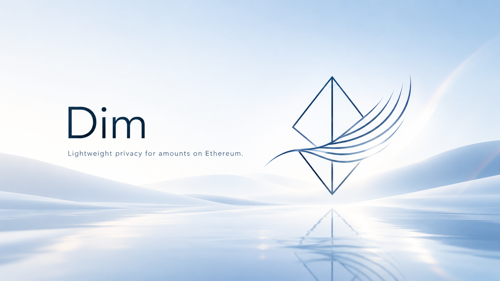

# Dim

Ethereum上の機密ETH UTXOと、Uniswapを利用した公開支払い。

[English](README.md) · [アプリを使う](#アプリを使う) · [appsをローカルで起動する](#appsをローカルで起動する) · [対象範囲と利用の流れ](#対象範囲と利用の流れ) · [機密性の限界](#機密性の限界) · [先行EIPベンチマークの再現](#先行eipベンチマークの再現) · [文書索引](#文書索引)

## プロジェクトの目的

Ethereum上で、UTXOの消費と生成の関係を公開しながら、ETHの金額を秘匿する送金の仕組みを研究するプロジェクトです。研究用プロトタイプでは、ETHの入金、機密送金、公開出金を扱います。Uniswap接続では、固定額のETHを公開トークンへ交換して指定した最終受取人に全量を渡し、支払者が残りの機密UTXOを使い続けられます。開発者と研究者が機能、コスト、安全性、金額の機密性の限界を評価し、将来の標準化を議論するための根拠を提供します。公開された取引グラフと既知の金額から、送金額や残額が判明する場合があります。

## アプリを使う

アプリでは、機密テストETHの報酬を受け取り、その一部をUniswapで支払い、残額のUTXOを再利用する体験を目指しています。[紹介ページ](https://dim.mmymshd52.workers.dev/)ではプロジェクトを説明し、[`/app`の操作画面](https://dim.mmymshd52.workers.dev/app)ではDemo reward、Pay、Deposit、Withdrawを扱います。

**提供状況：** 2026-09-27に記録した公開環境はモックのプレビューです。以下は実装中の実接続版の利用フローであり、公開テストネットで完走を確認した手順ではありません。READMEの基準コミット`9542a8b`では、`VITE_DIM_MODE`を`live`に変えるだけでは実接続になりません。ブラウザ接続は[#59](https://github.com/shodaimomiyama/ethereum-confidential-utxo/issues/59)、報酬配布は[#58](https://github.com/shodaimomiyama/ethereum-confidential-utxo/issues/58)、公開配置は[#73](https://github.com/shodaimomiyama/ethereum-confidential-utxo/issues/73)で進めています。既存プレビューの配置記録は[開発環境ガイド](docs/guides/development.md#webモックの静的公開)にあります。

### 実接続版を使うための準備

ChromeとMetaMaskを使い、Ethereum Sepoliaのテスト用ウォレットを用意します。機密報酬から始める場合も、取引のgas用に公開テストETHを残してください。機密残高ではそのgasを払えません。Depositでは、入金額も公開残高から用意します。設定された**Get test ETH**リンクは外部faucetへの案内であり、Dim自体が公開gas用ETHを配布する機能ではありません。

実接続を構成した環境では、必要に応じて**Connect wallet**、**Switch to Sepolia**、**Prepare privacy key**、**Recheck public balance**で準備します。鍵準備では専用のウォレット承認から受領鍵を導出します。サービスへのログインには別のSIWE署名を使い、ウォレット接続や鍵準備だけではAPI認証は成立しません。ログインの最終的な画面導線は#59の対象です。ウォレットに表示される要求の目的を確認してから承認してください。

公開ETHと利用可能な機密ETHは別の残高です。**Resync private balance**では、接続中の所有者の鍵と公開履歴を使い、受領データと使用可能性を再確認します。資金を増やしたり、未確定の受領を使用可能にしたりする操作ではありません。アカウントやネットワークを切り替えた場合は、その接続先で残高と操作を確認し直します。

### 報酬を受け取り、支払い、残額を使う

以下は機密残高が空で、報酬配布元が利用可能な場合の例です。金額は資産の増減を説明するためのもので、faucet配布額、報酬上限、gas見積り、固定交換レートではありません。入力欄の初期値は空欄です。

| 手順 | 入力と操作 | 確定・受領照合後に期待する結果 |
| --- | --- | --- |
| 受領 | **Demo reward**の**Demo reward amount in ETH**に`0.01`を入力し、**Request demo reward**を選びます。**Activity**で要求を追跡します。 | 配布元から`0.01 ETH`のUTXOを受け取ります。**Distribution finalized; receipt pending**はまだ**Reward received**ではなく、受領を照合できて初めて機密ETHが利用可能になります。 |
| 支払い | **Pay privately**の**Pay amount in ETH**に`0.004`を入力します。最終受取人の公開アドレスを入力するか、**Use my address**を選びます。**Current terms**、**Estimated output**、**Minimum output**、**Deadline**、**Selected UTXO**を確認し、**Start private payment**を選んで必要なウォレット要求を承認します。 | 正の残額が残る使用可能な入力を1個、自動選択します。`0.004 ETH`全額をdUSDへ交換し、最低受取額を満たす場合に出力dUSDの全量を受取人へ渡します。`0.01 ETH`の入力は消費され、受領照合後に`0.006 ETH`の残額UTXOが利用可能になります。gasは公開ETHで別途支払います。 |
| 再利用 | **Withdraw**の**UTXO to withdraw**で`0.006 ETH`の残額を選び、公開出金先を確認して**Withdraw full UTXO**を選びます。 | その1個のUTXOを消費し、接続中の公開アドレスへ`0.006 ETH`を戻します。出金取引のgasは別途差し引かれます。機密残額は生成しません。 |

見積りは接続先の実際の表示を使ってください。実接続時のdUSD出力額は流動性に依存します。認可前に**Minimum output in dUSD**と**Deadline (UTC timestamp)**で成立条件を設定できます。見積り更新で条件が変わった場合は、**Previous terms**と**New terms**を確認し、**Confirm new terms**を選びます。期限切れや古い見積りでは支払いを開始できません。

Payの入力は自動選択、Withdrawの入力は手動選択です。小さなUTXOを複数持ち、合計が支払額を満たしていても、単一の入力で支払えるとは限りません。1個の出金は、保有する全UTXOの一括出金ではありません。受領照合済みの残額は、条件を満たす別の支払いにも使えます。残額の機密再送金は本体の利用フローに含まれますが、この画面に汎用的な機密送金UIはありません。

### 自分で入金する場合

報酬の代わりに自分の公開テストETHを使う場合は、**Deposit**を開き、**Deposit amount in ETH**に例えば`0.01`を入力して**Start deposit**を選びます。ウォレットでは入金額とgasを分けて確認してください。入金が成功すると、公開ETHは入金額とgasの分だけ減り、入金額に一致する機密UTXOが生成されます。受領照合後に利用可能となり、上記と同じPay・Withdrawの手順へ進めます。

入金額は公開されます。報酬から始めることで、自分の公開入金額を明白な元金とする流れを避けられますが、配布元は配布額を知っています。取引グラフは公開され、後の公開支払いや出金から過去の金額が分かる場合もあります。[機密性の限界](#機密性の限界)を参照してください。

### 進行状況と復旧の見方

カードを切り替えても**Activity**で進行中の操作を確認できます。取引ハッシュが分かり、同じ配置環境のExplorerが設定されていれば、**View on explorer**から取引を開けます。ハッシュの存在やExplorer上の成功だけでは、受領照合や機密残高の使用可能性は確定しません。

| 表示・状態 | 意味と次の操作 |
| --- | --- |
| **Request accepted** / **Distribution pending** | 報酬要求が記録された、または配布待ちの状態です。**Recheck reward request**で同じ要求を追跡し、結果不明を別の報酬要求に読み替えないでください。 |
| **Pending confirmation** | 提出を把握していますが、必要なチェーン確定を確認できていません。既存操作を追跡します。 |
| **Status cannot be confirmed** | RPC停止や送信応答の喪失などで結果が不明です。利用可能なら**Recheck status**で確認します。不明は失敗ではなく、新しい使用や根拠のない再送は引き続き禁止される場合があります。 |
| **On-chain success; receipt check pending** / **On-chain success; private receipt needs rechecking** | チェーン操作は成功していますが、機密受領が未確認または不整合です。再確認・再同期し、出力を利用可能残高に数えないでください。 |
| **Attempt failed** | 今回の試行は失敗しました。照合結果が許す場合だけ、既存操作と認可を維持して**Retry same attempt**で再試行します。支払い失敗では資産効果を取り消しますが、取引のgasは戻りません。 |
| **Not submitted** | 未提出と確認でき、復旧条件が許す場合は、**Resume original submission**で保存済み操作の提出を再開します。チェーン上で失敗した試行の再試行とは異なります。 |
| gas不足・古い見積り・条件変更 | 公開gas用ETHを用意して再確認するか、最新の条件を取得して確認します。実行できない理由は無効な操作の説明に表示されます。 |
| 再編成・古い残高 | **Resync private balance**と操作の再確認で、影響する履歴を照合してから使用します。以前表示された受領や残高だけでは判断しません。 |

実接続版の復旧では、同じウォレットと配置環境へ戻り、受領鍵を準備し、必要な認証を行って、保存済み操作をサービスとチェーンに照合します。設計では暗号化した操作記録とブラウザキャッシュを使います。ブラウザ保存の消去は取消操作ではなく、未送信の証拠にもなりません。別ブラウザでの復旧と公開サイトの受入検証は、[#46](https://github.com/shodaimomiyama/ethereum-confidential-utxo/issues/46)と[#50](https://github.com/shodaimomiyama/ethereum-confidential-utxo/issues/50)で追跡しています。**Full history: Coming soon**は全履歴を閲覧できる機能ではありません。

## appsをローカルで起動する

### 各構成の役割と現在の起動方法

| パス | 責務 |
| --- | --- |
| [`apps/uniswap-web`](apps/uniswap-web/) | React/Viteによる`/`の紹介ページと`/app`の4カード画面。ブラウザ接続では支払い・受領照合・同期に共通クライアントを使います。 |
| [`apps/uniswap-service`](apps/uniswap-service/) | 認証、入力予約、保存済み操作、報酬配布の接続を担うCloudflare WorkerとDurable Objectのサービス。本人の機密受領照合はブラウザの責務です。 |
| [`packages/uniswap`](packages/uniswap/) | 本体とEthereumのパッケージに依存する、共通の支払い条件、見積り、認可、照合、サービス契約。 |

Git、**Node.js 24.21.0**、**pnpm 10.34.5**と、依存取得用のネットワーク接続を用意します。先行EIPベンチマークのNode.js 22環境とは別です。nvmとCorepackが利用可能な環境で、新規cloneから実行します。

```bash
git clone https://github.com/shodaimomiyama/ethereum-confidential-utxo.git
cd ethereum-confidential-utxo
nvm install 24.21.0
nvm use 24.21.0
corepack enable pnpm
corepack prepare pnpm@10.34.5 --activate
pnpm install --frozen-lockfile
pnpm --filter @confidential-utxo/uniswap-web dev
```

Viteが表示するローカルURL（通常は`http://localhost:5173/`）を開くと紹介ページ、同じoriginの`/app`を開くと操作画面が表示されます。停止は**Ctrl+C**です。現在の入口でUIプレビューを表示するだけなら、コントラクトやパッケージの事前ビルドは不要です。既定ではモックとなり、**Connect simulated wallet**と**Scenario workbench**が表示されます。実ウォレット、RPC、Anvil、テストネット資金は不要です。現時点でこのコマンドが起動するのはプレビューであり、実接続の全構成ではありません。

サイトの検査と配信用アセットのビルドは、リポジトリルートで実行します。

```bash
pnpm --filter @confidential-utxo/crypto build
pnpm --filter @confidential-utxo/core build
pnpm check:site
pnpm test:site
pnpm build:site
```

出力先は`apps/uniswap-web/dist/`です。crypto/coreのビルドは、新規checkoutでサイトの型検査とテストが参照するパッケージ出力を用意します。これらのコマンドはフロントエンドを検査するもので、コントラクト配置、サービス起動、実接続の受入検証は行いません。本体・コントラクトの準備やサービス検査の前提は、[開発環境ガイド](docs/guides/development.md)と[ルートのスクリプト](package.json)を参照してください。

### 実接続に必要な構成

実接続版には、照合済みのPool・Adapter・Uniswap配置、流動性、資金を用意した報酬配布元、永続保存を備えたサービス、それらへ接続するブラウザcontrollerが必要です。サイトとAPIは設定したHTTPSの同一originで提供し、chain、コントラクトアドレス、配置世代、サービス認証設定を一致させます。境界は[接続アーキテクチャ](docs/integration/uniswap/architecture.md)と[設計](docs/integration/uniswap/design.md)に従います。

READMEの基準版では、ブラウザの標準入口へのlive controller接続は未完了で、serviceには試験用runtime設定はありますが、完全な本番起動コマンドはありません。wallet・鍵、暗号処理Worker、API認証、暗号化した操作保存、復旧は[#59](https://github.com/shodaimomiyama/ethereum-confidential-utxo/issues/59)のブラウザ接続、報酬処理は[#58](https://github.com/shodaimomiyama/ethereum-confidential-utxo/issues/58)の担当です。それらの接続と[#73](https://github.com/shodaimomiyama/ethereum-confidential-utxo/issues/73)の配置照合が揃ってから、再現可能な実接続の起動手順を確定します。

### フロントエンドの環境変数

現在の名前と既定値は[`src/site/config.ts`](apps/uniswap-web/src/site/config.ts)に定義されています。Viteプロセスへ渡し、開発時の変更後は再起動、配信するアセットの変更時は再ビルドしてください。現在のparserでは6変数とも任意です。`VITE_`の値は公開フロントエンドへ組み込まれるため、秘密鍵、サービスのSecrets、認証情報付きRPC URLを入れないでください。

| 変数 | 既定値 | 用途と制約 |
| --- | --- | --- |
| `VITE_DIM_MODE` | `mock` | `mock`または`live`のみ。`live`は実接続向けの表示を選びますが、controller・RPC接続・serviceを作りません。接続処理がなければ`/app`に**Dim app is not configured**と表示されます。 |
| `VITE_DIM_DEPLOYMENT_ID` | `local-v1` | 表示する配置環境とExplorer対応を識別します。前後の空白を除き、空なら既定値を使います。chain IDや配置manifestではありません。 |
| `VITE_DIM_CODE_URL` | 未設定 | 任意のソースコードへのリンク。 |
| `VITE_DIM_EVIDENCE_URL` | 未設定 | 任意の検証成果へのリンク。 |
| `VITE_DIM_FAUCET_URL` | 未設定 | 任意の外部**Get test ETH**リンク。ウォレットへの資金供給は行いません。 |
| `VITE_DIM_EXPLORER_BASE` | 未設定 | 選択した配置環境のExplorerの基底URL。実接続の取引リンクは`/tx/<hash>`を追加します。未設定ならExplorerリンクを表示しません。モックの詳細はローカルのままです。 |

4個のURL変数は、指定する場合はHTTPSの絶対URLが必要です。省略または空白だけなら未設定として扱います。これらは表示用の設定であり、実接続の配置設定一式ではありません。RPC・APIの設定とサービスのSecretsには、上記で追跡している配置の準備が必要です。

### 開発用のUIシミュレーション

モックは実接続の開発と並行してUIの振る舞いを確認するための機能です。**Advance simulation**、モック時計、シナリオのリセットは、実取引の提出や確定には使いません。模擬Sepoliaの表示やハッシュはチェーン上の記録ではなく、プレビューは暗号の安全性、実Uniswap取引、オンチェーンの取消、本番利用の成立を証明しません。

通し操作を手動でプレビューするには、**Connect simulated wallet**、**Switch to Sepolia**、**Prepare privacy key**、**Recheck public balance**の順に準備します。続いて`0.01 ETH`の報酬を要求し、**Use my address**宛に`0.004 ETH`を支払い、`0.006 ETH`の残額を出金します。報酬・支払い・入金の開始後は、**Advance simulation**を4回押し、承認、提出、チェーン成功・受領待ち、受領照合済みへ進めます。出金は3回で、機密出力の受領はありません。実際のウォレット承認やgas支払いは発生しません。モックの見積りは模擬値であり、実際の価格として使わないでください。

**Scenario workbench**ではIDを選んで**Load scenario**を押すと、現在のシミュレーションをそのシナリオの開始状態に置き換えます。**Next step**で表示された操作・イベント・時刻変更を適用し、**Scenario complete**まで進めます。**Reset scenario**では同じシナリオをやり直します。**Advance simulation**は手動で始めた操作を進めるもので、スクリプトの次のステップへ進む操作とは別です。**Mock clock (milliseconds)**と**Set clock**で時刻に依存するUI条件を確認でき、**Effect journal**にはネットワーク取引ではなく模擬効果を記録します。

| シナリオID | ステップを進めて確認すること |
| --- | --- |
| `S-27/hash-unknown` / `S-27/rpc-down` | 結果不明では再確認を許し、根拠のない再試行や新しい支払いを禁止する。 |
| `S-28/decryption-failed` | チェーン成功でも受領不整合なら利用可能な機密残高へ加算しない。 |
| `S-29/reorg-removes-adopted-change` | 照合によって、以前は利用可能とした残額を取り消す。 |
| `S-35/quote-age-exceeded` | 古い見積りで支払いを開始できない。 |
| `S-34/quote-changed-before-authorization` | 条件変更には明示的な確認が必要。 |
| `S-35/gas-shortage` | 公開gas不足では支払いを開始できない。 |
| `S-39/pay-hash-known` | ハッシュのイベントを適用すると**View simulated transaction**からローカルの取引詳細を開ける。 |

通常のモック操作とadvanceは、そのoriginの`localStorage`キー`dim-mock-session-v1`から再読み込み時に再生します。所有者・配置環境のscope一致が条件です。選択シナリオ、workbenchから直接投入したイベント、スクリプトの位置、モック時計はシナリオの途中状態として保存されません。未提出の支払い見積りは再読み込みで無効になります。**Reset scenario**はシナリオの初期化であり、保存セッションの消去とは異なります。プレビューを完全に初期化する場合は、そのoriginのブラウザコンソールで以下を実行し、模擬ウォレットの準備からやり直します。

```javascript
localStorage.removeItem('dim-mock-session-v1');
location.reload();
```

消すのはモックのセッションデータだけで、実接続の復旧手順ではありません。実装と振る舞いの詳細は[シナリオ一覧](apps/uniswap-web/src/mock/scenario-catalog.ts)、[モックの保存処理](apps/uniswap-web/src/mock/experience.ts)、[接続仕様](docs/integration/uniswap/specification.md)を参照してください。

## 対象範囲と利用の流れ

本体は、[本体PRD](docs/PRD.md)に記載したETH専用の公開グラフ型UTXOを提供します。[Uniswap接続](docs/integration/uniswap/PRD.md)では、機密ETHで受け取った金額の一部を、公開流動性を使った支払いに利用できます。

1. テスト用ETHを所有者のUTXOへ入金し、別の所有者へ機密送金します。
2. 受取人がUTXOを発見し、金額と確定状態を照合して、送信者の追加協力なしに使用できる状態にします。
3. 受取人が支払者となり、使用ETH額、交換先トークン、最低受取額、最終受取人、有効期限を認可します。接続では固定ETH額を全額交換し、最低受取額を満たす場合に交換出力の全量を最終受取人へ渡します。
4. 支払者は未使用のETHを機密UTXOとして保持し、その残額を再送金できます。

接続が扱うのは、単一UTXOから一種類の公開トークンへの部分支払いです。失敗した支払いでは、その試行による入力消費、残額生成、出金、交換、着金を一体に取り消します。先に確定した送金や外側のトランザクションのgas費用は、取消の対象に含めません。

テスト用資産を使い、ローカルEthereumと公開テストネットで検証する研究を対象とします。[接続仕様](docs/integration/uniswap/specification.md)では、デモ報酬、支払い、入金、全額出金を扱う公開デモサイトを必須としています。仕様の存在は実装・公開の完了を意味しません。実資金での本番運用、汎用的な機密ウォレットGUI、ERC-20の機密資産一般への対応、取引グラフの秘匿、厳密な請求額決済は初期範囲外です。標準としての採用や先行方式より低いコストは、今後検証する研究の目標です。

## 仕組み（How it's made）

[本体仕様](docs/specification.md)に従い、入力の存在と未使用を判定する状態をコントラクトストレージで管理し、UTXOの消費と生成の関係を公開します。各操作には、意図した資産効果と実行文脈に結び付いた、有効な所有者認可を要求します。入金では実受領ETH額に一致するUTXOを生成し、送金では入力総額を保存し、出金では公開出金額と機密残額の和を入力総額に一致させます。無断使用、二重使用、成功済み操作の再使用を拒否し、gasは別途公開ETHで支払います。

受取人は、自分の鍵と公開履歴から受領データを発見・復号し、整合性を確認します。CLIでは、受領成立と未確定・失敗・確認不能を区別し、再同期を行えます。Uniswap接続では、[接続要件](docs/integration/uniswap/requirements.md)に従い、交換条件を所有者の出金認可に結び付け、交換や着金が失敗した場合に支払いの資産効果を一体に取り消します。

[先行EIPのベンチマーク](benchmarks/prior-eips/)では、EIP-8182を別途測定します。BashとJavaScriptのスクリプトで、固定したEIP-8182参照実装をビルドし、snarkjsでpoolとdemo認可のGroth16証明を生成して、FoundryのツールとローカルAnvil上で検証します。参照demoのML-KEM-768/X25519による受領データ暗号化と公開ログからの復元も確認します。[比較調査](docs/research/prior-eip-comparison.md)に、参照コード、測定条件、開発用鍵の前提と限界を記録しています。

## 機密性の限界

秘匿の対象は金額であり、取引のつながりは公開します。入出金額に加え、Uniswap接続では使用ETH額、交換後のトークンと金額、最終受取人が公開されます。所有者やトランザクション送信者の秘匿も保証しません。例えば、入力額が既知なら公開出金額との差から残額が分かり、後続の全額出金から過去の送金額が判明する場合もあります。残額を機密UTXOで保持することだけでは、推論を防げません。

詳細は[本体の公開情報と秘密の範囲](docs/specification.md#公開情報と秘密の範囲)、[必要な検証成果物](docs/requirements.md#検証結果として提供する成果物)、[接続の機密性の限界](docs/integration/uniswap/PRD.md#公開情報と機密性の限界)を参照してください。

## 先行EIPベンチマークの再現

以下はEIP-8182参照実装のローカル測定手順です。

Git、Bash、Node.js 22とnpm、Foundry（`forge`、`cast`、`anvil`）、`jq`、`shasum`、参照実装と依存関係を取得するネットワーク接続が必要です。[記録済みの環境](benchmarks/prior-eips/config.json)はmacOS arm64、Node.js 22.22.0、npm 10.9.4、Foundry 1.7.1です。機器とツールの版も記録していますが、最低必要資源や他OSへの対応を示すものではありません。

追加ケースのスクリプトはclone内の測定出力を上書きするため、新規の作業用cloneで実行してください。コマンドはリポジトリのルートで実行します。新規セットアップでは、以下の参照実装の取得先を未使用のパスにしてください。

```bash
git clone https://github.com/shodaimomiyama/ethereum-confidential-utxo.git
cd ethereum-confidential-utxo
bash benchmarks/prior-eips/setup.sh /tmp/eip8182-clean
```

セットアップは参照実装を`639baaf7b29c22eb43ba6150140902ea8dbbbc46`に固定し、依存関係の導入、回路とコントラクトのコンパイル、開発用証明鍵の準備を行います。成功すると参照コミットと証明用資産のhashを表示します。試験専用の鍵とローカルで用意するテスト用資産を使い、個人の認証情報や実資金は必要ありません。

別の端末で、この測定専用のローカルノードを起動します。

```bash
anvil --silent --host 127.0.0.1 --port 18545 --chain-id 1 --hardfork cancun --timestamp 1735689000 --gas-limit 30000000 --disable-code-size-limit
```

最初の端末へ戻り、ウォームアップ1回と正式3試行を実行し、生データから再集計します。

```bash
bash benchmarks/prior-eips/repeat.sh /tmp/eip8182-clean http://127.0.0.1:18545 benchmarks/prior-eips/raw/new-run
node benchmarks/prior-eips/aggregate.mjs benchmarks/prior-eips/raw/new-run
```

各試行はノードをリセットします。集計では、送金receipt、改ざんした認可対象の拒否、受領データの復元、記録した状態フラグを確認します。成功すると`raw/new-run`へ`aggregate.json`を書き出し、gasと時間の中央値を表示します。時間やgasの厳密な値は実行ごとに変わり得ます。

同じ専用ノードで、暗号化した操作別の全17ケース、ETH送金の追加3試行、受取人による後続出金を再現できます。

```bash
bash benchmarks/prior-eips/cases/run-encrypted.sh /tmp/eip8182-clean http://127.0.0.1:18545 all
bash benchmarks/prior-eips/cases/repeat-eth.sh /tmp/eip8182-clean http://127.0.0.1:18545
bash benchmarks/prior-eips/recipient/run.sh /tmp/eip8182-clean http://127.0.0.1:18545
```

これらもノードをリセットします。期待結果は、[暗号化ケースの集計](benchmarks/prior-eips/cases/encrypted-summary.json)で17ケース成功、[ETHの集計](benchmarks/prior-eips/cases/eth-repeat-summary.json)で3試行、[受取人の結果](benchmarks/prior-eips/recipient/reuse-result.json)で受領したnoteの出金成功です。終了後は専用ノードを停止してください。

[比較調査](docs/research/prior-eip-comparison.md)から、[記録済みの生データ](benchmarks/prior-eips/raw/repeated/)と[既存のクリーンcheckoutでの追試](benchmarks/prior-eips/raw/clean-replay-repeated/aggregate.json)へ移動できます。同文書に、試験用トークン、demo認可、開発用セットアップ、code size制限解除の条件も記載しています。この測定だけでは、本体の性能、本番での安全性、通常のEthereumネットワークへの配置可能性は判断できません。

## 文書索引

macOS Apple Siliconでの環境構築、ローカルRPCスモークテスト、固定版K/Kontrolのスモーク証明は[開発環境ガイド](docs/guides/development.md)を参照してください。

技術文書の正本は日本語です。両READMEから同じ正本を参照します。

| 文書 | 内容 |
| --- | --- |
| [本体PRD](docs/PRD.md) | 課題、対象者、初期範囲、標準化の目的 |
| [本体要件定義](docs/requirements.md) | 機能、安全性、機密性、形式証明、評価と再現性の受入条件 |
| [本体仕様](docs/specification.md) | 状態遷移、認可、資産保存、受領と同期の規則 |
| [本体アーキテクチャ](docs/architecture.md) | 本体の構成、実装基盤、クライアントの境界、リポジトリと検証環境の構成方針 |
| [本体設計（草案）](docs/design.md) | 方式、認可、受領と同期、検証計画、採用判断の根拠 |
| [Uniswap接続PRD](docs/integration/uniswap/PRD.md) | 機密ETHからの公開部分支払いと残額の再利用 |
| [Uniswap接続要件定義](docs/integration/uniswap/requirements.md) | 認可、取消、機密性、コストと追試の受入条件 |
| [Uniswap接続仕様](docs/integration/uniswap/specification.md) | 支払いの受理、全量着金、取消、同期、公開サイトとデモ報酬要求の規則 |
| [先行EIPの比較調査](docs/research/prior-eip-comparison.md) | 比較範囲、測定条件、生データと限界 |
