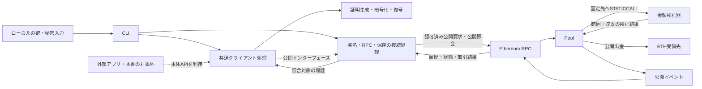
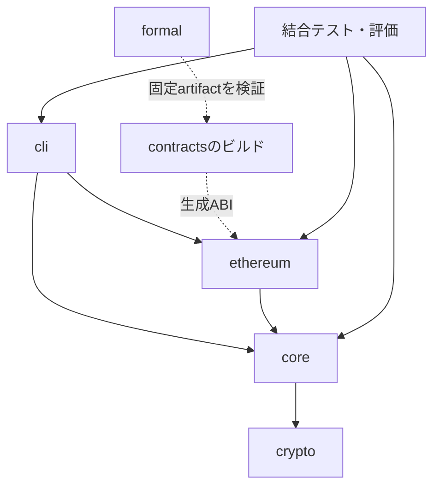

# Confidential UTXOのシステム構成と実装基盤

## 目的と文書の状態

本書は、Confidential UTXO本体の全体構成、実装基盤、モジュールとリポジトリの配置を定める確定版である。本書の範囲における構成と初回実装の基準を確定し、後続の実装・検証に適用する。アーキテクチャの確定と、方式・詳細設計の最終確定、実装・検証の完了は区別する。各決定の検証条件と、不成立時の見直し条件を後述する。各節のリンクから対応する詳細規則を確認でき、末尾の[詳細設計の参照索引](#詳細設計の参照索引)から採用理由・実験記録を含む全節へ移動できる。

要求・受入条件・方式に依存しない振る舞いは、[PRD](PRD.md)、[要件定義](requirements.md)、[仕様書](specification.md)を参照する。暗号方式、検証式、認可、符号化・ABI、受領・同期の詳細規則と採用根拠は[方式・詳細設計](design.md)を正本とする。

参照開始コミットは `11bbabf0e02f9cf0b744c51339edbbffe414b9da`。参照時点の詳細設計ではv3範囲証明は条件付きの基準であり、実コードの形式検証経路は未確立である。本書の構成上の合意を、暗号方式の最終採用、実装完成、形式証明完了とは扱わない。

## 対象範囲と文書の責務

本書の対象はPool、金額検証器、共通クライアント処理、CLI、Ethereum/RPCとの接続、および本体の開発・テスト・形式検証・評価環境とする。

| 本体設計の正本 | 記載する内容 |
| --- | --- |
| `docs/architecture.md` | 本体の構成要素、責務、依存方向、実行・配置単位、実装基盤、リポジトリ構成、信頼境界と検証環境 |
| `docs/design.md` | 本体の暗号方式、検証式、認可、符号化・ABI、受領・同期の詳細規則、採用根拠と成立性の証拠 |

本体のクライアント処理は外部アプリから再利用できる境界を設ける。ただし、再利用先の画面や配布形態を、本体の構成要素や必須依存に含めない。外部アプリは本体の公開APIを利用し、本体から接続側のUIやサービスへ依存しない。

接続側の文書は本体の仕様と設計を参照する立場であり、本書の正本や上位の規範にはしない。[接続PRD](integration/uniswap/PRD.md)と[接続要件](integration/uniswap/requirements.md)は利用先の文脈を確認する参考資料とする。本体の変更が必要な場合は変更要求として扱い、本体のPRD・要件定義・仕様書との整合を確認してから本体の設計へ反映する。接続側の文書変更だけで本体の責務や保証を変更しない。

ハッカソンの応募、発表、動画などの一過性の作業情報は本書の対象外とし、文書管理ルールに従ってIssueなどで管理する。

## 構成方針と採用状態

| 対象 | 方針 | 状態と確認条件 |
| --- | --- | --- |
| コントラクト言語 | Poolと金額検証器はSolidity 0.8系を基準とし、既存v3検証器を移植する | Solidity 0.8.37と後述のビルド設定を初回基準として合意。形式検証ツールとの接続は検証を要する。旧版の証拠を移植後へ流用しない |
| リポジトリ | 一つのリポジトリに `contracts/`、`packages/{crypto,core,ethereum,cli}/`、`formal/`、`tests/`、`benchmarks/`、`experiments/` を分けて置く | 分割方針として合意。以下の内部構成を配置基準とする。ディレクトリ作成済みを意味しない |
| CLI | 一つのCLIに操作作成・提出・同期の入口をまとめ、内部の責務を分ける。証明生成は独立したモジュール境界を設ける | 構成方針として合意。内部関数名・型宣言は、以下の責務と依存方向を守って実装時に定義する |
| 金額検証器 | 範囲検証と収支検証を内部モジュールに分けた一つのコントラクトをPoolとは別に配置し、固定した参照先へ `STATICCALL` で問い合わせる。提出者による選択や、配置後の差替え経路を設けない | 構成の基準として合意。呼出し境界を含む形式検証、配置可能なコードサイズ、操作全体の費用を確認し、不成立なら再検討する |
| クライアントの言語 | 共通クライアント処理とCLIはTypeScriptを採用する。外部アプリからも共通処理を利用できる構成にする | 実装基盤と固定版は合意済み。暗号依存、証明生成の移植、対象実行環境での適合性・資源条件は受入検証を要する |

方式を選んだ根拠は[方式選定の方針](design.md#方式選定の方針)と[構成の採用理由](design.md#構成の採用理由)、設計段階と実装後の確認の区分は[設計段階の採用判断とPoCの受入検証](design.md#設計段階の採用判断とpocの受入検証)を参照する。

## 共通クライアント処理と外部アプリの境界

本体の共通クライアント処理は、操作作成と正規符号化、証明生成、受領データの暗号化・復号、受領確認と同期を担う。金額やUTXOの検査規則を、CLIと外部アプリが別々に実装し直す構成を避ける。

所有者の署名、受領用鍵の供給、RPC通信、状態の保存は、共通処理から実行環境固有の実装を分離する境界とする。具体的なAPIと失敗時の扱いは後続節で定める。共通処理は特定の画面フレームワーク、ブラウザ拡張、接続サービス、デモ報酬APIに依存しない。CLIは本体側でこれらの境界を接続し、外部アプリは接続側で接続する。

秘密入力を扱う処理と、認可済みの公開要求を提出する処理を区別する。提出に非公開金額、秘匿用乱数、受領秘密鍵を要求しない。秘密情報を通常ログや共有成果物へ出力しない条件は、本体SEC-06と詳細設計に従う。

接続側が選ぶ秘密の実行場所、鍵の保存・再利用、対応ウォレットとブラウザ、画面の状態管理と配信コードへの信頼は、接続側の設計に記載する。本体では受領用鍵と認可鍵の役割、秘密の公開禁止、操作と公開入力の結合など、利用先によらず維持する条件を定める。外部アプリの成立性を、共通処理の存在だけから保証しない。

## システム全体構成

対応要件: FR-01〜FR-09、SEC-01〜SEC-06、OPS-04。詳細規則は[操作とインターフェース](design.md#操作とインターフェースの設計規則)と[受領・同期](design.md#d-09-確定条件と同期)を参照する。

次の図は予定する実行構成であり、実装済みの経路ではない。CLIと共通クライアント処理は同じローカルプロセス内で動作する構成とし、パッケージ分割を別サーバーや別プロセスの配置と混同しない。



破線は実行時に満たす境界を表す。ソースコードの依存方向は[モジュール構成](#モジュール構成)に従い、`core`が`ethereum`や`cli`をimportする意味ではない。

| 構成要素 | 責務 | 実行・配置単位 |
| --- | --- | --- |
| Pool | 所有者認可、入力の現在状態、再使用、出力形式を確認する。実際の操作から金額検証の公開入力を計算し、検証結果に従ってUTXO・帳簿・ETH移動を原子的に更新する | Solidityコントラクトとして配置 |
| 金額検証器 | 正規の公開入力と証明から、出力の正値範囲と操作の収支関係を検証する。所有者認可やUTXO台帳の管理は担わない | Poolとは別の固定コントラクトとして配置 |
| 共通クライアント処理 | 入力選択、要求の作成と符号化、暗号処理の呼出し、認可要求、受領・同期の判定を行う | TypeScriptライブラリ。CLIまたは外部アプリへ組み込む |
| 暗号処理 | コミットメント、範囲・収支証明、HPKE、受領データとコミットメントの照合に必要な演算を提供する | 共通処理から呼ぶライブラリ。独立した通信サービスにはしない |
| CLI | 鍵生成、受取情報の提示、同期、残高表示、作成、提出、操作照会の入口を提供する | 一つのNode.js実行プログラムとする |
| Ethereum/RPC | コントラクト実行と採用履歴・状態へのアクセスを提供する | ローカルノードまたは外部ネットワーク。履歴提供と回答の正しさを運用上の前提に含める |
| ETH受領先・外部接続 | Poolの公開出金を受け取る。本体外での資産操作は接続側の責務とする | アドレスまたは外部コントラクト。接続側の配置は本書で決めない |

Poolの状態更新は[ストレージと処理順序](design.md#ストレージと処理順序)、呼出し中の制御は[再入拒否](design.md#d-03-資産操作への再入拒否)、論理操作の再使用防止は[操作IDの規則](design.md#d-04-操作idによる順不同の実行と再使用防止)に従う。

### 金額検証器の配置

「金額検証器」は範囲と収支の両方を担う責務名であり、既存実験の「v3範囲検証器」はその一部である。検証式は[金額コミットメントと正値](design.md#金額コミットメントと正値)と[収支差の検証](design.md#収支差の検証)、境界値は[金額上限](design.md#d-05-単一utxoの金額上限)と[入力数・出金額上限](design.md#d-06-入力数と公開出金額の上限)を参照する。

合意した配置方針として、範囲検証と収支検証を内部モジュールとして分け、同じ金額検証器コントラクトに含める。Poolからの各検証呼出しを `STATICCALL` とし、別途変更可能な検証器registryやproxyを挟まない。既存の範囲検証入口 `verify` と収支検証入口 `verifyBalance` を分け、範囲検証の既存ABIを維持する。Poolが公開入力を再計算して直接呼び出し、収支challengeには実行チェーンと呼出し元Poolを結び付ける。具体ABI・返値の受理条件は[操作とインターフェースの設計規則](design.md#操作とインターフェースの設計規則)を正本とし、移植後の接続試験と証明をU-01で追跡する。

Poolが保存済み入力と要求から公開入力を再計算し、検証器へ渡す責任は移さない。計算式と結合対象は[操作の結合とABI](design.md#操作の結合とabi)を正本とする。検証器が返す成功だけを無条件に信頼せず、正しい引数への呼出し、返値の形式と真値、呼出し失敗の伝播をPool実コードの証明対象に含める。固定したコードが正しいという仮定だけでFV-03を省略しない。

配置時には、chain ID、Pool・検証器のアドレス、runtime hash、constructor引数、パラメータhashをmanifestへ記録し、Poolの参照先と一致させる。旧デプロイの検証器を変更する経路は設けず、変更版は新しい配置として識別する。資産移行の仕組みはこの方針だけで提供したことにはしない。

純粋ライブラリをPoolへ組み込む代替は、外部呼出しを減らせる一方、Poolのコードと検証対象を大きくする。別配置はコードと証拠を追跡しやすいが、引数・返値・失敗の境界、呼出し費用、複数の配置先の管理が増える。別配置の方が形式検証やgasで有利だとは未測定のまま主張しない。コードサイズ・費用・証明経路が成立しなければ分割を見直す。

## 主要なデータフロー

秘密情報は金額が公開される入出金の値と区別する。非公開金額、開示用乱数、証明内部の乱数、受領秘密鍵、認可秘密鍵を公開要求の付加フィールドや通常ログへ出力しない。

### 作成・証明生成・認可・提出

| 段階 | 担当と処理 | 情報の境界 |
| --- | --- | --- |
| 1. [入力の準備](design.md#操作の形と公開フィールド) | CLIが対象chain・Pool・操作内容と公開受取情報を受け取り、`core`が入力候補と採用履歴を照合する | 非公開金額・開示情報はローカル処理。RPC照会には公開識別子を使う |
| 2. [出力の作成](design.md#証明と受領データを作る順序) | `core`が操作内容を固定し、`crypto`がコミットメントと暗号化受領データを作る | 受取情報は公開。出力の平文金額と乱数は秘密。暗号文は公開可能 |
| 3. [証明生成](design.md#範囲証明と収支証明を本体へ結び付ける順序) | `core`が詳細設計の順序で操作IDと公開入力を作り、`crypto`が必要な範囲・収支証明を生成する | 秘密入力はローカル。外へ出すのは証明と公開入力。中断した証明一式は提出可能にしない |
| 4. [認可](design.md#d-02-ethereum形式の所有者認可と受領用鍵の分離) | `core`が固定した操作に対する署名要求を作り、署名の接続処理から所有者署名を受け取る | 共通処理が認可秘密鍵そのものを必要とするAPIにしない。署名は公開要求へ含める |
| 5. [提出](design.md#提出者とcliの処理) | `ethereum`の接続処理が認可済み公開要求を選択した提出アカウントから送る | 入金額とgasは公開ETH。秘密の復号や再計算を提出者の必須能力にしない |
| 6. [オンチェーン受理](design.md#ストレージと処理順序) | Poolが現状態・認可・公開入力を確認し、固定検証器の受理後に資産効果を確定する | 資産操作全体の失敗時に状態・ログ・ETH移動を取り消す。外側のgas支出は取消対象外 |

初期の直接提出では、提出アカウントが外側の送信者・直接の呼出し元・gas支払者に対応するが、所有者との一致は要求しない。中継コントラクトからの呼出しも、本体の認可規則を維持する。Uniswap固有の条件の結合や交換までの取消は接続側で設計する。

符号化順序、署名対象、操作ID、証明再生成と再提出の区別は[詳細規則](design.md#操作の結合とabi)と[証明生成の中断と再生成](design.md#証明生成の中断と再生成)を参照する。取得した取引ハッシュ、取引の成功、本体操作の確定、本人の受領成立を同一の成功状態にまとめない。

### 受領と同期

| 段階 | 担当と処理 | 失敗・再実行の扱い |
| --- | --- | --- |
| [履歴取得](design.md#イベントと照会のabi) | RPC接続処理が対象Poolの公開ログと照合点の状態を取得する | 通信失敗や取得範囲の不足を残高ゼロや成功と解釈しない |
| [復号と照合](design.md#d-08-暗号化受領データと出力イベント) | `core`が`crypto`と受領用鍵を使い、復号結果・所有者・コミットメント・金額範囲を確認する | 復号成功だけでは利用可能にしない。不整合データを計上しない |
| [状態の照合](design.md#同期手順) | 同じ採用履歴で生成・消費・操作結果を対応付け、確定条件を適用する | 重複取得、再編成、未確定、確認不能を詳細設計に従って区別する |
| [記録と再使用](design.md#再編成と再提出) | 保存境界を通じて照合点と同期状態を記録し、利用可能な入力を作成処理へ渡す | キャッシュを真の台帳としない。受取人の保持鍵と公開履歴から再構成でき、送信者のローカル状態を不要にする |

## モジュール構成

以下をパッケージ分割と責務の基準とする。独立公開するnpmパッケージやサービスの数を指定するものではない。

| 配置 | 主な内部責務 | 公開境界・依存 |
| --- | --- | --- |
| `contracts/src/Pool.sol` | 本体操作、認可、状態とETHの更新 | 論理ABIを詳細設計から実装。固定金額検証器を呼ぶ |
| `contracts/src/verifier/` | 範囲検証、収支検証、共通の点・scalar・transcript処理 | 検証公開入力と結果だけを境界にする。Pool台帳へ依存しない |
| `packages/crypto/` | `commitment`、`range-proof`、`balance-proof`、`receipt`、固定パラメータ | 数値・byte列と暗号入力を扱う。`core`、RPC、CLIへ依存しない |
| `packages/core/` | `operation`、`authorization`、`receipt`、`sync`、型・符号化・外部依存のinterface | `crypto`へ依存。署名・RPC・保存の具象実装へ依存しない |
| `packages/ethereum/` | RPC取得、取引提出、署名要求、ABIとの接続 | `core`の型・interfaceと生成ABIを利用する。暗号生成や同期の判定規則を再実装しない |
| `packages/cli/` | サブコマンド、設定、鍵・秘密ファイルの入出力、本人向け表示、ローカル保存 | `core`と`ethereum`を組み合わせる。外部アプリはCLIを経由せず共通処理を呼べる |



共有する論理型、操作・受取情報・イベントの符号化規則への対応は`core`に集約する。暗号内部の型は`crypto`に置き、必要な型を`core`から参照する。SolidityとTypeScriptの符号化は独立したテストベクトルで一致を確認し、共通コードを呼んだ結果同士の比較だけで正しさを判定しない。ABIは固定したコントラクトartifactから生成し、手作業のコピーを別の正本にしない。

### 外部依存の境界

| 境界 | 共通処理が必要とする能力 | 境界で維持する条件 |
| --- | --- | --- |
| [所有者署名](design.md#操作の結合とabi) | 固定した認可対象について署名を要求し、結果または拒否を受け取る | 署名前後に操作内容を変えない。所有者と提出者を分ける |
| [受領用鍵](design.md#d-08-暗号化受領データと出力イベント) | 指定する鍵で受領データを復号できる能力 | 鍵供給元の選定と所有者認可を混同しない。共通処理は特定wallet由来と仮定しない |
| [履歴・状態取得](design.md#同期手順) | 対象chain・Pool・照合点の履歴と状態を取得する | ブロック位置・hash、取得範囲、失敗を伝え、別履歴の結果を混在させない |
| [提出・結果取得](design.md#取引と受領の状態表示) | 公開要求の提出と、その操作・取引の結果照会 | 不明な結果を成功・未送信に変換せず、再提出判断を共通規則へ戻す |
| [保存](design.md#cliの暗号化保存規則) | 同期の照合点、操作の追跡情報、秘密を含む作成データを目的別に保持する | 公開要求・秘密データ・診断ログを区別する。暗号化保存の規則に従い、停止・復旧試験をU-05で追跡する |
| [乱数](design.md#証明生成の中断と再生成) | 対象実行環境の暗号学的乱数源からbyte列を得る | エラーを明示し、固定seedや試験用乱数を通常経路へ混ぜない |

これらは論理的なAPIの責務であり、関数名・引数型の最終版は実装基準の具体化時に固定する。暗号規則や同期の意味をAPI利用者へ再定義させない。

## 信頼境界

対応要件: SEC-01〜SEC-06、FV-01〜FV-04、PRIV-01、OPS-04。

| 境界 | 保持・処理する情報 | 保証と前提 |
| --- | --- | --- |
| 所有者の署名処理 | 認可秘密鍵 | 本人の署名処理と鍵供給元を信頼する。Poolは実署名と対象操作の結合を検証する |
| ローカル作成・受領処理 | 非公開金額、乱数、受領秘密鍵、復号結果 | 実行コード・暗号依存・乱数源・端末を信頼対象とする。メモリ保持だけでコード改ざんや物理的残留まで防ぐ保証はしない |
| 公開要求とRPC | 入力ID、所有者、コミットメント、暗号文、証明、署名、公開入出金額・宛先など | 公開項目の正本は詳細設計。秘密入力を追加しない。RPCの不正回答への完全な検証をlight clientなしに保証しない |
| Poolと金額検証器 | 公開要求、公開入力、状態、検証結果 | Poolは固定コードへの呼出しと結果利用を検査し、実コードの適合を証明対象とする。`STATICCALL`による状態変更禁止は検証計算の正しさの代用ではない |
| 外部ETH受領先 | 公開出金 | 拒否・再入・ETH返送を詳細設計どおりに扱う。Uniswapでの交換・着金の保証へ自動的に拡張しない |
| 暗号・実行・証明基盤 | 公開パラメータ、暗号仮定、compiler、EVM、証明器 | 仮定・意味論・ツールと対象版を証拠に列挙し、未証明の検証器全体を成功述語に置き換えない |

CLIでは秘密をコマンドライン引数や通常ログへ出さず、端末入力またはローカルの秘密用ファイルから扱う。公開要求ファイルには詳細設計が定める公開項目だけを出力する。受取人の再使用を送信者側の保存データへ依存させない。

公開する情報と推論上の限界は[公開される情報](design.md#公開される情報)と[収支からの推論例](design.md#収支からの推論例)、証明で信頼する範囲は[信頼境界](design.md#信頼境界)を参照する。

### CLIの永続化と復旧

CLIは受領秘密鍵、非公開金額・秘匿用乱数、作成途中の操作を暗号化してローカル保存し、起動時に利用者が解除する。所有者の署名鍵の供給は別の境界とする。暗号化は保存中のデータを保護するものであり、解除後の端末や実行コードを信頼する前提は変わらない。

バックアップには受領鍵と作成途中の操作を含め、取得時点を識別できる暗号化形式で出力する。受領鍵だけでは、チェーンへ未掲載の操作や同一操作の証明再生成に必要な情報を復元できない。バックアップ取得後の変更まで復旧できるとは扱わない。

残高とUTXOの使用状態は復元後にチェーンから再同期する。復元した未提出・提出結果不明の操作は自動提出せず、操作IDの成功履歴と入力の最新状態を確認し、既存の[再編成と再提出](design.md#再編成と再提出)に従う。照会できない場合は結果不明のまま保持する。

保存方式はNode組込みのscryptとAES-256-GCMによる版付き暗号化ファイルとする。利用者本人だけが読み書きできる権限を設定し、更新に使う最新状態の読み出しから変更・置換・親ディレクトリの同期完了まで、保存先ごとに排他を保持する。ロック取得前の古い状態による上書きを禁止する。暗号化した一時ファイルの同期・置換・親ディレクトリの同期を経て成功を返し、中断時は置換前か置換後の完全な保存状態から復旧する。公開要求ファイル・秘密データ・診断ログを分離する。パラメータ、形式、更新・復旧の詳細は[CLIの暗号化保存規則](design.md#cliの暗号化保存規則)を正本とする。

パスフレーズを失った場合の復号機能は提供しない。変更後も旧バックアップは旧パスフレーズで復号可能であり、暗号化だけで古い正常なバックアップへの差し戻しを検出することはできない。バックアップの世代だけを最新状態の証拠とせず、復元後のチェーン照合を必須とする。

## リポジトリ構成

参照開始時点では文書、`experiments/design/`の成立性確認、`benchmarks/prior-eips/`の比較対象の測定が存在する。本体の完成したPool・共通クライアント・CLIや、本体の全必須命題を証明する環境が存在するとは扱わない。

以下の「予定」は、配置方針が確定し、実装・設定ファイルの作成が未実施であることを示す。

```text
contracts/                      予定: 本体コントラクトのビルド単位
  src/Pool.sol                  予定: 状態管理と本体操作
  src/verifier/                 予定: 範囲・収支検証と共通演算
  test/                         予定: Solidity単体・不変条件テスト
  script/                       予定: 本体の配置・照合
packages/                       予定: TypeScriptの共有と実行境界
  crypto/src/                   予定: 暗号処理
  core/src/                     予定: 操作・同期と公開型
  ethereum/src/                 予定: Ethereumへの接続
  ethereum/generated/           予定: 固定artifact由来のABI
  cli/src/                      予定: CLI入口・設定・ローカル入出力
formal/                         予定: 本体の正式な証明経路
  model/                        予定: 状態モデル・経路比較
  pool/                         予定: Pool実コードの適合
  verifier/                     予定: 検証器実コードと検証関係
tests/                          予定: パッケージをまたぐ検証
  vectors/                      予定: 公開の符号化・暗号テスト入力
  integration/                  予定: CLI・本体の正常／異常経路
benchmarks/
  prior-eips/                   既存: 固定した比較対象の測定と再実行
  core/                         予定: 本体の正式評価・manifest・生データ
experiments/
  design/                       既存: 方式と形式検証の成立性確認
    crypto-profile-v3/          既存: v3実験と証拠
    formal/                     既存: 限定命題・未完了の証明経路
  architecture/                 予定: 移植・接続・依存互換性の最小確認
  (その他の既存設計実験は保持)
docs/                           本体の要求・要件・仕様・二つの設計書
  research/                     既存: 長期利用する比較資料
  integration/uniswap/          既存: 接続側文書。実装配置は接続側で決定
```

各TypeScriptパッケージの単体テストはそのパッケージ内に置き、`tests/integration/`から公開境界を通した結合を確認する。`formal/`は固定した実装artifactを参照する。実装側からテスト・実験・証明のコードを実行時にimportしない。`benchmarks/`は正式実装の公開APIを使い、測定のために検証を省いた本体を別実装しない。

既存の実験・測定資料は移動せず、過去の相対参照と再現経路を保つ。新しい入力や測定結果を過去の証拠へ上書きしない。具体的な設定ファイル、CI、コマンドと開発手順は環境構築で実装する。

## 採用技術と代替案

「採用基準」は初回実装で使用する合意済みの技術と版、「実験固定版」は過去の証拠を再現する版を指す。ライブラリの採用と、本体の規則への適合確認は別である。公開資料の確認日は2026-09-26。以下の完全版を固定し、`latest` や自動更新で置換しない。

| 用途 | 採用基準 | 理由・代替・制約 | 採用状態 |
| --- | --- | --- | --- |
| Pool・金額検証器 | Solidity 0.8.37 | 同じ言語系列で実装と検証を追跡する。0.4.19検証器の維持は移植を減らせるが旧環境が併存する。演算・ABIの意味変更を再確認する | 採用基準を固定済み。移植・互換性の検証はU-02 |
| 共通処理・CLI | TypeScript、Node.js | 利用者の扱いやすさとライブラリ共有を優先。Java継続は既存proverを活用できるが、通常実行の別runtimeが増える。Go/Wasm等は必要な場合の再検討対象 | 採用基準を固定済み。依存の結合検証はU-03 |
| 群演算・hash | `@noble/curves`のBN254 G1、Keccak実装は`@noble/hashes` | [noble-curves](https://github.com/paulmillr/noble-curves)を群演算に使う。v3 Bulletproofsの完成実装を提供するという意味ではない。ゼロscalar・単位元・正規入力の扱いを詳細規則に合わせる | 採用基準を固定済み。秘密入力・規則適合の検証はU-03 |
| 範囲・収支証明生成 | v3規則の専用TypeScript実装 | 旧Java/EVMと照合できる。既存130生成点とtranscriptを維持し、ライブラリの別の生成点導出へ置換しない | 未実装。移植確認はU-03 |
| HPKE | `hpke-js`系列のcore・X25519・ChaCha20-Poly1305構成 | [調査済みの固定ソース](https://github.com/dajiaji/hpke-js/blob/833f78d7abd37ba21764ed37ec228c3af477cbd6/README.md)を出発点とする。core単体の既定アルゴリズムに合わせて設計suiteを変更しない。Rustの候補は既存詳細設計に根拠を残す | 採用基準を固定済み。RFCベクトルとpacket相互運用はU-03 |
| ABI・署名要求・RPC | viem | [公開・wallet clientの分離](https://viem.sh/docs/clients/intro)を接続処理に対応付ける。既存実験のethers 6.13.4は代替・照合資料。ライブラリの既定値で本体の符号化規則を変更しない | 採用基準を固定済み。独立符号化ベクトルの検証はU-03 |
| コントラクト開発・ローカルEVM | FoundryのForge・Cast・Anvil | 既存実験との連続性を優先する。Hardhat等は代替。Foundryで具体テストが通ることと形式証明完了を区別する | 採用基準を固定済み。compiler・EVM・証明ツールの接続検証はU-02 |
| TypeScriptテスト | Vitest | [TypeScriptのテスト実行](https://vitest.dev/guide/)に使用する。Node組込みテストは依存の少ない代替。テストツールのためにUIフレームワークを本体へ追加しない | 採用基準を固定済み。実行確認はU-03 |
| パッケージ管理 | pnpm workspace | [同一リポジトリの依存管理](https://pnpm.io/workspaces)に使用する。npm workspaceも代替。既存実験のlockfileを一括変換しない | 採用基準を固定済み。lockfileと実行確認はU-03 |
| 実コード形式検証 | Kontrol/KEVMを第一経路とする | 既存の意味論と局所命題を参考にする。v3全体の成立性は未確立。別ツール・補題分割・実装構成変更は実際の証明対象を省略しない条件で比較する | 第一経路として合意。成立確認はU-04 |
| 状態モデルと検証関係の証明 | Kで共通状態モデルと整数・群の検証関係を記述する | 共通モデルだけの証明や、金額検証器の成功を仮定する証明に範囲を縮小しない | 第一経路として合意。実コードとの対応・全命題の成立はU-04 |

### 初回実装の固定基準

| 対象 | 完全版・設定 | 選定理由と一次資料 |
| --- | --- | --- |
| Solidity | `0.8.37`、optimizer有効、200 runs、`viaIR=false`、`evmVersion=cancun` | 既知のcompiler不具合修正を含む版を使う。初回はIR pipelineを加えず移植差分を抑える。[公式リリース](https://www.soliditylang.org/blog/2026/09/10/solidity-0.8.37-release-announcement/) |
| Foundry | Forge・Cast・Anvilとも `1.8.3` | stable版を共通固定する。[公式リリース](https://github.com/foundry-rs/foundry/releases/tag/v1.8.3) |
| Node.js | `24.21.0` LTS | Current系列を避けLTSを基準とする。[公式リリース](https://github.com/nodejs/node/releases/tag/v24.21.0) |
| TypeScript | `6.0.3` | 新しいcompiler系列への移行を本体設計と同時に行わない。[公開package](https://registry.npmjs.org/typescript/6.0.3) |
| pnpm | `10.34.5` | workspaceとlockfileの基準。Nodeの対応宣言を確認した版。[公開package](https://registry.npmjs.org/pnpm/10.34.5) |
| Vitest・テスト用Vite | `4.1.11`・`7.3.6` | Node 24と相互の対応宣言を確認。Viteはテスト依存であり本体UIの採用を意味しない。[Vitest](https://registry.npmjs.org/vitest/4.1.11)、[Vite](https://registry.npmjs.org/vite/7.3.6) |
| viem | `2.56.9` | ABI、署名要求とRPCを担当する。[公開package](https://registry.npmjs.org/viem/2.56.9) |
| noble | `@noble/curves 2.4.0`、`@noble/hashes 2.4.0` | 群演算とhashの直接依存を固定。ライブラリのhardeningを確認するが、専用prover全体の安全性を保証する証拠とは扱わない。[公式リリース](https://github.com/paulmillr/noble-curves/releases/tag/2.4.0) |
| HPKE | `@hpke/core 1.9.0`、`@hpke/dhkem-x25519 1.8.0`、`@hpke/chacha20poly1305 1.8.0`、共通依存 `@hpke/common 1.10.1` | 詳細設計のsuiteを維持する。[core](https://registry.npmjs.org/@hpke/core/1.9.0)、[X25519](https://registry.npmjs.org/@hpke/dhkem-x25519/1.8.0)、[ChaCha20-Poly1305](https://registry.npmjs.org/@hpke/chacha20poly1305/1.8.0)、[common](https://registry.npmjs.org/@hpke/common/1.10.1) |

この表は初回実装の決定であり、組合せのインストール・移植・相互運用が完了した記録ではない。推移依存もlockfileへ固定し、異なる依存版を根拠なくoverrideで統一しない。stack制約、対応不備、脆弱性などで変更が必要な場合は理由と新しい版の組合せを記録し、影響するベクトル・artifact・証明を再検証する。取得物のdigestと生成artifactのhashは環境構築時の成果物として記録する。

### 実験固定版と互換性

[EXP-08の記録](../experiments/design/crypto-profile-v3/exp08/result.json)はJava Temurin 23+37、Node 22.22.0、Solidity 0.4.19、Anvil 1.7.1、Prague、optimizer 200 runsを使用した。旧v3 runtimeは8,467 byteであり、固定hashと有限相互運用の結果はそのコードに対する証拠である。正式実装の最低資源や採用版を意味しない。

形式検証実験の固定依存は、[Kontrolのlockfile](https://github.com/runtimeverification/kontrol/blob/98fdebb7fce26b8764705a625cd2fbb01f27d6be/flake.lock)に対応する。

| ツール | 実験固定版 |
| --- | --- |
| Kontrol | `98fdebb7fce26b8764705a625cd2fbb01f27d6be` |
| KEVM | `v1.0.921`、`d4bf484a5dfe1e38d729a30434cd6f41e3590fb2` |
| K | `v7.1.337`、`4a46d1231473b599c699160132fd6e76a5c46406` |
| Haskell backend | `v0.1.155`、`38afc81fc9414f1e11e609b01a43a436b613bd2d` |
| LLVM backend | `v0.1.140`、`f02284f09858cd2b9f310ad0142b3e04054295ec` |

形式検証の第一経路はこの固定Kontrolとlock全体から開始し、各依存の最新版を個別に混ぜない。[固定Nix定義](https://github.com/runtimeverification/kontrol/blob/98fdebb7fce26b8764705a625cd2fbb01f27d6be/flake.nix)の既定はFoundry `rc-1`とSolidity `0.8.13`であり、初回実装のビルド基準と一致しない。証明環境の既定値で別artifactを生成して置き換えず、正式ビルドと同じソース・設定・ABI・bytecode・AST・storageLayoutを対応付け、対象hashの一致を確認する。この取り込みが成立しない場合は接続処理または証明環境を見直し、変更後のlock全体と成立確認を記録する。

初回の共通意味論はcompiler target、ローカルAnvil、KEVM scheduleをCancunに揃える。EXP-08のPrague設定や公開ネットの実forkと同一視しない。固定KontrolのNix定義とCI構成にmacOS ARMの経路があることも、必要な証明が完了できる根拠ではない。実行EVMと証明側のprecompile意味論・gas条件を対応付ける。

正式ビルドでは次を一組として固定する。

- Node、TypeScript、パッケージ管理ツール、依存lockfileと暗号ライブラリの完全版・取得元。
- Solidityの完全版、optimizerとruns、viaIR、EVM target、Foundry版、ソースhash、ABIとcreation/runtime bytecode。
- 証明器の版・lockfile・実行imageまたは環境定義、backend、solver、schedule、命題と前提、対象artifact hash。
- chain ID、genesis、適用fork、デプロイ先、パラメータhash、入力ベクトルと公開してよい試験用秘密の識別。

## 開発・検証・実行環境

対応要件: FV-01〜FV-04、EVAL-01〜EVAL-04、OPS-01〜OPS-05。公開入手できるツールとCPUで再現できる経路を基本とし、有料サービスやGPUを必須にしない。

要件ごとの対応は[全必須要件との対応](design.md#全必須要件との対応)、具体的な操作例は[必須シナリオとの対応](design.md#必須シナリオとの対応)、証明とテストの責務は[証明の対象](design.md#証明の対象)と[自動テストと再現](design.md#自動テストと再現)で確認する。比較対象の選定は[比較対象の固定候補](design.md#比較対象の固定候補)、計測項目は[測定計画](design.md#測定計画)に従う。

### ビルドから検証への経路

1. 固定した依存からコントラクトとTypeScriptをビルドし、ABIとコードhashを記録する。
2. パッケージ単体と独立ベクトルで、符号化・暗号・公開入力の一致と異常系を確認する。
3. ローカルEVMでCLIと本体を結び、実署名・実暗号で[必須シナリオ](design.md#必須シナリオとの対応)を検証する。
4. 同じ対象artifactに対して、モデル・実コード・検証関係の機械検証を実行する。工程は独立して並行できるが、結果は同じ対象版へ対応付ける。
5. 固定条件で正式な操作全体と比較対象を測定し、生データ・失敗・資源条件を保持する。
6. 公開テストネットで本体操作と代表的拒否を確認する。デプロイだけを全経路の検証と扱わない。

| 検証対象 | 配置・担当する経路 | 完了に必要な証拠 |
| --- | --- | --- |
| 状態モデルと経路P/Q | `formal/model/` | 正常操作、保存、認可、二重使用・再使用防止、原子性と経路間の資産効果。二つの実認可方式の実装を必須化しない |
| Pool実コード | `formal/pool/`、`contracts/test/` | 実署名の解析と結果利用、公開入力と検証器呼出し、状態更新、ETH移動、revertがモデルへ対応すること |
| 金額検証器実コードと本体固有の検証関係 | `formal/verifier/` | 点・scalar・証明の解析、hash・群演算・precompile・検証式が詳細規則へ対応すること。整数保存への関係を含む |
| CLI・暗号生成・受領・同期 | 各パッケージと`tests/integration/` | 公開ベクトル、正常・異常系、通信中断、停止・再起動、再編成。受取人停止中の送金後に送信者を停止し、受取人だけで受領・再送金・出金できること |
| 正式評価 | `benchmarks/core/`と既存比較経路 | 操作全体のgas、生成・同期・復号、初回費用、公開情報と推論の対照例。測定規則は[詳細設計](design.md#測定計画)を参照 |

再送金と出金には別の出力または部分使用後の残額を用い、同じUTXOの二重使用を正常例にしない。具体テスト、形式証明、暗号学的安全性の根拠は別の証拠として記録する。証明穴、スキップ、タイムアウト、未判定の必須命題を成功に含めない。

各命題には要件ID・仕様節・詳細規則・ソース/bytecode範囲・hash・前提・ツール版・コマンド・結果を対応付ける。暗号プリミティブ、EVM/precompileの意味論、compiler、K/backend/solver、補助補題と公理を信頼対象として列挙する。入力拒否の小さい命題だけでPool・金額検証器全体の完成を主張しない。

### ローカルと公開ネットワーク

ローカルEthereumは正常・異常系の制御、再編成や通信障害の再現、比較の反復測定に使う。本体の受入検証では対象ネットワークのcode size・取引gas等の制約を守る。比較対象の既存実験で用いた制限解除を、本体が通常環境へ配置可能である証拠にしない。

公開テストネットはSepolia（chain ID `11155111`）を初回基準とし、本体の一連の操作・履歴取得・確定・実測gasを確認する。[公式ネットワーク案内](https://ethereum.org/en/developers/docs/networks/)のアプリ開発向け推奨に基づく。RPCは利用者がHTTPS endpointを明示指定する。配置block以降のログ・取引input・block hashとfinalized照会を取得できることを接続時に確認し、履歴制限には分割取得で対応する。未指定endpointや別providerへ自動切替しない。

実行時のfork、参照blockの高さとhash、RPC/client情報、テストETHの入手条件、配置先とcode hashをmanifestへ記録する。RPC認証情報は公開manifestに含めない。稼働終了やfork変更時は適合性を再確認し、Cancunでの証明を現在の公開ネット全体の証明と扱わない。公開履歴はリセットできないため、試行を新しい入力と取引で識別する。

正式再現の基準はUbuntu 24.04 LTS、x86_64、8論理CPU、RAM 32 GiB、空きSSD 100 GiBとし、GPUを要求しない。macOS ARM64は通常開発の追加対象とする。既存の調査環境（macOS ARM64、32 GiB、論理CPU 10個）は過去の記録として保持する。異なるCPU・OSでの結果を同条件の性能比較として混ぜない。

形式証明の初期資源予算は1命題60分、RAM 16 GiB、worker 1、全suite 24時間とする。これらは計画上の受入予算であり、必要最低資源や完了可能性の実測値ではない。超過・タイムアウトは未判定として保存し、命題分割・手法・構成を再評価する。予算変更だけで成立と扱わない。実行imageや環境定義、取得物digest、OS/CPU情報とコマンドは実行manifestに固定する。実装利用者のWeb端末・配信方式は接続側で別に検証する。

履歴取得と確定条件の詳細は[D-09 確定条件と同期](design.md#d-09-確定条件と同期)、通信失敗時の表示は[取引と受領の状態表示](design.md#取引と受領の状態表示)を参照する。

### 実験コードを正式実装へ取り込む条件

実験コードは参考とし、通常実行から`experiments/`を直接参照しない。既存の証拠と後続検証の区分は[実験と後続検証の境界](design.md#実験と後続検証の境界)、暗号方式の根拠は[v3の暗号学的な採用判断と限界](design.md#v3の暗号学的な採用判断と限界)、移植後の証明条件は[v3実コードの形式検証経路](design.md#v3実コードの形式検証経路)を参照する。移植・取り込み前に、対象ソースとライセンス、固定profile、変更点、合格条件を記録する。

Solidity移植では[0.8系の変更点](https://docs.soliditylang.org/en/latest/080-breaking-changes.html)を踏まえ、演算のoverflow/underflow、有限体演算、ABIの不正入力、単位元、precompile失敗の意味を照合する。TypeScript移植では試験用の固定乱数・強制分岐・秘密を出力する診断を通常経路から分離する。受理・拒否・transcriptの一致、実コードの代表命題、Poolとの結合と費用を移植後の版で確認する。

既存証拠はまず再利用できる問いを特定するために読む。追加実験は実行前に問い・影響規則・対象版・入力・資源上限・判断基準を定め、失敗と未検証範囲も保存する。本書作成のために追加の暗号実験や形式証明は実行していない。既存責務とAPIの文書照合で構成と配置の判断は説明できるが、移植の成立性・性能・証明経路は文書だけでは確認できないため、以下の検証条件として追跡する。

## 決定事項の検証と見直し条件

従来の未決事項U-01〜U-06について、設計上の選択は完了した。IDは追跡用に維持し、以下は決定済みの基準と未実施の検証を示す。

| ID | 決定済みの基準と未実施の検証 | 影響・進められない範囲 | 後続担当と見直し条件 |
| --- | --- | --- | --- |
| U-01 | 別入口の範囲・収支検証ABIとPoolの直接呼出しを決定済み。移植後の公開入力・返値と失敗伝播の接続試験・証明は未実施 | 呼出し境界は設計済み。接続の成立は実装後の検証を要する | 本体設計。サイズ・費用・証明の難所が増える場合は、固定された複数検証器を含む別案を比較 |
| U-02 | Solidity・Foundryの完全版、compiler設定とCancun基準を決定済み。移植後の相互運用・異常系・コードサイズ・操作全体の費用と証明環境への接続は未検証 | ビルド基準は確定。生成artifactの固定と配置・測定の成立確認を要する | 本体詳細設計と環境構築。意味変更や不成立があれば移植方法・分割・検証手法を見直す |
| U-03 | Node・TS・暗号・HPKE・RPC・テスト・workspaceの完全版を決定済み。独立ベクトル、移植proverの受理/拒否とtranscript、資源・秘密取扱いは未検証 | 直接依存の基準は確定。推移依存のlockと相互運用の成立確認を要する | クライアント設計。候補がv3・HPKE規則や再現条件を満たさなければ代替ライブラリ・実装を比較 |
| U-04 | Kontrol/KEVMとKを第一経路として決定済み。移植後の固定実コードへの非空虚な代表命題、Poolの呼出し境界と検証関係の証明は未完了 | 暗号方式・形式検証手法の最終採用と詳細設計の確定を妨げる。全必須証明の完了も未達 | 形式検証・詳細設計。タイムアウト延長やharnessのみの成功で代替せず、命題分割・手法・実装構成を再評価 |
| U-05 | 暗号化ローカル保存、受領鍵・作成途中の操作の暗号化バックアップ、復元後の再同期と明示的な再提出を決定済み。scrypt・AES-256-GCMの保存profile v1、専用権限と単一writer、同期後の原子的置換も決定済み | 永続化基準は確定。暗号ベクトル・異常系・停止・復旧試験を要する | CLI設計。中断後の誤再提出や秘密の公開が起きる方式は不採用。接続側のwallet復旧方式はここでは決めない |
| U-06 | Ubuntu x86_64の資源予算、macOS ARM64の開発対応、Cancun・Sepolia・明示RPCを決定済み。manifestは実行時に生成する | 環境・測定基準は確定。設定の実装、資源内での再現、公開ネットへの適合確認は未実施 | 環境・評価担当。ネットワーク変更やCPUでの再現不能時に環境・依存を再選定 |

合意した基準に従って実装と検証を進める。バージョンや構成の選択を完了したことは、方式の最終採用やPoCの要件達成を意味しない。特にU-04の代表命題の完了は詳細設計を確定する前の条件として維持する。不成立時は根拠と影響する決定を記録し、未達の検証を成功扱いせず再設計する。

## 後続作業への引継ぎ

| 担当する作業 | 本書から引き継ぐもの | 完了の判定 |
| --- | --- | --- |
| 方式・詳細設計と成立性確認（#7） | v3移植方針、固定検証器境界、U-01〜U-04と既存の証拠 | 詳細規則と方式採用の条件を満たす。全必須要件・証明範囲を縮小しない |
| 環境構築（#4） | 配置ツリー、採用基準、版の固定方法、ビルド・テスト・証明・評価の経路 | 採用判断を反映した設定・CI・実行手順。`docs/development.md`の整備はこの担当で行う |
| 本体・CLI実装 | 公開境界とデータフロー、固定した実装基準と検証条件 | 実暗号による全必須シナリオ、独立受領、取消・拒否・秘密取扱いの検証 |
| 形式証明 | 対象artifactと共通モデル・検証関係の対応 | FV-01〜FV-04の全必須命題を再検証可能にする |
| 評価・公開環境 | 正式実装と比較対象、測定条件、公開情報・推論の範囲 | EVAL・OPSの既存受入条件を満たし、失敗・限界も記録する |
| 接続側の設計 | 本体APIと依存方向、一般出金と接続固有の原子性の境界 | 接続側の仕様・設計と検証。本体を利用できることだけで接続の成立を主張しない |
| 完成時のREADME整備（#15） | 本体の二つの設計文書と実装・証拠の位置 | 完成した成果と未達を区別して案内する。今回の変更は文書索引の更新に限る |

最終的な成果公開では、実装・形式証明・比較と推論評価の結果・限界を対応付ける。有望な費用条件が見つからない場合も結果を残す。本書の構成上の合意を、公開デプロイ・正式測定・成果公開の完了として扱わない。

## 詳細設計の参照索引

`design.md`の全節へのリンクを、本文の章順にまとめる。現在の実装基準と過去の実験記録は、各節に記載した対象版・適用条件に従って読む。

### 設計規則・採用理由・検証計画

| 章 | 詳細節 |
| --- | --- |
| [目的と文書の状態](design.md#目的と文書の状態) | 章本文を参照 |
| [方式選定の方針](design.md#方式選定の方針) | [D-01 MW由来の構成を最初に検証する](design.md#d-01-mw由来の構成を最初に検証する)、[D-07 BN254を採用候補に残す](design.md#d-07-bn254を採用候補に残す)、[選択理由と代替案の扱い](design.md#選択理由と代替案の扱い)、[D-10 修正版Bulletproofsを先に検証する](design.md#d-10-修正版bulletproofsを先に検証する)、[D-11 v3を研究PoCの範囲証明基準として条件付き採用する](design.md#d-11-v3を研究pocの範囲証明基準として条件付き採用する) |
| [候補構成で使う用語](design.md#候補構成で使う用語) | 章本文を参照 |
| [合意した構成の詳細規則](design.md#合意した構成の詳細規則) | [D-02 Ethereum形式の所有者認可と受領用鍵の分離](design.md#d-02-ethereum形式の所有者認可と受領用鍵の分離)、[D-03 資産操作への再入拒否](design.md#d-03-資産操作への再入拒否)、[D-04 操作IDによる順不同の実行と再使用防止](design.md#d-04-操作idによる順不同の実行と再使用防止)、[D-05 単一UTXOの金額上限](design.md#d-05-単一utxoの金額上限)、[D-06 入力数と公開出金額の上限](design.md#d-06-入力数と公開出金額の上限) |
| [構成の採用理由](design.md#構成の採用理由) | [D-02 所有者認可を金額の検証から分離する理由](design.md#d-02-所有者認可を金額の検証から分離する理由)、[D-03 再入を拒否する理由](design.md#d-03-再入を拒否する理由)、[D-04 操作ごとの成功履歴を使う理由](design.md#d-04-操作ごとの成功履歴を使う理由)、[D-05とD-06 初期PoCの金額幅と入力数を絞る理由](design.md#d-05とd-06-初期pocの金額幅と入力数を絞る理由) |
| [設計段階の採用判断とPoCの受入検証](design.md#設計段階の採用判断とpocの受入検証) | 章本文を参照 |
| [金額の検証関係の候補](design.md#金額の検証関係の候補) | [金額コミットメントと正値](design.md#金額コミットメントと正値)、[収支差の検証](design.md#収支差の検証)、[証明と受領データを作る順序](design.md#証明と受領データを作る順序)、[範囲証明と収支証明を本体へ結び付ける順序](design.md#範囲証明と収支証明を本体へ結び付ける順序) |
| [実装と形式証明の参照候補](design.md#実装と形式証明の参照候補) | 章本文を参照 |
| [D-08 暗号化受領データと出力イベント](design.md#d-08-暗号化受領データと出力イベント) | [採用理由と代替案](design.md#採用理由と代替案) |
| [操作とインターフェースの設計規則](design.md#操作とインターフェースの設計規則) | [コンポーネントの責務](design.md#コンポーネントの責務)、[操作の形と公開フィールド](design.md#操作の形と公開フィールド)、[識別子と正規符号化](design.md#識別子と正規符号化)、[操作の結合とABI](design.md#操作の結合とabi)、[ストレージと処理順序](design.md#ストレージと処理順序)、[公開インターフェースとエラー](design.md#公開インターフェースとエラー)、[イベントと照会のABI](design.md#イベントと照会のabi)、[拒否理由のABI](design.md#拒否理由のabi)、[保存状態と公開ABIの採用理由](design.md#保存状態と公開abiの採用理由)、[提出者とCLIの処理](design.md#提出者とcliの処理)、[CLIの暗号化保存規則](design.md#cliの暗号化保存規則)、[保存profile v1](design.md#保存profile-v1)、[更新と復旧](design.md#更新と復旧)、[採用理由と検証](design.md#採用理由と検証)、[証明生成の中断と再生成](design.md#証明生成の中断と再生成)、[証明再生成の採用理由と検証](design.md#証明再生成の採用理由と検証) |
| [D-09 確定条件と同期](design.md#d-09-確定条件と同期) | [同期手順](design.md#同期手順)、[取引と受領の状態表示](design.md#取引と受領の状態表示)、[再編成と再提出](design.md#再編成と再提出)、[採用理由](design.md#採用理由) |
| [機密性と評価の構成案](design.md#機密性と評価の構成案) | [公開される情報](design.md#公開される情報)、[収支からの推論例](design.md#収支からの推論例)、[比較対象の固定候補](design.md#比較対象の固定候補)、[測定計画](design.md#測定計画) |
| [機械検証とテストの分担](design.md#機械検証とテストの分担) | [証明の対象](design.md#証明の対象)、[信頼境界](design.md#信頼境界)、[自動テストと再現](design.md#自動テストと再現) |
| [環境と後続作業](design.md#環境と後続作業) | 章本文を参照 |
| [全必須要件との対応](design.md#全必須要件との対応) | 章本文を参照 |
| [必須シナリオとの対応](design.md#必須シナリオとの対応) | 章本文を参照 |

### 実験記録・技術的根拠

| 章 | 詳細節 |
| --- | --- |
| [実験と後続検証の境界](design.md#実験と後続検証の境界) | [EXP-01 範囲証明の生成とEVM検証の接続](design.md#exp-01-範囲証明の生成とevm検証の接続)、[EXP-01で確認した範囲と採用への影響](design.md#exp-01で確認した範囲と採用への影響)、[EXP-02 検証器実コードへの形式検証の適用](design.md#exp-02-検証器実コードへの形式検証の適用)、[EXP-02で確認した範囲と未確認事項](design.md#exp-02で確認した範囲と未確認事項)、[EXP-03 修正版Bulletproofsの相互運用と境界入力](design.md#exp-03-修正版bulletproofsの相互運用と境界入力)、[EXP-03の改訂規則と理由](design.md#exp-03の改訂規則と理由)、[EXP-03の結果と採用への影響](design.md#exp-03の結果と採用への影響) |
| [技術的根拠](design.md#技術的根拠) | 章本文を参照 |
| [EXP-04 暗号学的根拠の照合](design.md#exp-04-暗号学的根拠の照合) | [群、生成点、検証式の対応](design.md#群生成点検証式の対応)、[Fiat–Shamir変換と内部生成点](design.md#fiatshamir変換と内部生成点)、[有限回の乱数生成と採用前の残課題](design.md#有限回の乱数生成と採用前の残課題) |
| [EXP-05 形式検証環境の診断と修正版コードの局所命題](design.md#exp-05-形式検証環境の診断と修正版コードの局所命題) | 章本文を参照 |
| [EXP-06 最適化済み検証器の入力拒否命題](design.md#exp-06-最適化済み検証器の入力拒否命題) | 章本文を参照 |
| [EXP-07F 形式検証harnessの時間切れ診断](design.md#exp-07f-形式検証harnessの時間切れ診断) | 章本文を参照 |
| [EXP-07A 生成点候補の最小実験](design.md#exp-07a-生成点候補の最小実験) | 章本文を参照 |
| [EXP-07B v2候補の限定相互運用と予備費用](design.md#exp-07b-v2候補の限定相互運用と予備費用) | 章本文を参照 |
| [暗号プロファイルの採用条件の再評価](design.md#暗号プロファイルの採用条件の再評価) | 章本文を参照 |
| [EXP-08 v3候補の限定相互運用](design.md#exp-08-v3候補の限定相互運用) | 章本文を参照 |
| [v3の暗号学的な採用判断と限界](design.md#v3の暗号学的な採用判断と限界) | 章本文を参照 |
| [v3実コードの形式検証経路](design.md#v3実コードの形式検証経路) | 章本文を参照 |
