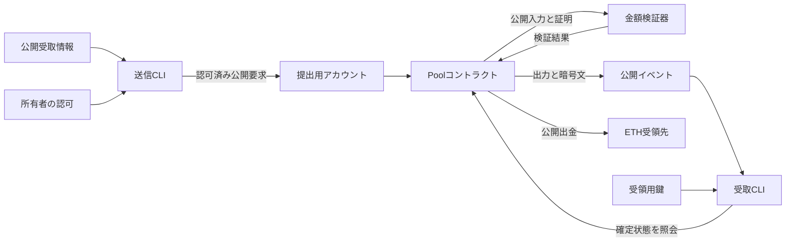

# Confidential UTXOの設計

## 目的と文書の状態

[PRD](PRD.md)、[要件定義](requirements.md)、[仕様書](specification.md)を満たす実現方法と、その選択理由を定める。
入力文書の基準コミットは `73af56202fb365cd0e9cbed65dc4de147e492a5d` とする。

本書は設計中の草案であり、並行開発に使う暫定基準である。v3検証器の実コードに対する形式検証経路は未確立で、FV-03〜FV-04の達成も、方式の最終採用も主張しない。
本書の役割は、仕様を満たす方式と構成を選ぶため、その判断根拠と実装が従う規則を示すことである。方式の妥当性を左右する問いは、一次資料、数式、既存実装、必要な最小実験で確認する。独立して進められるPoC実装は本草案を基準に別Issueで並行できるが、v3検証器やPoolとの結合は変更可能性を残し、未証明の経路を完成・要件達成として扱わない。全必須命題の形式証明、正式な性能比較、公開テストネットでの一連の検証は後続Issueの受入条件とする。

設計書を確定する条件は、採用方式と代替案の比較、仕様・全必須要件への対応、方式固有の検証関係と実装間で一致すべき詳細規則、信頼前提、採用判断に必要な実験の結果、PoCで検証する命題と受入条件を説明できることである。方式の採否を変え得る未解決事項は、推測で埋めて「採用済み」としない。実装後に初めて確かめられる性質は、対応する検証方法と失敗時の再設計条件を残して引き継ぐ。設計書の確定はPoCの要件達成を意味しない。

本書で「設計上採用」と記す場合は、上記の根拠に基づいて後続実装の基準とする判断を指す。「PoCで実証済み」や「形式証明完了」は別の状態である。実験コードは採用判断の証拠であり、そのまま本体の実装へ流用する前提にしない。
設計本文には長期的に有効な判断、規則、根拠と限界を置く。試験入力、生データ、ツールの試行履歴は`experiments/design/`に置き、本文から結論に必要な範囲を参照する。並行する形式検証とPoC実装のタスク・進捗・変更要求は別Issueで管理し、設計の前提が崩れた場合に本書の該当判断を更新する。
MW由来の構成を最初に検証する方針、Ethereum形式の所有者認可と受領用鍵の分離、資産操作への再入拒否を構成上の判断とする。
操作IDによる順不同の実行、単一UTXOの金額上限、入力数上限も以下に定める。
受領データにはHPKEを用い、所有者で検索できる出力イベントへ掲載する。
公開テストネットの受領確定はfinalizedを基準とする。
修正版Bulletproofsの限定実験では、正値shiftを含む正常例の生成とEVM検証、指定した不正例の拒否を確認した。
範囲証明には後述のv3を研究PoCの条件付き基準として選ぶ。本体との公開入力の結合と操作の符号化は設計規則として後述する。結合を含む実コードでの成立、実装言語、形式証明ツールの最終採用は未確定である。
合意した構成と検証中の候補を区別し、実コードの成立性を確認したものとは扱わない。

| 設計対象 | 現在の判断 | 残る確認と後続検証 |
| --- | --- | --- |
| 所有者認可、操作ID、金額幅・入力数、HPKE受領、finalized同期 | D-02〜D-06、D-08〜D-09の構成と[操作の結合規則](#操作の結合とabi)を基準にする | 符号化の独立実装による一致、実署名とpacketの照合は後続PoCで確認する |
| MW由来の金額証明 | EXP-08のv3を研究PoCの範囲証明基準として条件付き採用する。EXP-03のv1とEXP-07A/Bのv2は比較・検証履歴とする | 本体が計算する公開入力・収支証明との結合は設計規則を固定。代表的難所への形式検証の見通しを確認する。v3の暗号学的前提と保証の限界は後述する |
| 形式検証の経路 | EXP-05で局所命題は成立。EXP-10の直接claimの構文問題はEXP-11で修正し、現行v3 runtimeへの到達を確認した。EXP-11はメモリ不足、EXP-12は900秒の上限で未完了。EXP-13の高速バックエンドも証明完了を記録できなかった。v3実コードの命題は未証明 | [形式検証経路の採用判断](#v3実コードの形式検証経路)に従い、対象bytecodeで完了する代表命題を示すか、検証手法・実装構成を見直す |

ここで残る確認は方式の選択に必要な範囲に限る。全操作の実装、全必須命題の証明、正式測定は後続Issueの受入条件である。

## 方式選定の方針

### D-01 MW由来の構成を最初に検証する

対応要件: SEC-01〜SEC-04、PRIV-01、FV-02〜FV-04。
対応仕様: [暗号方式などを具体化する条件](specification.md#設計で具体化する事項)。

Mimblewimble（MW）で用いられるPedersen commitmentと範囲証明を基礎に、所有者認可と暗号化した受領データを組み合わせる構成から検討する。
範囲証明の最初の候補は、Grinで使用されるBulletproofsとする。
trusted setupが不要であることは、この候補の性質として評価し、方式全体の必須採用条件にはしない。

全必須要件と仕様を実現できる見通しを、設計上の採用条件とする。設計段階では方式固有の数式、一次資料と採用判断に必要な最小実験から、その見通しと残るリスクを判断する。要件への実適合は後続PoCで検証する。
候補の比較では、実装、実コードの形式証明、第三者による再現を後続で完了できる根拠を優先し、そのうえで予備的な実行費用とクライアント側の負担を比較する。操作全体の正式なgas測定はPoCの評価で行う。
言語や暗号方式だけを先に固定せず、本体と検証器を機械検証できる構成として評価する。
公開入手できるツールとCPUでの再現を基本とし、有料サービスやGPUを必須依存にしない。

### D-07 BN254を採用候補に残す

対応要件: SEC-01、PRIV-01、FV-03〜FV-04、EVAL-03。
対応仕様: [公開情報と秘密の範囲](specification.md#公開情報と秘密の範囲)、[証明義務と検証の境界](specification.md#証明義務と検証の境界)。

BN254上の金額検証を採用候補に含め、安全性の見積りと前提を明記したうえで実装と形式証明の成立性を評価する。
128 bit安全性を持つという前提で採用せず、[参照候補の安全性評価](#実装と形式証明の参照候補)に出典と適用範囲を残す。
これはBN254を調査対象から除外しない判断であり、検証器の採用や暗号学的安全性の証明を完了した判断ではない。

### 選択理由と代替案の扱い

公開グラフを許容する本体仕様では、消費するUTXOをストレージ上で直接識別できる。
そのため、金額のコミットメント、収支の検証、範囲証明を組み合わせるMW由来の構成を、要求に対応する候補として調べる。
この対応だけから、EVM上の実行費用や形式証明の容易さを結論付けない。

MWの取引構築手順を継承できるかは、非対話受領の要件に照らして判断する。
Grinの通常送金は受取人との取引作成時のやり取りを必要とするが、本体仕様は受取人停止中の送金確定を要求する。
公開グラフ、所有者認可、公開履歴からの受領を持つ本体の構成について、独立して適合を確認する。

最初の候補で成立性を確認できない場合は、難所と確認済みの根拠を示し、別の範囲証明やSNARKを含む構成を比較する。
trusted setupの有無だけで採否を決めず、追加の信頼前提、公開パラメータの検証方法、実装と証明の根拠を評価する。
必須要件を満たす候補が得られない場合は、設計を未確定とし、必要な上流変更を明示する。

### D-10 修正版Bulletproofsを先に検証する

対応要件: SEC-01、PRIV-01、FV-03〜FV-04。
対応仕様: [暗号方式などを具体化する条件](specification.md#設計で具体化する事項)。

EXP-01で見つかった正規表現、単位元、transcriptの差を修正したBulletproofs候補を、後述のEXP-03以降で先に検証した。
これはユーザーが選択した調査順序であり、修正版の安全性や本体への採用をその時点で確定した判断ではない。
生成側とEVM検証側の同じ規則への適合を確認し、未解消の暗号学的根拠と形式検証の実行可能性を設計上の採否を左右する問いとして残す。全必須命題の証明完成は後続PoCの条件とする。

### D-11 v3を研究PoCの範囲証明基準として条件付き採用する

対応要件: SEC-01、PRIV-01、FV-03。
対応仕様: [暗号方式などを具体化する条件](specification.md#設計で具体化する事項)、[証明義務と検証の境界](specification.md#証明義務と検証の境界)。

EXP-07Aの固定生成点とEXP-08のv3規則を、研究PoCで実装する範囲証明の基準として選ぶ。64 bitの正値shift、証明式、正規符号化、直接full-prefixのchallenge抽出、正規な単位元の扱いは[実験profile](../experiments/design/crypto-profile-v3/exp08/profile.json)を参照し、[採用判断](#v3の暗号学的な採用判断と限界)で根拠と条件を示す。

この判断は、異なるラベルから導出した生成点間の関係探索困難性、BN254の離散対数問題、ハッシュの理想化、秘密乱数源を前提とする。既存論文がv3の固定実装をそのまま証明したという主張や、128 bit安全性の保証ではない。Poolが実際の操作から計算した公開入力との結合と、実コードの形式検証を適用できる見通しが成立しなければ、この条件付き採用を見直す。全必須命題の完成と正式な性能評価は後続PoCの受入条件である。

## 候補構成で使う用語

所有者、受取情報、受領データ、論理操作の意味は[仕様書の用語](specification.md#用語)を継承する。
金額の秘匿と使用権限の検証、および操作の作成と提出を区別するため、次の用語を用いる。

| 用語 | 意味 |
| --- | --- |
| 金額コミットメント | 金額と秘匿用の乱数から作り、金額を平文公開せずに検証へ用いる暗号的な表現 |
| 開示情報 | コミットメントとの対応を確認するための金額と乱数。知っていること自体を所有者の使用権限とはしない |
| 範囲証明 | コミットした金額が指定した整数範囲内にあることを、金額を明かさず検証する証明 |
| 収支の検証 | 入金、送金、出金それぞれの保存式が、数学的な整数について成立することの確認 |
| 認可鍵 | 所有者が特定の論理操作の実行を認可するために使う鍵 |
| 受領用鍵 | 公開履歴に掲載された暗号化受領データを復号するために使う鍵 |
| trusted setup | 公開パラメータ生成時の秘密の適切な破棄など、生成過程への追加の信頼を必要とする初期設定 |
| 証明生成の試行 | 固定した操作内容と公開入力について、証明内部の乱数を新たに採取し、必要な証明一式を作る1回のローカル処理 |
| 証明再生成 | 操作IDを維持したまま、証明内部の乱数を更新して証明を作り直すこと。取引の提出を伴わない |
| 再提出 | 同じ論理操作を外側の取引で再び提出すること。証明再生成とは別に成功履歴と入力状態を確認する |

構成要素の関係を次に示す。
これは設計上の責務であり、全経路の実装済み状態を示すものではない。



## 合意した構成の詳細規則

### D-02 Ethereum形式の所有者認可と受領用鍵の分離

対応要件: FR-01、FR-03、FR-05〜FR-09、SEC-02、SEC-04、SEC-06。
対応仕様: [所有者と認可](specification.md#所有者と認可)、[提出と実行文脈](specification.md#トランザクションの提出と実行文脈)、[受領の保証](specification.md#受領の保証と不整合な受領データ)。

所有者をEthereum形式の公開アドレスで識別し、そのアドレスに対応する認可鍵の署名で論理操作を認可する構成を基準とする。
金額の検証と所有者認可は、それぞれ必要な検証として扱う。
同一所有者の入力を合算する場合は所有者アドレスの一致を確認し、入金では出力所有者の署名を要求する。
外側の送信者や直接の呼出し元との一致を、所有者の判定条件にしない。

受領データの復号には、認可鍵と異なる鍵を使う。
公開受取情報には所有者の識別と受領データの暗号化に必要な情報を含め、送信者が受取人の認可秘密鍵を必要としない構成にする。
送信者が作成時に知る金額と秘匿用の乱数、または受領用の復号能力だけでは、受取人の資産操作を認可できない。
公開受取情報の署名対象と暗号化方式は[D-08](#d-08-暗号化受領データと出力イベント)で具体化する。鍵の生成・保存と配布手順の実装は後続PoCで確認する。

認可対象には、入力、出力と所有者、金額への暗号的な結合、公開入出金、出金先、受領データ、対象環境、操作の再使用を識別する情報を含める。
初期版の署名形式は、secp256k1のECDSAと[EIP-712](https://eips.ethereum.org/EIPS/eip-712)による構造化データの署名を基準とする。
非公開金額を平文で署名要求へ含めず、コミットメントと検証関係を通じて結び付ける。
EIP-712自体には再使用防止が含まれないため、署名検証とは別に、成功済み操作の判定を行う。

### D-03 資産操作への再入拒否

対応要件: FR-04、SEC-01、SEC-03〜SEC-05、FV-02。
対応仕様: [失敗と外部呼出し](specification.md#失敗と外部呼出し)、[未計上ETH](specification.md#未計上eth)。

入金、送金、出金の全入口で、資産操作が実行中かを判定する共通の制御を使う。
いずれかの資産操作が実行中なら、呼び返された資産操作は状態を変更する前に拒否する。
外部の検証器や出金先を呼び出す場合も、その呼出しより前から制御を有効にし、資産操作が完了するまで解除しない。
同じEthereumトランザクション内で、完了した操作の後に別の操作を順番に実行することは再入と区別する。

資産操作を伴わないETH受領には、この拒否条件を適用しない。
出金先からの単なるETH返送は未計上ETHとして受け取り、UTXOを発行せず、出金額を受領先との純差額に読み替えない。
受領処理は資産操作や別の外部呼出しを開始しない。
正当な入金は、認可された当該入金呼出しの実受領からだけ認識する。

出金先がETH受領中に再入を試みた場合の結果は、失敗の伝播に従って判定する。

| 出金先の振る舞い | 本体の結果 |
| --- | --- |
| 再入の失敗を処理したうえでETH受領を完了 | 再入した資産操作は拒否し、外側の出金はほかの条件を満たせば成功 |
| 再入の失敗を伝播するか、ETH受領を拒否 | 当該出金の入力消費、出力生成、ETH移動、成功記録をすべて取り消す |
| ETHの一部を資産操作なしで返送し、受領を完了 | 認可した全出金額で債務を減らし、返送分は未計上ETHに対応付ける |

### D-04 操作IDによる順不同の実行と再使用防止

対応要件: FR-01、FR-09、SEC-03〜SEC-04、OPS-04。
対応仕様: [操作の再使用と競合](specification.md#操作の再使用と競合)。

各操作にランダムな32 byteの識別用値を付け、認可する操作内容と合わせて論理操作IDを計算する。
所有者単位の連番による実行順序は要求せず、互いの入力を消費しない独立した操作は順不同で提出できる。
同額の新たな入金は、識別用値を含めて別の操作として認可する。

操作IDの入力には、対象チェーンとデプロイ、所有者、操作種別、識別用値、正規化した入力列、出力列、公開入出金額、公開出金先を含める。
出力列は、出力所有者、金額コミットメント、暗号化受領データとの結合を含む。
署名と証明のバイト列、提出者、外側のトランザクションnonceは操作IDに含めない。
署名や証明を再生成したことだけでは、同じ認可済み操作の再使用を可能にしない。
認可方式や版を署名対象に含める場合も、認可表現から同じ論理操作への対応と、操作IDの同一性を維持する。
未知の認可方式や版を、別の新規操作として受理しない。

本体は成功済み操作IDを記録し、同じ操作IDの再実行を拒否する。
この記録は、入力消費、出力生成、公開資産移動と一体に確定する。
出金の外部呼出し前に一時的に記録しても、呼出しの失敗で当該操作全体が取り消される場合は記録も取り消す。
入力のない入金にも同じ規則を適用し、追加ETHを添えた成功済み入金の再提出を拒否する。

UTXOごとの未使用確認と消費は、操作IDの成功履歴とは別に管理する。
異なる操作IDで同じ入力を使おうとした場合は、先に成功した操作だけが入力を消費できる。
CLIは成功履歴の操作内容も照合し、別の競合操作による入力消費を、意図した操作の成功として表示しない。

### D-05 単一UTXOの金額上限

対応要件: FR-01〜FR-04、SEC-01、FV-03。
対応仕様: [金額と入出力数](specification.md#金額と入出力数)。

単一UTXOの金額上限を `M = 2^64 wei` とし、各UTXOの金額を `1 ≤ v ≤ M` とする。
ここで `v` はwei単位の整数である。
上限は18.446744073709551616 ETHであり、1 wei単位の精度を維持する。
入金額にも同じ上限を適用する。

64 bitの範囲証明は、`v - 1` が `0` から `2^64 - 1` の範囲にあることを表す構成を基準とする。
金額 `v` そのものは上限で65 bitを必要とするため、`uint64` へ切り詰めない。
公開金額と通常の金額計算には、少なくともこの上限と入力合計を扱える整数型を使う。
受領データには`v`を格納し、証明に使う`v - 1`は復号した`v`から計算する。[受領平文の正規符号化](#d-08-暗号化受領データと出力イベント)に従う。

### D-06 入力数と公開出金額の上限

対応要件: FR-02〜FR-04、SEC-01。
対応仕様: [金額と入出力数](specification.md#金額と入出力数)、[基本操作](specification.md#基本操作)。

送金と出金の入力数上限を `N = 2` とする。
3個以上の入力を一度に受け取る操作は、部分実行せず拒否する。
公開出金額の上限は、最大2個の入力を全額出金できる `W = N × M = 2^65 wei` とする。
この値は36.893488147419103232 ETHであり、上限の表現には66 bitを必要とする。
出金額は同時に入力合計以下でなければならず、残額を生成する場合はその金額も `M` 以下とする。

入力合計と出力合計には、単一UTXOの上限を適用しない。
例えば `M + M → M + M` は、所有者と認可などの条件を満たせば受理する。
3個以上のUTXOを整理する場合は複数操作に分けるが、合計額を `M` を超える一つのUTXOへまとめることはできない。

## 構成の採用理由

### D-02 所有者認可を金額の検証から分離する理由

受取人が取引作成に参加しなくても送信を完了できるようにしつつ、作成者が知る開示情報と使用権限を区別するために、独立した所有者署名を用いる。
Ethereum形式の認可を基準にすることで、金額コミットメントの曲線を選ぶ判断と、所有者の識別を分けて検討できる。
受領用鍵を分けることで、復号と使用認可の権限も区別できるが、受領鍵だけで何が復元できるかは暗号化方式の設計で具体化する。

専用公開鍵とSchnorr署名を使う代替案には、金額証明と曲線演算を共通化できる可能性がある。
ただし、採用する曲線と署名検証器の実装適合を合わせて確認する必要があるため、初期の基準案にはしない。
本案でも署名の解析、署名対象の生成、検証結果と実操作の対応は形式証明の対象に含める。

### D-03 再入を拒否する理由

認可された独立操作も再入中に受理する構成では、外部呼出し中の状態遷移と、入れ子になった操作の取消範囲を扱う必要がある。
本体仕様は安全な再入拒否を許容しているため、初期構成では資産操作中の再入を拒否し、証明すべき実行経路を絞る。
この選択でも、任意のETH受領先の成功と失敗、ETH返送、外側の呼出しによる取消は確認対象に残る。
Uniswap接続で必要な出金と交換の原子性は、接続側が失敗伝播を保証することによって実現する。

### D-04 操作ごとの成功履歴を使う理由

所有者の異なるUTXOから複数の操作を作成した場合、連番の未処理によって後の操作が待たされることを避けるため、操作ごとに再使用を判定する。
この構成は、入力を持たない入金にも同じ成功履歴を適用できる。
代替の所有者単位の連番は保存量を抑えられるが、実行順序の制約を導入するため採用しない。
操作IDの保存量が成功操作数とともに増える費用は、評価に含める。

### D-05とD-06 初期PoCの金額幅と入力数を絞る理由

64 bit幅の範囲証明を基準にして、1 weiの精度と研究用の入出金額を両立させる。
2入力は必須の合算シナリオを満たす最小の上限であり、入力の組合せと実行資源の確認範囲を限定できる。
これらを選んだことだけで、検証器の費用や証明可能性を確認済みとはしない。
単一UTXOで上限を超える額を扱う案や入力数を増やす案は、範囲証明、符号化、整数の保存、実行資源の再検証を伴う変更として扱う。

## 設計段階の採用判断とPoCの受入検証

方式固有の検証式や符号化は、採用候補を選んだだけでは確定しない。実装間で一致すべき規則は、採用判断の根拠と分けて具体化する。次の左列は設計判断に必要な範囲、右列は並行して着手できるものを含む後続PoCの受入検証である。設計段階の限定実験を右列の完了として数えない。

| 対象 | 設計段階で判断・固定すること | 後続PoCで検証すること | 対応する仕様と要件 |
| --- | --- | --- | --- |
| 金額の表現と検証関係 | 曲線、生成点、収支証明、範囲証明の関係と安全性の前提を整理する。正値と整数の保存を表す式を示し、採否を変え得る暗号・EVM上の難所だけを実験する | 採用経路の全正常・不正入力について実暗号の受理・拒否、保存、検証器実コードの適合を確認する | [金額と入出力数](specification.md#金額と入出力数)、SEC-01、FV-03 |
| 所有者認可 | 送信者が知る開示情報と使用権限を分離し、入力、出力、受領データ、環境、再使用の識別へ認可を結び付ける規則を定める | 本体の実署名検証と状態更新を通し、偽認可・改ざん・競合を拒否することを確認する | [所有者と認可](specification.md#所有者と認可)、SEC-02〜SEC-04、FR-09 |
| 非対話受領 | 鍵、暗号化受領データ、公開履歴、UTXO照合の構成を定め、成立を左右する未解決の境界だけを確認する | 受取人と送信者の停止を含む受領・再送金・出金、再同期と不整合の拒否を確認する | [受領の保証](specification.md#受領の保証と不整合な受領データ)、FR-05〜FR-07 |
| EVMと実行費用 | 対象EVMで必要な演算が使えること、実暗号の限定試験、資源上の明白な不成立がないことを確認する | 認可・状態更新・受領データを含む操作全体のgasと証明生成時間を反復測定する | [共通の受理条件](specification.md#共通の受理条件)、SEC-01〜SEC-05、EVAL-02 |
| 本体と検証器の形式証明 | 証明義務、信頼境界、対象ツールを定め、採否を左右する実コード上の難所を限定的に試す。タイムアウトや未判定を成功扱いしない | 本体、暗号検証器、本体固有の検証関係と共通モデルの対応について、FV-01〜FV-04の全必須命題を固定コードで再検証する | [証明義務](specification.md#証明義務と検証の境界)、FV-01〜FV-04 |

## 金額の検証関係の候補

対応要件: SEC-01、PRIV-01、FV-03。
対応仕様: [論理状態と資産保存](specification.md#論理状態と資産保存)、[金額と入出力数](specification.md#金額と入出力数)。

以下はMW由来の構成を調べるための検証関係の候補である。
具体的な曲線、生成点、証明形式、ハッシュへの入力、正規符号化を固定し、実コードとの適合を確認するまでは、採用済みの検証器の定義とはしない。

### 金額コミットメントと正値

位数が素数 `q` の加法群を使う。
`G` と `H` はこの群の生成点であり、一方を他方の何倍で表せるかを誰も知らない方法で導出する。
`r` は `0 ≤ r < q` の秘匿用の乱数、`v` はwei単位の金額とする。
スカラーと群の点の積を乗算、群の演算を加算と表記し、金額コミットメントを次で表す。

```text
C(v, r) = vH + rG
```

送金と出金で生成する出力については、`C - H` の開示値 `v - 1` に64 bitの範囲証明を適用する構成を初期版の基準とする。
これにより、範囲証明が `0 ≤ v - 1 < 2^64` を保証すれば、単一UTXOの条件 `1 ≤ v ≤ M` に対応する。
入金は、`1 ≤ d ≤ M`の公開検査と`X = dH − C_out`の知識証明で公開入金額に結び付け、独立した範囲証明を要求しない。
金額0のダミーUTXOを資産として作らず、釣銭がない場合には論理上の出力を生成しない。

### 収支差の検証

`ΣC_in` は消費する入力コミットメントの総和、`ΣC_out` は生成する出力コミットメントの総和とする。
空の総和は群の単位元である。
`d` は公開入金額、`w` は公開出金額で、該当しない操作ではそれぞれ0とする。
次の公開点 `X` を計算し、`X = xG` を満たすスカラー `x` を証明者が知ることを、対象操作に結び付けて証明する。

```text
X = ΣC_in + dH - ΣC_out - wH
```

正しい収支では、`x` は入力の秘匿用乱数の合計から出力の秘匿用乱数の合計を引いた値に対応する。
`x` 自体を公開する方式とはせず、知識の証明に必要な情報だけを公開する。
任意の群の点には何らかの離散対数が存在するため、`X = xG` の解の存在だけを保存の根拠にしない。
範囲証明と知識の証明の健全性、開示情報との対応、生成点間の離散対数が未知という仮定を組み合わせて、仕様の保存条件を導く必要がある。
この対応は、本体固有の検証関係としてFV-03の対象に含める。

この導出で`Δv = Σv_in + d − Σv_out − w`、`Δr = Σr_in − Σr_out`と置くと、受理した公開式は`X = Δv H + Δr G`である。収支の知識証明から`x`、入力の過去の受理と出力の範囲証明から対応する開示値を抽出できるという前提の下で、`Δv H = (x − Δr)G`を得る。`Δv`が群位数`q`で0でなければ、これは`G`に対する`H`の離散対数関係を与える。したがって、その関係を知らないという仮定の下で`Δv ≡ 0 (mod q)`を導く。続く整数範囲の確認で`|Δv| < q`を示して初めて`Δv = 0`へ戻す。この議論は抽出可能性と生成点の仮定に依存し、単なるEVM正常例の受理からは導けない。

入金では `X = dH - C_out` となる。
`X` の離散対数の知識から `C_out = dH + (-x)G` という開示情報との対応を導き、公開額 `1 ≤ d ≤ M` を本体で検査する構成なら、入金時の独立した範囲証明を省ける。
この構成を初期版に採用し、範囲証明を省く場合もコミットメントが正規の群の点であることと知識の証明を検証する。
既存入力に対しては、過去の受理によって正値範囲内の金額が結び付いていることを帰納的に使う。
現在の出力の範囲証明が保証する開示情報と組み合わせて保存を導くため、入金から後続使用までの対応を分断しない。

整数の保存へ戻すため、保存式の両辺が群位数 `q` 未満であることを、保存検証の成功を仮定せずに示す。
入金では両辺が `M` 以下、送金では両辺が `2M` 以下である。
出金では入力側が `2M` 以下である一方、検証前の出金額と残額の合計は最大 `W + M = 3M` になり得る。
したがって、この候補では独立した事前条件として `3M < q` を要求する。
`q` は群位数であり、点の座標を表す有限体の法とは区別する。

正常な入力でも、乱数の相殺によって `X` が群の単位元になる場合がある。
また、`v = 1` かつ `r = 0` なら `C - H` も単位元になる。
これらを、一般の署名公開鍵の検査と同じ理由で一律に拒否しない。
単位元とスカラー0を含む検証規則を証明方式ごとに固定し、不正点や非正規表現の拒否とは区別する。

収支の知識証明には、[RFC 8235の楕円曲線上のSchnorr NIZK](https://www.rfc-editor.org/rfc/rfc8235.html#section-3.3)を参照し、次の加法群版を使う。証明者は新しい一様な`k ∈ [1,q-1]`を選び`R = kG`を作る。`c`は[収支証明の正規符号化](#操作の結合とabi)で`1 ≤ c < q`へ拒否抽出する。`s = k + cx mod q`を返し、検証者は正規な`R`と`0 ≤ s < q`を検査したうえで`sG = R + cX`を確かめる。`R`は非単位元とし、`X`だけは単位元を認める。`X`が単位元なら正当な証人は公開値`x = 0`であり、この規則でも`R = sG`として検証できる。RFCの通常の公開鍵検査は単位元を除くため、この例外と操作文脈への結合は本構成固有の適応であり、RFCへの無条件の適合とは呼ばない。秘密nonceの再使用や既知の関係を持つnonceは`x`を漏らすため、操作ごとに新しく採取し、CLIの秘密入力として保護する。

### 証明と受領データを作る順序

操作IDは暗号化受領データに結び付くため、暗号文の生成に操作IDを必要とする構成は循環参照になる。
先に決まる対象チェーン、デプロイ、識別用値、出力の位置、所有者、コミットメントなどに受領暗号文を結び付け、暗号文を作成した後に操作IDを計算する構成を基準とする。
証明の生成に操作IDを使う場合も、証明のバイト列を操作IDへ含めず、生成順を一方向にする。
そのうえで、操作IDに対応する内容を所有者署名へ結び付ける。

### 範囲証明と収支証明を本体へ結び付ける順序

以下はD-04の操作IDと上記の金額検証関係を実コードへ対応させる設計規則である。符号化と検証器境界は[操作の結合とABI](#操作の結合とabi)で固定する。

1. CLIは各出力に新しい秘匿用乱数`r_i`を生成し、金額`v_i`とともに`C_i = v_i H + r_i G`を作る。受領packetの平文には整数の`v_i`と正規範囲の`r_i`を入れる。暗号化に使う`info`は操作IDが未確定でも決まるチェーン、Pool、操作種別、識別用値、出力位置、所有者、`C_i`、受領形式から作る。
2. 全packetを暗号化し、その112 byte全体のhashを各出力へ入れた後、正規符号化から`operationId`を一度だけ計算する。Poolも実際に渡されたpacketから同じhashを再計算する。証明バイト列と署名は操作IDへ入れない。出力IDは`operationId`と出力位置から計算し、packetの`info`には戻して入れない。
3. CLIは各出力について、入金を除き、`C_range_i = C_i - H`を対象に`v_i - 1`の64 bit範囲証明を作る。証明のtranscriptには本体が計算した`operationId`、出力位置、`C_range_i`が含まれる。入金の1出力は、公開`d`の範囲検査と次の収支証明で金額を固定する。
4. 本体はストレージから入力コミットメントを読み、公開`d`、`w`と要求の出力コミットメントから`X = ΣC_in + dH - ΣC_out - wH`を自分で計算する。`X = xG`の知識証明は、[固定したchallenge](#操作の結合とabi)で`operationId`と`X`に結び付ける。`X`が単位元でも`x = 0`を正当な証人として扱う。
5. 本体は`operationId`と各出力位置を再計算し、出力の正規点を検査する。各範囲証明の`coords[0:2]`が、本体で計算した`C_i - H`に座標も単位元表現も含めて一致することを確認してから、固定した検証器へ同じ`operationId`と出力位置を渡す。検証器へ渡す`C_range_i`を提出者が独立に選ぶことはできない。
6. 収支証明は本体で計算した`X`、全出力の範囲証明は本体で計算した`C_range_i`に対して成立した場合だけ、入力消費、出力生成、成功済み操作ID、ETH移動とイベントを一体に確定する。一つでも失敗した場合は操作全体をrevertする。

入金で範囲証明を省く場合も、`1 ≤ d ≤ M`、`msg.value = d`、正規な`C_out`、`X`の知識証明をすべて確認する。送金と出金では全出力に範囲証明を要求し、入力には生成時に成立した金額範囲を帰納的に使う。いずれの操作でも`3M < q`を独立に確認した設計値として維持し、群の法で一致することだけを整数の資産保存とみなさない。

採用試験では、`operationId`、packet、出力位置、保存済み入力、`C_i`、`C_range_i`、`X`を各々一箇所ずつ変更した要求を拒否する。入金の公開額境界、単位元の正当例、送金の2入力合算、全額出金、出金先での失敗と再入も含め、revert後のUTXO・操作ID・帳簿・ログの状態不変を確認する。FV-03では本体が組み立てた公開入力と検証器の実入力の一致、FV-02では検証結果から状態更新までの対応を証明対象にする。

## 実装と形式証明の参照候補

EVM向けの範囲証明の構造を確認する参照コードとして、次の固定版を調査対象とする。
これらを本体へ採用する判断や、本体の曲線をBN254へ固定する判断とは区別する。

| 参照コード | 確認できた内容 | 採用判断に残る確認 |
| --- | --- | --- |
| [BulletProofLib](https://github.com/leanderdulac/BulletProofLib/tree/b7ec38970636d47f6b6bc0db6a3df62b188a247c) | MITライセンス。Solidity `^0.4.19`、BN254。EXP-01で元コードの接続と境界の問題を確認。EXP-03の改訂候補で正値shift、単位元の正常例、正規化、累積transcriptの相互運用を確認 | 改訂transcriptと生成点の暗号学的根拠、実コードの機械検証、本体の収支・認可・受領との合成 |
| [Anonymous Zether](https://github.com/Consensys-inc-archive/anonymous-zether/tree/be12ba6336607b26f235730a0c792a00d79625b5) | Apache-2.0ライセンス。Solidity `^0.7.0`。BN254上の範囲関係と内積検証を含む公開実装 | アカウント型の先行方式と本体UTXOモデルの差分、取り出して利用する検証関係の範囲、アーカイブされた依存関係の再現 |

BulletProofLibの固定版には、再実行時に解消すべき差がある。
SolidityとTruffleの正常例は4 bitである一方、JavaのBN128テストと生成済みweb3j wrapperは16 bitを対象とする。
JavaからEVMへ送信する例は、Windows上のkeystoreの絶対パスにも依存する。
このため、公開コードが存在することを、そのまま本体の64 bit証明の再現手順が成立する根拠にはしない。

[GasUsage.js](https://github.com/leanderdulac/BulletProofLib/blob/b7ec38970636d47f6b6bc0db6a3df62b188a247c/truffle/test/GasUsage.js)は、検証関数の戻り値が偽でも、トランザクションのreceiptを取得すると成功を示すログを出す。
実験では検証結果が真であることを明示的に確認し、gas測定用の呼出しにも真を要求する処理を置く。
既存のgasログだけを検証成功の証拠として引用しない。

曲線の選定では、EVMで使える群演算、既存検証器、安全性の根拠を合わせて確認する。
BN254には上記の公開検証器があり、BLS12-381には[EIP-2537](https://eips.ethereum.org/EIPS/eip-2537)で定義される加算や多重スカラー乗算がある。
いずれについても、本構成の検証器の成立性と費用は未確認である。
曲線名や座標のbit数だけで安全性水準を判断せず、保証ごとの暗号仮定と攻撃評価を確認する。

例えば、固定版のgnark-cryptoは[BN254を推定103 bit](https://github.com/Consensys/gnark-crypto/blob/fffb11080f9fcf9be636edd955860680e37e90f3/ecc/bn254/bn254.go)、[BLS12-381を推定126 bit](https://github.com/Consensys/gnark-crypto/blob/fffb11080f9fcf9be636edd955860680e37e90f3/ecc/bls12-381/bls12-381.go)と記載している。
両者は[同じ攻撃費用の解析](https://eprint.iacr.org/2019/885)を参照する見積りであり、証明された安全性の下限ではない。
EIP-2537のBN254についての80 bitという記述とも区別し、出典の異なる値を一つの保証値へまとめない。
BN254を128 bit安全性の曲線とみなして採用することはしない。

本体と検証器の実コードへの形式検証は、Solidityから生成したEVMバイトコードをKontrol/KEVMで扱う構成を最初の実験候補とする。
[確認したKEVMの意味論](https://github.com/runtimeverification/evm-semantics/blob/d4bf484a5dfe1e38d729a30434cd6f41e3590fb2/kevm-pyk/src/kevm_pyk/kproj/evm-semantics/evm.md)には、外部呼出しの失敗に伴う状態の復元と、BN254の加算と乗算について無効点を拒否する分岐がある。
これらは必要な境界をモデルが表している根拠であり、本体の証明が完了できる証拠ではない。

実験候補の依存関係は、[Kontrolの固定版](https://github.com/runtimeverification/kontrol/tree/98fdebb7fce26b8764705a625cd2fbb01f27d6be)の[lockファイル](https://github.com/runtimeverification/kontrol/blob/98fdebb7fce26b8764705a625cd2fbb01f27d6be/flake.lock)に従う。
各ツールの最新コミットを個別に組み合わせない。

| ツール | 固定版が指定する依存 |
| --- | --- |
| Kontrol | `98fdebb7fce26b8764705a625cd2fbb01f27d6be` |
| KEVM | `v1.0.921`、`d4bf484a5dfe1e38d729a30434cd6f41e3590fb2` |
| K | `v7.1.337`、`4a46d1231473b599c699160132fd6e76a5c46406` |
| Haskell backend | `v0.1.155`、`38afc81fc9414f1e11e609b01a43a436b613bd2d` |
| LLVM backend | `v0.1.140`、`f02284f09858cd2b9f310ad0142b3e04054295ec` |

固定版にはmacOS ARM向けの[Nix定義](https://github.com/runtimeverification/kontrol/blob/98fdebb7fce26b8764705a625cd2fbb01f27d6be/nix/kontrol/default.nix)と[CI設定](https://github.com/runtimeverification/kontrol/blob/98fdebb7fce26b8764705a625cd2fbb01f27d6be/.github/workflows/test-pr.yml)があり、Dockerを必須としないローカル実行経路を検討できる。
これを、この環境でのビルド成功や必要な証明の完了と同一視しない。
コンパイラとFoundryは、NixとDockerで既定版が異なるため、実験対象のコードと合わせて版を固定する。
KEVMの既定scheduleはCANCUNであり、BLS12-381のprecompileを使う場合にはPRAGUEなど対応するscheduleを明示する。

代替ツールは、必要な実行意味を省略していないかを確認してから用いる。
例えば[調査したClearの版](https://github.com/NethermindEth/Clear/blob/6ef2e7eda01080e5d5fd7474354c1a71adab5071/Clear/PrimOps.lean#L94)では、CALLとSTATICCALLが状態を変更しない仮の実装である。
この版だけを根拠として、外部呼出しやprecompileを含む本体の適合を主張できない。
局所的な算術の証明に使う場合にも、その証明と実行経路全体の適合を結ぶ義務が残る。

## D-08 暗号化受領データと出力イベント

対応要件: FR-05〜FR-07、SEC-02、SEC-04、SEC-06、PRIV-01、OPS-04。
対応仕様: [受領の保証](specification.md#受領の保証と不整合な受領データ)、[受領と同期の状態](specification.md#受領と同期の状態)。

受領データには[RFC 9180のHPKE](https://www.rfc-editor.org/rfc/rfc9180.html)を用い、所有者で検索できる出力イベントへ掲載する構成を基準とする。
認可鍵から独立したX25519鍵を受領用鍵とする。
初期版はBase mode、DHKEM(X25519, HKDF-SHA256)、HKDF-SHA256、ChaCha20-Poly1305の組合せとする。
出力ごとに新しい乱数を用いて一度だけ暗号化するsingle-shot APIを使い、複数出力で暗号化コンテキストを使い回さない。
金額を検証する群と、受領用鍵の曲線は独立に選ぶ。

公開受取情報の論理フィールドは`(chainId,pool,owner,receivePublicKey,receiptFormat,recipientInfoVersion,signature)`とする。`receivePublicKey`はX25519の公開鍵を表す生の32 byte、`receiptFormat = 1`は本節のHPKE suiteとpacket形式、`recipientInfoVersion = 1`はこの署名対象の版を表し、初期版はこれらの値だけを受理する。対象チェーンとPoolは、後述のEIP-712 domainにも含める。

所有者は、操作認可とは異なるEIP-712のprimary type `RecipientInfo(address owner,bytes32 receivePublicKey,uint8 receiptFormat,uint8 recipientInfoVersion)`へ署名する。domainの型、`name = "Ethereum Confidential UTXO"`、`version = "1"`は[操作認可と同じ規則](#操作の結合とabi)を使い、`chainId`は対象チェーン、`verifyingContract`は対象Poolとする。`hashStruct`はこの型文字列のKeccak-256を先頭に置き、記載順の4値をEIP-712どおり各32 byteへ符号化してKeccak-256を取る。署名digestは`Keccak-256(0x1901 || domainSeparator || hashStruct(RecipientInfo))`とする。初期版の`signature`は65 byteの`r || s || v`で、`1 ≤ r < n_secp256k1`（`n_secp256k1`はsecp256k1の群位数）、`1 ≤ s ≤ floor(n_secp256k1 / 2)`、`v ∈ {27,28}`を要求する。

送信CLIは期待する`owner`、対象`chainId`と`pool`、両版、公開鍵の長さとHPKEによる受理を確かめ、署名から復元した非ゼロのアドレスが`owner`と一致した場合だけ暗号化する。公開受取情報の署名はオフチェーンで検証し、Poolへ別の署名を渡す条件にはしない。この署名だけでは受領秘密鍵の所持、現実の人物の身元、情報の鮮度を証明しない。古い署名済み鍵の再提示を失効させる仕組みは初期版に含めず、鍵を更新する受取人は新しい公開受取情報を認証済みの経路で送信者へ渡す。正常な受取情報の生成時には、CLIが保持する受領秘密鍵と公開鍵の対応を確認する。独立した符号化テストベクトルと、別チェーン・別Pool・所有者・鍵・版・署名を改変した場合の拒否は後続PoCで確認する。

平文は、金額`v`と秘匿用乱数`r`をそれぞれ32 byteの符号なしbig-endian整数として、`v || r`の順に格納する64 byteの固定長データとする。`1 ≤ v ≤ M`と`0 ≤ r < q`を復号後に検査する。
HPKEの掲載データは、32 byteのカプセル化結果と80 byteの暗号文の合計112 byteとなる。
イベントのABI、所有者、コミットメントなどの費用はこの長さに含めない。
所有者が認可する操作には、カプセル化結果を含む掲載データ全体のハッシュを結び付ける。

HPKEの `info` には、[操作IDより先に決まる結合対象](#操作の結合とabi)の正規符号化から計算した32 byteのハッシュを使う。
single-shotでのコンテキストの結合は[RFC 9180の8.1節](https://www.rfc-editor.org/rfc/rfc9180.html#section-8.1)を参照し、AEADの追加認証データは空へ固定する。
復号に必要な結合対象を、受取人が公開履歴から再構成できるようにする。

暗号化受領データは出力イベントへ掲載し、所有者を検索できる索引を付ける。
復号に成功しても、金額範囲、乱数の正規範囲、所有者、金額コミットメントとの一致、採用履歴での確定と未使用を確認するまで利用可能資産へ計上しない。
Base mode自体は送信者認証を提供しないため、当該操作の所有者認可と掲載データの結合も確認する。
悪意ある送信者が作成した不整合な受領データをすべてオンチェーンで拒否する機能は追加しない。

実装候補には、[Rustのrust-hpke](https://github.com/rozbb/rust-hpke/tree/024f006836ce2adbfc528b25e22b635065b16096)と[TypeScriptのhpke-js](https://github.com/dajiaji/hpke-js/tree/833f78d7abd37ba21764ed37ec228c3af477cbd6)がある。
採用CLIの言語に合わせて一つを選び、固定suiteのRFCテストベクトル、無効な鍵と改ざんデータの拒否、送受信プロセス停止後の受領と再使用を確認する。
受領秘密鍵が将来漏れる場合に過去の公開暗号文を保護する保証は、この構成では主張しない。

### 採用理由と代替案

所有者署名を付けた公開受取情報をオフチェーンで照合し、他者が同じ所有者名義の別の受領鍵へ差し替えることを拒否する。Poolでの受取情報登録を必須にしない一方、古い署名済み鍵の失効は保証しない。

所有者を公開する本体仕様に合わせ、所有者索引を受領データの検索にも使う。
暗号文はコントラクト呼出しの入力に加えてイベントにも含まれるため、重複掲載の費用を操作全体のgasへ含める。
暗号文を呼出し入力だけへ載せる代替案は掲載量を減らせる一方、受取側で対象取引の入力を取得・解析する処理を必要とする。
初期PoCでは、公開ログから受領に必要な情報を取得できる構成を優先する。
通常のRPCまたは利用者自身のノードから必要な履歴を取得できることを実行環境の条件とし、独自の配送サーバーを必須にしない。

## 操作とインターフェースの設計規則

対応要件: FR-01〜FR-09、SEC-01〜SEC-05、OPS-04。
対応仕様: [基本操作](specification.md#基本操作)、[共通の受理条件](specification.md#共通の受理条件)、[外部インターフェース](specification.md#外部インターフェースの意味)。

以下の符号化、受理条件、保存する状態、操作・照会・イベント・エラーのABIは、暫定設計で並行実装が従う規則として固定する。ストレージの物理スロット配置やpacking、CLIの内部配置は実装基盤の選定と区別する。
初期版の論理ABIを固定しても、コンパイル可能なPool実装の完成とは区別する。
候補の実コード確認で変更が必要になった場合は、ここに示す公開項目とその意味との適合を再確認する。

### コンポーネントの責務

| 構成要素 | 責務と境界 |
| --- | --- |
| Poolコントラクト | 所有者認可、入力の現状態、再使用、出力の形式、金額検証結果を確認し、UTXOとETH移動を一体に更新する |
| 金額検証器 | 正規形式の公開入力と証明から、各出力の正値範囲と操作の収支関係を検証する。呼出し先・コード・パラメータをデプロイ時に固定し、提出者に選ばせない |
| CLIの作成処理 | 入力選択、金額計算、乱数生成、受取情報の検査、暗号化、証明生成、認可署名を行う。秘密入力をRPCへ送らない |
| CLIの提出処理 | 認可済みの公開要求を、選択した提出用アカウントから送信する。操作内容を書き換えない |
| CLIの同期処理 | 公開ログと状態を同じ採用履歴へ合わせ、復号、整合性、所有権、使用状態を照合する。受領の成立と取引の成功を区別する |
| EthereumとRPC | 実行と採用履歴を提供する。RPCの履歴提供と回答の正しさを運用上の前提に含め、応答不能時に成功を推定しない |

金額検証器は固定した純粋な検証ライブラリ、または固定コードへの `STATICCALL` とする候補を比較する。
任意の外部コントラクトが返す成功フラグを受理する構成にはしない。
採用した検証器が正しいという仮定だけでFV-03を省略しない。

### 操作の形と公開フィールド

初期版の`kind`は入金0、送金1、出金2に固定し、それ以外を拒否する。
`owner` は認可する所有者、`inputs` はUTXO IDの列、`outputs` は順序付き出力列、`d` と `w` は公開入出金額とする。
該当しない公開金額は0、該当しない公開出金先はゼロアドレスへ固定する。
公開出金先には所有者と同一かという制約を設けず、ETH受領の成否を判定する。

| 操作 | 入力 | 出力の順序と所有者 | ETHと公開金額 |
| --- | --- | --- | --- |
| 入金 | 0個 | 出力0を `owner` のUTXOとする。必ず1個 | `msg.value = d`、`1 ≤ d ≤ M`、`w = 0` |
| 送金 | 1個または2個。全入力の所有者が `owner` | 出力0を指定受取人とする。釣銭があれば出力1を `owner` とする。自己宛てを許可 | `msg.value = d = w = 0` |
| 出金 | 1個または2個。全入力の所有者が `owner` | 全額なら0個。残額があれば出力0を `owner` とする | `msg.value = d = 0`、`1 ≤ w ≤ W`。指定した一つの宛先へ `w` を送る |

出力はすべて正の金額を表し、存在しない釣銭を金額0の出力として符号化しない。
入金と入力消費、出金と第三者向けUTXO出力を混在させない。
初期版は可変長の入出力列を使い、物理的なダミーUTXOを導入しない。
送金の受取人が `owner` と一致する場合も、出力の役割と順序を保つ。

### 識別子と正規符号化

ハッシュはKeccak-256、整数は非負の固定幅型とし、ABIの `abi.encode` による符号化を使う。
可変長データを区切りなしで連結する符号化は使わない。
公開金額は `uint256` とし、CLI内では任意精度整数で計算してから範囲を検査する。
JavaScriptの浮動小数点数を金額計算へ用いず、JSONの金額はwei単位の10進文字列とする。

`inputs` は `bytes32` の数値として厳密な昇順を要求し、同じIDの重複を拒否する。
`outputs` は前節の役割順とし、所有者が同じ場合も並べ替えない。
各出力は所有者、正規形式のコミットメント、受領形式の識別子、受領packet全体のハッシュを持つ。
未知の形式、規定外の長さ、未使用フィールドの非ゼロ値は拒否する。
群の点とスカラーの正規範囲は、下記のBN254の`p`と`q`で検査し、剰余を取って不正入力を受理する方法は使わない。

`operationId` は、固定の用途識別値、対象チェーン、Poolアドレス、`kind`、`owner`、32 byteの識別用乱数、正規入力列、正規出力列、`d`、`w`、公開出金先から[下記の式](#操作の結合とabi)で計算する。
出力IDは、別の固定用途識別値、`operationId`、0から始まる出力位置から計算する。
コミットメント単体をUTXO IDとして扱わず、同じコミットメントを持つ別の生成も区別する。
新しい出力IDが既存記録と衝突する場合は操作全体を拒否する。
衝突困難性を仮定することと、既存記録を上書きしない実装上の検査を分ける。

認可は、EIP-712のdomainでチェーンとPoolを指定し、認可方式・版、`owner`、`operationId`を含む[固定した構造](#操作の結合とabi)を署名する。
実装間の相互運用用テストベクトルは後続PoCの受入条件とする。
初期版のECDSA署名は65 byteの`r || s || v`、`v`は27または28とする。本体は`1 ≤ r < n_secp256k1`（`n_secp256k1`はsecp256k1の群位数）と`1 ≤ s ≤ floor(n_secp256k1 / 2)`を検査する。
`ecrecover` の失敗、ゼロアドレス、復元アドレスと `owner` の不一致を拒否する。
[EIP-2](https://eips.ethereum.org/EIPS/eip-2)のトランザクション署名の制限が、そのまま `ecrecover` に適用されるとは扱わない。
所有者アドレスにコードがあることだけを理由に拒否せず、採用した署名規則で認可能力を確認する。ただし初期版の認可は復元アドレスが一致するECDSA署名に限るため、その署名を作れない任意のコントラクト所有者は対象外とする。
初期版では認可方式を一つに固定し、未知の方式・版を拒否する。

### 操作の結合とABI

対応要件: SEC-01〜SEC-04、FR-01〜FR-05、FV-02〜FV-03。対応仕様: [認可対象](specification.md#認可対象)、[資産保存](specification.md#論理状態と資産保存)、[受領の保証](specification.md#受領の保証と不整合な受領データ)。以下は初期研究PoCに採用する設計上の符号化と検証器境界であり、実コードの全経路が適合したという実証ではない。[Solidity ABI](https://docs.soliditylang.org/en/latest/abi-spec.html)の`abi.encode`を使い、型、引数順、配列の長さと順序を含む符号化全体をhashする。`abi.encodePacked`は使わない。以下の`K`はKeccak-256、`tag(s)`はUTF-8文字列`s`のバイト列に対する`K`である。すべてのtagは`bytes32`、`chainId`と位置は`uint256`、識別用乱数は`bytes32`として符号化する。

`kind`は入金0、送金1、出金2の`uint8`に固定する。`receiptFormat`は初期版HPKE packetを表す`uint8(1)`だけを受理する。packetは`enc`32 byteとAEAD暗号文80 byteをこの順に連結した112 byteとし、Poolは提出された実バイト列の長さを検査する。`packetHash_i = K(packet_i)`であり、独立した申告値を信用しない。各出力の`C_i`は正規なBN254 G1座標`(Cx_i,Cy_i)`である。基礎体の法は`p = 21888242871839275222246405745257275088696311157297823662689037894645226208583`、群位数は`q = 21888242871839275222246405745257275088548364400416034343698204186575808495617`とする。`C_i`の単位元は、値の正値性を別に証明できる場合のみ許す。

```text
INFO_TAG      = tag("ecu/hpke-info/v1")
OUTPUT_TAG    = tag("ecu/output/v1")
INPUTS_TAG    = tag("ecu/inputs/v1")
OUTPUTS_TAG   = tag("ecu/outputs/v1")
OP_TAG        = tag("ecu/operation/v1")
OUTPUT_ID_TAG = tag("ecu/output-id/v1")
BALANCE_TAG   = tag("ecu/balance-schnorr/bn254/v1")

info_i = K(abi.encode(INFO_TAG, uint256(chainId), address(pool), uint8(kind),
                      bytes32(salt), uint256(i), address(outputOwner_i),
                      uint256(Cx_i), uint256(Cy_i), uint8(receiptFormat_i)))
inputIdsHash = K(abi.encode(INPUTS_TAG, bytes32[] inputIds))
outputHash_i = K(abi.encode(OUTPUT_TAG, uint256(i), address(outputOwner_i),
                            uint256(Cx_i), uint256(Cy_i), uint8(receiptFormat_i),
                            bytes32(packetHash_i)))
outputsHash = K(abi.encode(OUTPUTS_TAG, bytes32[] outputHashes))
operationId = K(abi.encode(OP_TAG, uint256(chainId), address(pool), uint8(kind),
                           address(owner), bytes32(salt), bytes32(inputIdsHash),
                           bytes32(outputsHash), uint256(d), uint256(w),
                           address(destination)))
outputId_i = K(abi.encode(OUTPUT_ID_TAG, bytes32(operationId), uint256(i)))
```

`chainId`はPoolが`block.chainid`から、`pool`は`address(this)`から取得する。CLIも対象デプロイの値で同じバイト列を作る。`inputIds`は厳密な昇順、`outputHashes`は役割順で、空配列も`abi.encode`の配列長を含めてhashする。`salt`はCLIが操作ごとに新しい32 byteを生成する。Poolは乱数性を判定せず、同じ`operationId`の成功履歴と出力ID衝突を拒否する。証明、署名、提出者、外側のトランザクションnonceはこの式に含めない。`info_i`にはpacketHash、operationId、outputIdを含めないため、`C_i → info_i → packet_i → operationId → 証明・署名`の生成順に循環がない。イベントにはhashしたものと**同じpacketの全バイト列**を掲載し、受取人は公開イベントと操作contextから`info_i`を再構成する。

収支証明の公開値は、Poolが保存済み入力のコミットメントを読んで`X = ΣC_in + dH − ΣC_out − wH`と計算する。`G`と`H`は[EXP-08の固定パラメータ](../experiments/design/crypto-profile-v3/exp08/profile.json)のblindingBaseとvalueBaseであり、`PARAMETERS_HASH_V3 = 0x0bfd116b8ef31332d31d3350ed24fa36d1e17865a7c1dc0758331da0755f8dae`に固定する。`X`は提出者から独立に受け取らない。証明は`(uint256 Rx,uint256 Ry,uint256 s)`の3 wordで、`R`は正規な非単位元、`0 ≤ s < q`とする。`X`の正規な単位元表現は`(0,0)`だけとする。`c`は次の最初の受理候補とし、256候補がすべて失敗したら操作を拒否する。

```text
for counter = 0..255:
  candidate = uint256(K(abi.encode(BALANCE_TAG, uint256(chainId), address(pool),
                                   bytes32(PARAMETERS_HASH_V3), bytes32(operationId),
                                   uint256(Gx), uint256(Gy), uint256(Xx), uint256(Xy),
                                   uint256(Rx), uint256(Ry), uint256(counter))))
  if 1 <= candidate < q: c = candidate; break
verify sG = R + cX
```

`candidate`を`q`で剰余にして受理しない。EVMの曲線precompileが短い入力を補完し長い入力の余剰を無視する仕様と、証明ABIの正規性を混同しない。[EIP-196](https://eips.ethereum.org/EIPS/eip-196#encoding)に従う点表現を使い、Poolと検証器は各座標が基礎体の法未満で曲線上にあること、必要な点だけ非単位元であること、scalarが群位数未満であることを確認する。可変長証明入力は指定語数へ厳密に一致させる。

v3範囲証明の固定境界は、[EXP-08の検証器ABI](../experiments/design/crypto-profile-v3/exp08/profile.json)と同じ`verify(bytes32 operationId,uint256 outputIndex,uint256[10] coords,uint256[5] scalars,uint256[] ls,uint256[] rs)`とする。`coords`は`C_range,A,S,T1,T2`のx,yを順に並べ、`scalars`は`tauX,mu,t,a,b`、`ls`と`rs`はそれぞれ6点のxを先に、yを後に並べた12 wordとする。送金・出金では各出力に1件、入金では0件を要求する。Poolは`C_range_i = C_i − H`を計算し、`coords[0:2]`と正規な単位元表現も含め完全一致させ、Pool自身の`operationId`と`i`を固定したv3検証器へ渡す。検証器の版とパラメータhashはデプロイ時に固定し、別の検証器へ差し替えられる経路を置かない。収支証明は全操作に1件要求する。

Poolの外部要求の論理ABIは`OperationRequest(uint8 kind,address owner,bytes32 salt,bytes32[] inputIds,Output[] outputs,uint256 d,uint256 w,address destination)`、`Output(address owner,uint256 Cx,uint256 Cy,uint8 receiptFormat,bytes packet)`、`BalanceProof(uint256 Rx,uint256 Ry,uint256 s)`、`RangeProofV3(uint256[10] coords,uint256[5] scalars,uint256[] ls,uint256[] rs)`、認可署名`bytes`とする。`deposit(request,balanceProof,signature)`はrange proofを受け取らず、`transfer(request,balanceProof,rangeProofs,signature)`と`withdraw(request,balanceProof,rangeProofs,signature)`では`rangeProofs.length == outputs.length`を要求する。各入口は`kind`と入出力数、公開額、`msg.value`の表に合わない要求を拒否する。この論理ABIを実装時のSolidity関数宣言へ翻訳しても、型・順序・長さ・結合規則を変えない。

認可のEIP-712 domainは`EIP712Domain(string name,string version,uint256 chainId,address verifyingContract)`、`name = "Ethereum Confidential UTXO"`、`version = "1"`、`chainId = block.chainid`、`verifyingContract = address(this)`とする。署名対象の型文字列は`OperationAuthorization(bytes32 operationId,address owner,uint8 authScheme,uint8 authVersion)`、値はPool計算の`operationId`、要求の`owner`、`authScheme = 1`（ECDSA）、`authVersion = 1`である。署名digestは[EIP-712](https://eips.ethereum.org/EIPS/eip-712)の`K(0x1901 || domainSeparator || hashStruct(OperationAuthorization))`で計算する。成功履歴は認可方式・版を含まない`operationId`だけで管理し、後続版を導入しても同じ論理操作を再使用できない。提出者はdigestや`operationId`を別の入力として指定できない。

Poolは実packet、保存済み入力、要求の正規出力から上記の値を再計算し、署名、収支証明、全範囲証明を受理した後にだけ状態を変更する。全確認を通る前に外部ETH送付を行わず、成功済みID、UTXO状態、帳簿更新とイベント・ETH送付はrevert時に一体で取り消す。形式検証では、Poolで計算した各公開値が実際の署名digestと検証器の引数へ渡ること、検証失敗時に状態が変わらないことを対象にする。今回の結合関係は既存のv3 profile、ABI規則、収支の式から設計できるため、設計段階でPoolの全操作を実装する追加実験は行わない。独立した符号化テストベクトル、署名・証明を組み合わせた正常・改変試験、実コードの対応証明は後続PoCで確認する。

### ストレージと処理順序

対応要件: SEC-01、SEC-03〜SEC-05、FV-02。対応仕様: [論理状態と資産保存](specification.md#論理状態と資産保存)、[操作の再使用と競合](specification.md#操作の再使用と競合)。

初期版の保存状態を次の型で固定する。以下はSolidity表記によるデータ定義であり、コンパイラ版や物理スロット番号を指定するものではない。

```solidity
struct UtxoRecord {
    address owner;
    uint256 Cx;
    uint256 Cy;
    uint8 status;
}

mapping(bytes32 => UtxoRecord) utxos;
mapping(bytes32 => bool) executedOperations;
uint256 accountedLiability;
bool operationInProgress;
```

`utxos`のキーはUTXO ID、`executedOperations`のキーは操作IDとする。`status`は`0 = Absent`（不存在）、`1 = Unspent`（未使用）、`2 = Spent`（消費済み）に固定し、ほかの値を保存しない。初期状態は全記録が既定値で、成功履歴は`false`、帳簿残高は0、再入制御は`false`とする。デプロイ時点でETH残高があれば、全額を未計上ETHとする。

生成時は`Absent`だけを`Unspent`へ変え、所有者と正規なコミットメント座標を保存する。消費時は`Unspent`だけを`Spent`へ変え、所有者と座標は保持する。生成後の所有者・座標は変更せず、記録の削除、`Spent`からの再発行や未使用への復帰を行わない。不存在は`status`で判定し、所有者や座標のゼロ値だけで判定しない。`Absent`の他フィールドはすべてゼロとする。

仕様の生成済み集合`U`には`Unspent`と`Spent`、消費済み集合`S`には`Spent`を対応付ける。成功履歴は資産効果と一体で`false`から`true`へ変え、明示的に消去しない。revertによる取消と、チェーン再編成による履歴の取消は、この採用履歴内の遷移とは区別する。`operationInProgress`は[D-03](#d-03-資産操作への再入拒否)に従い、資産入口から完了まで`true`とする。

暗号化受領packetはイベントに掲載し、ストレージへ同じ全データを重複保存しない。消費した操作との対応も`InputConsumed`から取得する。mapping自体の全件列挙機能は設けず、公開履歴で発見したIDを照会する。

初期版は公開入金累計から公開出金累計を差し引く帳簿残高を`accountedLiability`として保持する。
これは個々の秘匿金額を平文で保存するものではない。
未使用UTXO総額と一致することを資産保存から示し、読取時の未計上ETHを `address(this).balance - accountedLiability` と対応付ける。
加減算はあふれと不足を拒否し、未計上ETHを引き出す管理用操作を設けない。

資産操作の処理は、次の順序を基準とする。

1. 共通の再入制御を有効にし、形式、操作の形、当該呼出しの `msg.value` を検査する。
2. 操作ID、出力ID、認可対象を組み立て、成功済み操作、入力の存在・未使用・所有者、出力ID同士と既存記録との衝突を検査する。
3. 本体で所有者署名を検証し、実際に使う入出力と公開金額を金額検証器へ渡す。偽の返値、検証器の失敗、異常な戻り値を拒否する。
4. 全入力を消費し、全出力を生成し、成功済み操作IDと帳簿残高を更新する。
5. 出金では指定先へ空のcalldataを伴うETHの `CALL` を行い、失敗なら操作全体をrevertする。受領先の戻りデータ全体を無制限にコピーしない。
6. 入力消費、出力生成、操作成功のイベントを発行し、再入制御を解除する。

資産操作には `delegatecall` による同一 `msg.value` の再利用経路を設けない。
複数入金をまとめる外側のコントラクトは、それぞれの呼出しへ個別のETHを送る必要がある。
通常の `receive` はETH受領だけを行い、UTXOと帳簿残高を増やさない。
出金先がPool自身の場合も、通常受領の分類に従い、返ったETHは未計上ETHとして残る。

一つの資産操作がrevertすれば、その呼出し内のストレージ、ETH移動、ログも取り消される。
外側のframeが後にrevertした場合も、その配下の成功済み操作を含めて取り消される。
外側が個別操作の失敗を処理した場合、別の成功した操作まで自動で取り消されるとは扱わない。
この境界を、外部交換を含む一連の操作の原子性と区別する。

### 公開インターフェースとエラー

初期版の資産入口は`deposit`、`transfer`、`withdraw`に分け、各入口に操作内容、認可署名、必要な金額証明を渡す。[論理ABI](#操作の結合とabi)に従う。
入金だけをpayableとし、送金と出金へのETH添付を拒否する。
本体の外に永続的な「認可検証済み」チケットを作らず、各入口で実行時の認可と状態を再確認する。
事前の `eth_call` 成功を、後の取引が成功する保証にしない。

対応要件: FR-06〜FR-07、SEC-03〜SEC-06、OPS-04。対応仕様: [外部インターフェース](specification.md#外部インターフェースの意味)、[受領と同期](specification.md#受領と同期の状態)。

#### イベントと照会のABI

イベントはすべて非anonymousとし、[Solidity ABIのイベント符号化](https://docs.soliditylang.org/en/latest/abi-spec.html#events)に従う。次の宣言の型・順序・`indexed`位置を固定する。イベントはPool自身が発行し、CLIは対象チェーンとPoolのアドレスを照合する。

```solidity
event OperationSucceeded(
    bytes32 indexed operationId,
    uint8 kind,
    address indexed owner,
    bytes32[] inputIds,
    bytes32[] outputIds,
    uint256 d,
    uint256 w,
    address destination,
    bytes32 salt
);

event OutputCreated(
    address indexed owner,
    bytes32 indexed utxoId,
    bytes32 indexed operationId,
    uint256 outputIndex,
    uint256 Cx,
    uint256 Cy,
    uint8 receiptFormat,
    bytes packet
);

event InputConsumed(
    bytes32 indexed inputId,
    bytes32 indexed operationId
);

function getUtxo(bytes32 utxoId) external view
    returns (uint8 status, address owner, uint256 Cx, uint256 Cy);
function isOperationExecuted(bytes32 operationId) external view
    returns (bool executed);
function getAccounting() external view
    returns (uint256 actualBalance, uint256 accountedLiability, uint256 unaccountedEth);
```

成功した操作は、入力の厳密昇順で`InputConsumed`を入力ごとに1件、出力位置の昇順で`OutputCreated`を出力ごとに1件、最後に`OperationSucceeded`を1件発行する。入力・出力のない側にはイベントを作らない。`outputIds`は出力の役割順とし、`outputIndex`、コミットメント、packetは実際に受理した要求と一致させる。単なるETH受領ではこれらを発行しない。後に外側frameがrevertすれば、各イベントも取り消される。

CLIは同じ操作IDの成功イベントと全出力イベントから、入力列、出力列、所有者、`kind`、`d`、`w`、`destination`、`salt`を復元し、packetの実バイト列から操作IDを再計算する。出力ID列との対応と、入力消費イベントの個数・IDも照合する。チェーンとPoolは取得対象から定まり、HPKEの`info`も再構成できる。ログが欠ける場合、単独の出力イベントだけで同期完了とはしない。

`getUtxo`は`utxos`の記録を上記の戻り値順で返す。不存在は`(0,address(0),0,0)`、消費済みは`status = 2`と保持した所有者・座標を返す。`isOperationExecuted`は当該照会点の成功履歴だけを返し、未提出と未確定の区別には使わない。`getAccounting`は実残高、帳簿残高、その差を返す。実残高が帳簿残高を下回る場合は`AccountingInvariantViolation()`で拒否し、差を0へ丸めない。外部呼出し中の照会結果は中間状態を表し得るため、CLIの確定判定には同じ確定ブロックを指定した照会を使う。

#### 拒否理由のABI

Poolが判別した拒否理由は、以下の[ABIエラー形式](https://docs.soliditylang.org/en/latest/abi-spec.html#errors)で返す。名前と引数型から得るselector、および記載順の引数を固定する。引数は公開値に限り、秘密金額、開示用乱数、秘密鍵や復号結果を含めない。

| エラー宣言 | 対応する拒否条件 |
| --- | --- |
| `InvalidRequest()` | 操作種別・個数・出力所有者の役割・入力順序・未使用フィールド・受領形式やpacket長が不正。出力コミットメントが非正規または曲線外。証明件数が不一致 |
| `PublicAmountOutOfRange()` | 公開入金額または公開出金額が当該操作の範囲外 |
| `MsgValueMismatch(uint256 expected, uint256 actual)` | 処理へ到達した入金要求の`d`と実際の`msg.value`が不一致 |
| `ReentrantOperation()` | 資産操作中に別の資産入口へ再入 |
| `InputNotFound(bytes32 inputId)` | 指定した入力が不存在 |
| `InputAlreadySpent(bytes32 inputId)` | 指定した入力が消費済み |
| `DuplicateInput(bytes32 inputId)` | 同じ入力IDの重複を検出 |
| `InputOwnerMismatch(bytes32 inputId)` | 入力の所有者が要求の認可所有者と不一致 |
| `OperationAlreadyExecuted(bytes32 operationId)` | 同じ論理操作が成功済み |
| `OutputIdCollision(bytes32 outputId)` | 生成するIDが既存記録または同じ操作の別出力と衝突 |
| `InvalidAuthorization()` | 署名の形式・正規範囲・復元結果が認可規則を満たさない |
| `InvalidBalanceProof()` | 収支証明の解析・正規性・公開入力との結合・検証が不成立 |
| `InvalidRangeProof(uint256 outputIndex)` | 指定出力の範囲証明の解析・正規性・公開入力との結合・検証が不成立 |
| `WithdrawalFailed(address destination, uint256 amount)` | 指定先へのETH送付が失敗 |
| `AccountingInvariantViolation()` | 帳簿残高の加減算で不足・あふれを検出、または会計照会で実残高が帳簿残高を下回る |

金額検証器のfalse、revert、異常な戻り値、precompileの失敗は、Poolが結果を処理できる場合に対応する証明エラーへ正規化する。出金先や検証器の任意のrevertデータをPool自身のエラーとしてそのまま伝播しない。金額検証の内部で、どの等式や秘密値が原因かを公開エラーで約束しない。

不正な外側ABI、未知のselector、nonpayable入口へのETH添付、実行資源不足など、Poolの理由判定へ到達しない失敗では、このエラー形式を保証しない。複数条件が不正な場合の優先順位も固定しない。CLIはエラーの欠落や未知のデータを成功と扱わず、RPC通信失敗と実行の失敗を区別する。エラーバイト列だけでは発生元や確定履歴上の成否は証明されないため、[取引と受領の状態表示](#取引と受領の状態表示)に従って照合する。revertで消えるログを失敗記録として当てにしない。

#### 保存状態と公開ABIの採用理由

初期PoCでは、消費済みUTXOも所有者とコミットメントを保持し、照会と仕様モデルの対応を単純にする。消費時に詳細を削除する代替案は保存量を減らせるが、過去の記録の照合が公開履歴へ依存する。物理スロットの最適化は、上記の観測結果と遷移を保つ範囲で評価する。

イベントを操作成功・出力生成・入力消費に分けることで、所有者による発見、UTXOごとの消費追跡、操作全体の再構成をそれぞれ索引で行える。入力・出力IDなどを重複して掲載する費用は操作全体のgasへ含める。単一イベントへ集約する案との費用差は、初期版の受領・同期規則を変更せず評価する。

拒否理由を識別可能にすることで、CLIは入力の取り違え、競合、認可失敗などを説明できる。全失敗を一つにまとめる案より公開ABIは増えるが、秘密値や暗号検証内部の診断を公開しない境界を固定できる。

後続PoCでは、イベントと照会・エラーの独立した符号化ベクトル、全出力を含む操作IDの再構成、不存在から生成・消費までの照会、消費済み記録の保持、revert後の状態とログの取消を確認する。FV-02ではこの保存状態を仕様の`U`・`S`・成功履歴`H`・債務`L`へ対応付ける。ABIの固定はこれらの試験・証明の完了を意味しない。

### 提出者とCLIの処理

初期の提出経路は、所有者署名を含む要求を通常のEthereum取引でPoolへ送る構成を基準とする。
この直接経路では提出用アカウントが外側の送信者、直接の呼出し元、gas支払者に対応するが、所有者との一致は要求しない。
中継コントラクトから呼び出す場合も、所有者は検証した署名から決まり、`msg.sender` や `tx.origin` から決めない。
入金の資金とgasは公開ETHから支払い、UTXOやPoolの裏付けからgasを控除しない。

CLIは、鍵生成、受取情報の提示、同期、残高表示、操作の作成、提出、操作状態の照会を分ける案とする。
秘密を含む作成入力はローカルファイルまたは端末から読み込み、コマンドライン引数や通常ログへ秘密鍵と開示情報を出さない。
公開要求のファイルにはコミットメント、暗号文、証明、署名だけを出力し、金額・乱数の秘密入力を別フィールドとして残さない。
自己入金や研究用の既知金額など、元から公開する値と本人だけに示す金額を区別する。
再使用に必要な情報は保持鍵と公開履歴から復元できるようにし、送信者のローカル保存へ依存しない。

### 証明生成の中断と再生成

対応要件: FR-01〜FR-04、SEC-04、SEC-06、OPS-01、OPS-04。対応仕様: [共通の受理条件](specification.md#共通の受理条件)、[操作の再使用と競合](specification.md#操作の再使用と競合)、[受領と同期の状態](specification.md#受領と同期の状態)。

初期PoCのCLIは、1回の明示的な生成要求につき必要な証明一式を1回試行し、自動では再試行しない。v3の各challengeと秘密scalarの採取は、固定profileの最大256候補を維持する。収支証明のchallengeも[既定の抽出規則](#操作の結合とabi)を維持し、再生成のために上限や受理範囲を変えない。正規な内部単位元を理由に範囲証明を生成し直す処理は加えない。

候補が枯渇した場合は証明一式の生成を中断し、途中の結果を提出可能な要求として出力しない。CLIは「ローカルでの証明生成中断」と、候補枯渇の種別・公開してよい段階名を表示する。この試行は取引を提出せず、オンチェーンで拒否された試行として記録しない。同じ操作の過去の提出が存在し得るため、ローカル中断だけから論理操作が未実行だとも判断しない。

利用者が明示的に再実行した場合、同じチェーン・Pool・操作種別・所有者・入力列・出力列・公開額・出金先・`salt`・packetを保持し、範囲証明と収支証明の内部乱数をすべて新たに採取して証明一式を作り直す。出力コミットメントの開示用乱数と証明内部の乱数は別物であり、前者を再生成しない。これにより操作IDと出力IDは変わらず、既に作成済みの当該所有者署名も再利用できる。

証明再生成に必要な入力・出力の開示情報と公開要求は、秘密を扱うローカル作成データとして保持する。公開要求ファイルや診断ログへ秘密を付加しない。このローカルデータが失われた場合、保持鍵と履歴などから同一の内容を復元できない限り「同じ操作の証明再生成」とは扱わない。受取人の通常受領は引き続き、送信者のローカルデータを必要としない。

範囲証明の新しい内部乱数から、最初のchallengeの入力となる`A`・`S`を新たに生成し、後続段階にもprefixを通じて反映する。収支証明では新しいnonceから`R`を作る。同じ失敗候補列を固定して繰り返すことを避ける構成だが、有限回の再実行が必ず成功する保証は置かない。検出できた乱数源のエラー、不正な秘密入力、実装エラーは候補枯渇と区別し、原因を解消するまで再生成を進めない。

packetの再暗号化、出力コミットメントや`salt`の変更は別の操作IDになるため、証明再生成の一部として自動で行わない。変更する場合は新しい操作の作成・認可として扱う。初回提出・再提出のいずれも、生成成功とは別に[操作の成功履歴と入力の最新状態](#再編成と再提出)を確認し、成功済み・競合・確認不能の規則に従う。

候補枯渇は、有効な証明を付けた要求のオンチェーン受理条件と区別する。CLIで中断を明示することにより、正常な要求を拒否してよいという仕様変更や、暗号方式の完全性保証の追加を行うものではない。

#### 証明再生成の採用理由と検証

初期PoCは中断を観測可能にし、乱数源や実装の問題を無制限の自動再試行で隠さない構成を選ぶ。回数を限った自動再試行も可能だが、初期版では試行ごとの結果と資源使用を明示して診断できることを優先する。既存の実験profileの1回試行と、利用者による別の生成要求を区別して測定する。

後続CLIテストでは、候補枯渇・乱数源エラーを試験用の入力源で発生させ、部分要求を提出しないこと、明示的な再生成で操作ID・packet・署名対象を保つこと、過去の提出結果を上書きしないことを確認する。正常経路では実暗号で再生成した証明を検証する。異常経路の注入試験を、暗号学的安全性や自然な枯渇確率の実測の証拠とはしない。

## D-09 確定条件と同期

対応要件: FR-05〜FR-07、SEC-03、OPS-04。
対応仕様: [受領と同期の状態](specification.md#受領と同期の状態)。

公開テストネットでは、Ethereumの `finalized` として取得したブロックまでを確定した履歴とする。
その`finalized`ブロックまでに含まれる出力だけを、受領の整合性と未使用を照合したうえで利用可能にする。それより新しい出力は未確定として表示する。
確定状態を取得できないRPCでは確認不能とし、任意の確認ブロック数へ自動で切り替えない。
ローカル実験で即時確定を模擬する場合は、公開ネットワークの合意による確定と区別して設定を記録する。

### 同期手順

1. 対象チェーン、Poolアドレス、デプロイブロック、検証器とパラメータの識別を設定と照合する。
2. `finalized` のヘッダーから高さとハッシュを取得し、そのブロックを今回の照合点とする。
3. デプロイ地点から照合点まで、所有者に対応する出力ログと、その操作内容を取得する。操作IDを再構成するため、発見した出力を作った操作の全出力とpacketも取得する。各ログのブロック・取引・ログ位置を保存する。
4. 出力の操作IDとUTXO IDを再構成し、公開contextからHPKEを復号する。所有者、金額範囲、乱数の正規範囲、コミットメントの一致を確認する。
5. 同じ照合点の `getUtxo` と成功済み操作の状態を読み、出力の存在と未使用を確認する。消費済みなら、消費した操作も公開履歴から照合する。
6. 同期結果をUTXO IDごとの状態として保存し、受領成立・未使用の金額を合計する。既存残高へ取得額を単純加算しない。

状態照会には、[EIP-1898](https://eips.ethereum.org/EIPS/eip-1898)のblock hash指定と `requireCanonical` を使う経路を基準とする。
ログ取得では取得範囲を分割し、ヘッダーとログの対応を確認する。
履歴が途中で欠ける場合や必要な状態を読めない場合、その区間の同期完了を主張しない。
完全性を保証しない第三者RPCの回答に依存する場合はその前提を記録し、利用者自身のノードを使える構成にする。
履歴データへの永続的なアクセスを、イベントに記録することだけで保証したとは扱わない。

### 取引と受領の状態表示

| CLIの状態 | 判定と残高への反映 |
| --- | --- |
| 未確定 | 提出中または確定前。出力を利用可能へ加えない |
| 確定した成功 | 当該操作の成功イベントと成功記録を採用履歴上で確認。復号と未使用の確認は別に行う |
| 確定した試行の失敗 | 当該試行が失敗した根拠を確定履歴で確認。同じ操作の別試行の成功は別途調べる |
| 受領成立・未使用 | 確定、復号、金額と所有者の整合、未使用を確認。UTXO単位で一度だけ計上 |
| 消費済み | 照合点で消費を確認。残高に含めない |
| 復号不能・不整合 | データの対応が成立しない。残高へ含めず、オンチェーン債務を未計上ETHへ振り替えない |
| 確認不能 | 必要な履歴・状態・確定根拠を取得できない。過去の結果を表示する場合は、照合点と未更新であることを併記 |

外側の取引receiptが成功していても、内部呼出しの対象操作が成功したとは限らない。
成功イベントと操作IDの履歴が見つからず、失敗の根拠も得られない内部試行は確認不能とする。
直接呼出しのreceiptの失敗や、別途取得した実行記録による内部呼出しの失敗と区別する。

### 再編成と再提出

保存したヘッダーハッシュと採用履歴の不一致を検出した場合、該当履歴に基づく利用可能判定を取り下げる。
初期PoCでは、デプロイ地点から採用履歴を再取得して全状態を作り直せる構成を基準とし、差分同期はその結果と一致する最適化として扱う。
取り消された生成と消費を両方見直し、同じ高さの別ブロックを同一履歴と扱わない。
finalizedと扱った履歴に不一致が生じた場合も、古い残高を使い続けず確認不能として再検証する。

再提出の前に操作IDの成功履歴を調べ、成功済みなら提出者や取引ハッシュが異なっていても同じ操作の成功と認識する。
未成功なら各入力の最新状態も照合し、別操作が消費していた場合は競合として示す。
確認不能の間は、未実行だと仮定した新しい操作を自動生成しない。
入金も、同額かどうかではなく操作IDで再使用と新しい認可を区別する。
外側のnonceと取引の置換、論理操作の成功、UTXOの消費を別々に記録する。

### 採用理由

任意の確認ブロック数を使う代替案は待ち時間を減らせるが、設定した回数と再編成リスクの関係を別に説明する必要がある。
研究PoCでは待ち時間よりも、利用可能と判断した根拠を追跡できることを優先し、finalizedを基準にする。
この選択はRPCの正しさや履歴の可用性まで保証するものではなく、それらは別の実行前提として残る。

## 機密性と評価の構成案

対応要件: SEC-06、PRIV-01〜PRIV-03、EVAL-01〜EVAL-04。
対応仕様: [公開情報と秘密の範囲](specification.md#公開情報と秘密の範囲)、[推論シナリオ](specification.md#推論シナリオ)。

### 公開される情報

公開対象は、入力と出力の対応、所有者、操作種別、操作IDとUTXO ID、公開入出金額と出金先、コミットメント、署名、証明、受領暗号文、提出者、時刻やブロック位置、取引データ長、gasとする。
所有者で検索できるイベントによって、同じ所有者の出力をまとめて観測できることも評価へ含める。
秘匿対象は、公開額として現れない個別金額、コミットメントの乱数、認可秘密鍵、受領秘密鍵とする。
以前の送信者は自分が作成した出力の金額と乱数を知るため、一般の観測者と同じ情報量とは扱わない。

Pedersen commitmentの秘匿、範囲証明と収支証明のゼロ知識性、HPKEの暗号文の秘匿、所有者署名の偽造困難性を別々の仮定として示す。
金額を暗号化したことから、公開グラフの収支による推論まで防げるとは結論付けない。
固定幅の金額表現と暗号文は長さからの漏えいを限定するが、実calldata、分岐、gas、署名と証明の生成処理も評価対象に残す。

### 収支からの推論例

所有者Aが10 weiを入金し、そのUTXO一つからB向けの金額 `a` とA向け釣銭 `b` を生成する。
公開収支と正値条件から `a + b = 10`、`1 ≤ a,b ≤ M` が分かる。
一般の観測者には収支上、`(a,b) = (1,9), …, (9,1)` の9候補が残る。
AとBは送受領で知る情報があるため、この候補数をそのまま適用しない。

後にBがこの出力だけを入力として、残額なしで3 weiを公開出金した場合、過去の送金額は `a = 3`、釣銭は `b = 7` と分かる。
全額移転で額を追跡できる例、合算した入力の一部が既知の例も、仕様の必須推論シナリオに沿って用意する。
この例は収支の推論であり、同じコミットメントに複数の正しい開示値を提示できるという意味ではない。
採用方式の全公開情報が追加の識別手段を与えないことは、一次資料の仮定と実装・公開データの確認を合わせて評価する。

### 比較対象の固定候補

第一候補は、[EIP-8182の固定版](https://github.com/ethereum/EIPs/blob/59454e9b9f577c8b9ed1246714f44990711e5751/EIPS/eip-8182.md)と、[公開参照実装の固定版](https://github.com/0xFacet/eip-8182-reference-implementation/tree/639baaf7b29c22eb43ba6150140902ea8dbbbc46)とする。
比較経路の候補は、参照実装ルートのGroth16 pool証明とUltraHonkによるECDSA認可の組合せである。
`build_pool.sh`、`build_honk_session.js`、`TransactHonkAuthTest` が、実証明生成からPool内の検証までをつなぐ参照経路である。
テスト対象のsessionがない場合にはスキップされるため、テストプロセスの終了コードだけで実検証の成功と判定しない。
採用の確定には、この固定経路を再実行した証拠が必要であり、現時点ではコード調査までである。

| 相違点 | 比較時の扱い |
| --- | --- |
| グラフと所有者 | 本体は消費と生成の対応および所有者を公開する。EIP-8182の秘匿範囲と同等とは扱わない |
| セットアップ | 本体の初期候補はtrusted setup不要。比較候補のGroth16 poolは回路固有のsetupを要し、参照実装の開発用生成と本番ceremonyを区別する |
| 認可 | 本体候補は公開ECDSA検証。比較候補は回路内ECDSAを含む。認可を含めた構成全体の費用として比較する |
| 入出力 | 比較候補の2入力・3出力、ダミー、任意の手数料出力と、本体の論理入出力数の差を記録する |
| 配送 | 参照実装ルートのテストは固定文字列の受領データを用いる。その結果だけでは暗号化配送・同期・復号の同等比較にならない |
| 別の実装系統 | 参照リポジトリの `erc/` は別の回路・公開入力を持つ。ルートのEIP-8182経路の測定値へ混ぜない |

参照実装の[ベンチマーク集計](https://github.com/0xFacet/eip-8182-reference-implementation/blob/639baaf7b29c22eb43ba6150140902ea8dbbbc46/scripts/bench/render.js)には、Honkの実行gasから認可部分を差し替えた値や、別操作の証明時間を流用した値がある。
その見出し値を本体との実測比較として転記しない。
同一の認可構成で各操作を実行し、必要な処理を含む生データから集計し直す。

### 測定計画

測定ケースは入金、全額送金、部分送金、2入力の合算送金、全額出金、部分出金とする。
送金・出金の両方について、証明、所有者認可、状態更新、受領データを含む取引全体を測る。
受領データの掲載費用は取引全体の内数として記録し、合算時に二重計上しない。

| 測定対象 | 記録する量 |
| --- | --- |
| 通常操作 | receiptのgas、calldataとログのbyte数、入出力数、成功判定、公開ETHとUTXOの収支 |
| 作成 | 金額証明の生成、認可、暗号化、要求全体の作成時間。witness生成を除外する場合は別記録にする |
| 受領 | 対象履歴量、RPC要求数と取得量、同期時間、復号時間、整合性確認時間 |
| 初回費用 | デプロイ、公開パラメータ、比較対象の登録とsetup、キャッシュ作成。通常操作と分ける |
| 資源 | OS、CPU、メモリ、ツール版、EVM fork、ピークメモリ、終了状態 |

正式評価前に、入力、認可構成、依存版、初回と反復時の状態、反復回数、集計方法、資源上限をmanifestへ固定する。
gas測定用に本体の検証を省略しない。
失敗・タイムアウト・比較不能のケースも残し、速い値だけを選別しない。
参考コードの単体検証gasと、認可・配送を含む操作全体のgasを同じ費用として並べない。

## 機械検証とテストの分担

対応要件: FR-09、FV-01〜FV-04、OPS-01。
対応仕様: [証明義務と検証の境界](specification.md#証明義務と検証の境界)、[経路間の資産効果](specification.md#経路間の資産効果の同等性)。

### 証明の対象

| 対象 | 必須命題と実コードへの対応 |
| --- | --- |
| 共通状態モデル | 正常操作の成立、整数の保存、認可、入力の一度だけの消費、入金を含む操作再使用の拒否、失敗時の原子性 |
| 経路のモデル比較 | 抽象経路PとQを同じ所有者・論理操作へ対応付け、正常時の資産効果と不正時の拒否が同じ条件を満たすこと |
| Pool実コード | 形式検査、認可対象の構築、実署名の検証結果、現在の入力状態、検証器の引数と返値、状態更新、ETH移動、revertが共通モデルに適合すること |
| 金額検証器実コード | 証明解析、点とスカラーの範囲、ハッシュの入力、有限体演算、群演算の呼出し、検証等式、失敗の扱いが詳細規則に適合すること |
| 本体固有の検証関係 | 正値へのshift、公開入金との一致、収支差の知識、`3M < q` による整数への対応が、モデルの金額範囲と保存を表すこと |

経路PとQの比較は、二つの実認可方式の実装を必須とするものではない。
実装する経路については、認可を真と仮定した抽象モデルだけで済ませず、実際の署名解析、domain、認可対象、復元結果の使用を機械検証する。
Native AA、鍵更新、資産移行の実装適合や、公開情報と費用の同等性まで、この比較から主張しない。

### 信頼境界

暗号学的安全性の仮定と、プログラムが検証規則を実行することの証明を分ける。
離散対数、ハッシュ、署名、範囲証明と知識の証明の健全性などを、対象方式と一次資料に対応付ける。
検証器全体の正しさや、本体固有の検証関係が保存を表すことを、未証明の成功述語に置き換えない。

Kontrol/KEVMを採る場合は、固定EVM schedule、precompileの意味論と実ノードの対応、暗号プリミティブ、コンパイラ、Kと各backend、SMT solver、補助補題と公理を列挙する。
ソースを対象とする命題と、生成されたバイトコードを対象とする命題を区別し、実際にデプロイ・実験したコードのハッシュへ結び付ける。
呼出しの成功を固定するモデルや未対応命令を含む経路を、正常な証明完了と扱わない。

各命題について、要件ID、仕様節、詳細規則、コード範囲、コミットとbytecode hash、前提、ツール版、設定、実行コマンド、結果を記録する。
証明穴、スキップ、タイムアウト、未判定が一つでも残る必須命題は未達とする。
単体の算術補題の成功だけで、外部呼出しや認可を含む本体全体へ適用済みとは扱わない。

### 自動テストと再現

CLI、証明生成、HPKE、配送と同期は、公開ベクトル、正常系・異常系の自動テスト、停止と再起動を含む実行で確認する。
受領では、Bを停止した状態でAが送金を確定し、Aを停止した後にBが保持鍵と公開履歴だけで復号・再送金・出金する。
再送金と出金には別々の出力、または部分使用後の残額を用い、同じUTXOを二度使う実験にはしない。
モデル・実コードの機械検証、具体入力によるテスト、暗号方式の安全性の根拠をそれぞれ異なる証拠として報告する。

## 環境と後続作業

対応要件: OPS-01〜OPS-05、EVAL-04。
対応仕様: [設計で具体化する事項](specification.md#設計で具体化する事項)。

調査・実験環境はmacOS ARM64、メモリ32 GiB、論理CPU 10個である。
初期の範囲証明実験はJava、Node.js、Solidity、Anvilを使い、本体とCLIの正式な言語選定とは分ける。
本体候補はSolidityとEVMの実コードをKontrol/KEVMへ対応付ける構成であり、CLI候補にはHPKEと暗号証明の生成経路を合わせた依存版の固定が残る。
環境構築の成功と、必要な命題を証明できることは別々に確認する。

公開テストネットは、[Ethereumのアプリ開発向け案内](https://ethereum.org/en/developers/docs/networks/#sepolia)に従いSepoliaを候補とする。
実行時にはチェーンID、genesis、適用fork、RPCの履歴取得能力、finalized照会、テスト用ETHの入手方法を確認し、manifestへ固定する。
対象ネットワークが終了・変更された場合は実行環境の選定をやり直し、過去の測定値を別環境の値と混同しない。
ローカルでのテストと反復測定、公開テストネットでの一連の本体操作、全必須命題の再検証は、それぞれ後続の必須成果に残す。

設計段階では、採用判断を変え得る問いと詳細規則を確定する。形式検証経路は独立したIssueとブランチで調べ、依存の少ない実装は本草案を基準に並行できる。v3検証器やPoolとの結合は設計変更の可能性を受け入れて進め、未確定の方式を固定済みと扱わない。下表の実装・証明・評価は独立したIssueへ分け、受入条件を満たすまではPoCや成果公開の完了としない。本書を完成させるために全作業を先に終える意味ではない。

| 順序 | 後続Issueの作業 | PoC・成果公開の受入条件 |
| --- | --- | --- |
| 1 | 本体、検証器、CLIと受領経路の実装 | 正常な入金・送金・合算・出金、独立受領、異常時の拒否と取消、秘密情報の取扱いを再現 |
| 2 | 状態モデルと実コードの機械検証 | FV-01〜FV-04の全必須命題を、公開環境と固定コードで第三者が再検証できる |
| 3 | ローカルの比較・推論評価 | 少なくとも一方式の実証明生成とEVM検証を含む比較、観測者別の推論、配送・同期・初回費用、生データを公開可能にする |
| 4 | 公開テストネットでの本体検証 | 入金、部分送金、合算、受取人の再送金と出金、代表的な拒否を、取引記録と実測gasへ対応付ける |
| 5 | 成果の公開 | ethresear.chへ、実装・証明・比較・推論の結果と限界を対応付けて公開。有望な利用条件が見つからない場合も結果を示す |

設計段階の限定した実験から、後続の実装完成、形式証明完成、公開デプロイ、正式評価、成果公開を完了したとは扱わない。

## 全必須要件との対応

本表の「今回の根拠」は、設計の対応と採用判断の材料を示す。
文書・数式・コードの調査は、テストや形式証明の完了ではない。
設計実験の結果がある場合も、その対象範囲は[実験と後続検証の境界](#実験と後続検証の境界)に限る。
各要件の受入条件は[要件定義](requirements.md)を正本とし、下表の後続作業によって減らさない。

| 要件 | 仕様上の所在 | 設計の詳細規則 | 今回の根拠 | 後続で満たす受入条件 |
| --- | --- | --- | --- | --- |
| FR-01 | [基本操作](specification.md#基本操作) | 操作の形、msg.value、入金の収支証明 | 入金式と公開上限の対応 | 実暗号入金、後続使用、無認可・実受領不一致の拒否 |
| FR-02 | [基本操作](specification.md#基本操作) | 出力の役割順、範囲、釣銭なし | D-05〜06と保存式 | 全額・部分送金と両出力の独立使用 |
| FR-03 | [所有者](specification.md#所有者の同一性) | アドレス一致、入力1〜2個 | D-02、D-06 | 同一所有者合算、不正入力混入の全体拒否 |
| FR-04 | [外部呼出し](specification.md#失敗と外部呼出し) | ETH CALL、再入制御、残額 | D-03と処理順序 | 自分・第三者・コントラクトへの全額・部分出金、失敗時の取消 |
| FR-05 | [受領保証](specification.md#受領の保証と不整合な受領データ) | 独立鍵、HPKE、受領照合 | D-08、RFC 9180 | 受取人停止後の送金、送信者停止後の受領と両使用 |
| FR-06 | [受領保証](specification.md#受領の保証と不整合な受領データ) | 索引付き出力イベント、操作contextの復元 | D-08、[固定イベントABI](#イベントと照会のabi) | 手動配送・専用サーバーなしの公開履歴取得 |
| FR-07 | [受領と同期](specification.md#受領と同期の状態) | finalized、復号照合、UTXO単位の計上 | D-09 | 不整合・未確定・消費後の誤計上なし、再同期で一致 |
| FR-08 | [gas会計](specification.md#ガスと資産移動の会計) | 提出用アカウント、公開ETH支払い | 提出者とCLIの案 | gasと返金、入出金、UTXOの収支を別記録 |
| FR-09 | [経路の同等性](specification.md#経路間の資産効果の同等性) | 本体内の実認可、共通操作ID | D-02、D-04、証明の対象 | P/Qモデルの比較と採用実経路の適合を機械検証 |
| SEC-01 | [資産保存](specification.md#論理状態と資産保存) | 正値shift、収支差、3M<q、ETH帳簿 | 数式、EXP-03の正値shiftと限定境界試験 | 境界・不正発行拒否、保存と本体・関係の機械検証 |
| SEC-02 | [認可](specification.md#所有者と認可) | 認可鍵と受領鍵の分離 | D-02 | 無認可・以前の送信者の使用拒否、機械検証 |
| SEC-03 | [再使用](specification.md#操作の再使用と競合) | 3状態の保存、昇順入力、実行時照合 | D-04と[保存状態・遷移](#ストレージと処理順序) | 重複・不存在・消費済み・競合拒否、機械検証 |
| SEC-04 | [認可対象](specification.md#認可対象) | operationId、EIP-712、packet hash | D-04、EIP-712 | フィールド改変・別環境・再使用・偽認可を拒否、機械検証 |
| SEC-05 | [失敗](specification.md#失敗と外部呼出し) | 共通lock、ETH CALLの失敗伝播 | D-03と処理順序 | 受領失敗・再入・返送・外側revertのテストと機械検証 |
| SEC-06 | [公開範囲](specification.md#公開情報と秘密の範囲) | CLI秘密入力と公開要求の分離 | 公開項目の整理 | calldata、ログ、配送、成果物へ非公開秘密の平文漏えいなし |
| FV-01 | [証明義務](specification.md#証明義務と検証の境界) | 共通状態モデル | 必須命題の対応 | 安全性と正常操作成立を機械検証 |
| FV-02 | [証明義務](specification.md#証明義務と検証の境界) | Pool実コードとモデル対応 | Kontrol/KEVMの候補調査 | 認可・検証入力・結果利用・外部CALLを含む実コード適合 |
| FV-03 | [証明義務](specification.md#証明義務と検証の境界) | 検証器実コード、shift・収支関係 | 参照コードと数式、EXP-03の具体実行。EXP-02の形式検証は未判定 | 検証器と詳細規則、本体固有の関係とモデルを機械検証 |
| FV-04 | [検証境界](specification.md#証明義務と検証の境界) | 命題・コード・版・前提の追跡 | 依存版と信頼境界の候補 | 全必須命題に穴・省略なし、第三者再検証 |
| PRIV-01 | [公開範囲](specification.md#公開情報と秘密の範囲) | 金額証明、HPKE、公開項目 | 一次資料とBN254の見積り | 仮定と実データの公開範囲、暗号的秘匿を説明 |
| PRIV-02 | [推論](specification.md#推論シナリオ) | 観測者別の収支とメタデータ | 10の分割の9候補 | 一意例と複数候補例を全公開情報込みで再現 |
| PRIV-03 | [推論](specification.md#推論シナリオ) | 後続出金・追加情報の比較 | 3の全額出金による一意化 | 既知額・合算・後続出金の前後で推論変化を再現 |
| EVAL-01 | [比較条件](specification.md#設計で具体化する事項) | 固定EIP-8182経路 | ソース上の実prover・verifier経路 | 第一候補を実行し、実証明を伴う比較対象を最低1方式確保 |
| EVAL-02 | [gas会計](specification.md#ガスと資産移動の会計) | 同じ認可構成の操作全体測定 | 既存集計値を混用しない判断 | 入金・送金・合算・出金のgasと生成時間、初回費用を実測 |
| EVAL-03 | [公開情報](specification.md#公開情報と秘密の範囲) | 配送・同期・復号、機能差の併記 | 比較候補の配送の不足を確認 | 配送負担を測り、機能・秘匿・信頼前提・比較不能を明示 |
| EVAL-04 | [評価条件](specification.md#設計で具体化する事項) | 測定前manifestと生データ | 測定項目の案 | 条件・反復回数・集計を事前固定し第三者が再集計 |
| OPS-01 | [必須シナリオ](specification.md#必須の動作シナリオ) | ローカル実行と機械検証、生成中断と明示的な再生成 | EXP-01の限定対象、[CLI再生成規則](#証明生成の中断と再生成) | 全テスト・測定・必須命題をローカルまたは公開検証環境で再実行 |
| OPS-02 | [必須シナリオ](specification.md#必須の動作シナリオ) | Sepolia候補、finalized | 公開ネットワークの案内とD-09 | 本体の公開デプロイと一連の成功・代表的拒否、実測gas |
| OPS-03 | [インターフェース](specification.md#外部インターフェースの意味) | 固定依存・CLI・履歴の前提 | 環境と後続作業の整理 | 公開手順と第三者の鍵・テストETHだけで再現 |
| OPS-04 | [同期](specification.md#受領と同期の状態) | block hash照合、再取得、opId照合、ローカル中断と提出結果の区別 | D-09、EIP-1898、[拒否理由のABI](#拒否理由のabi) | 通信失敗・未確定・再編成・コピー・競合をCLIで正しく識別 |
| OPS-05 | [検証境界](specification.md#証明義務と検証の境界) | 結果と用途判断の対応、成果公開 | 後続作業への割当 | ethresear.chへ実装・実測・再現・限界・用途判断を根拠付きで公開 |

## 必須シナリオとの対応

番号と期待する振る舞いは、[仕様書のS-01〜S-18](specification.md#必須の動作シナリオ)を参照する。
以下の各行は、同じ番号の仕様シナリオへの設計上の対応である。
今回の証拠は記載した規則・数式との照合に限り、全シナリオの実行成功は未確認である。
EXP-01の単体証明の実行を、入出金・認可・同期を含むシナリオの成功へ読み替えない。

| シナリオ | 設計規則 | 後続の確認方法と受入条件 |
| --- | --- | --- |
| S-01 | 入金0→1、owner署名、msg.value、公開dの知識証明 | 10の実入金と後続使用。無認可・不一致・0・上限超過を拒否 |
| S-02 | 送金1→1、釣銭省略 | 10をBへ移転し、Aの入力だけを消費。ゼロ出力なし |
| S-03 | 出力0=B、出力1=A、個別packet | 10→3+7を両者が独立使用 |
| S-04 | 最大2入力、owner一致、厳密昇順 | 2+3→4+1。重複・不存在・消費済み・別所有者を全体拒否 |
| S-05 | 自己宛て許可、opIdと位置から新ID | 合算・分割・再作成を実行し新旧を区別 |
| S-06 | 出金1/2→0/1、ETH CALL、残額owner | 自分・第三者・受領可能コントラクトへ全額・部分出金 |
| S-07 | 独立受領鍵、イベント、再同期 | B停止中に送金、A停止後にBが受領・再送金・出金 |
| S-08 | 復号とcommitment照合、finalized、ID単位計上 | 不整合・未確定を非計上、同じ履歴を再取得して一致 |
| S-09 | 実ECDSA、domain、operationId、固定方式 | 他者・以前の送信者・偽認可・意図改変・別環境・未知版を拒否 |
| S-10 | 成功済みIDと入力状態を別管理 | コピー提出と別意図の競合を区別。抽象P/Q両方向の再使用拒否 |
| S-11 | 共通lock、CALL失敗時revert、frameの取消 | 受領拒否・再入失敗の処理/伝播・外側失敗をテストと機械検証 |
| S-12 | 通常receiveと帳簿の分離 | 寄付・強制受領・返送でEのみ増加し発行なし |
| S-13 | M=2^64、N=2、W=2^65、shiftと3M<q | 1/M/M+1、負値・非正規値、2/3入力、M+M→M+Mを確認 |
| S-14 | ownerと提出者の分離 | 別アカウント提出で認可効果を維持し公開ETHでgas支払い |
| S-15 | 同一block hash、再走査、確認不能 | RPC失敗・再編成・再試行で成功と残高を誤認しない |
| S-16 | 公開項目一覧、秘密の入力経路 | calldata・ログ・ファイルを検査し本人表示と公開既知値を区別 |
| S-17 | 入力なしでも成功済みopIdを検査 | ETH追加を伴う入金再使用を拒否し、別saltの新規認可入金を受理 |
| S-18 | 本体実行時の再検証、事前eth_callは参考 | 先行検証後の消費や条件不成立を拒否し、先に成功した操作を維持 |

## 実験と後続検証の境界

実験は、資料、数式、既存の実装や証明では解消できず、採否を左右する問いに限って行う。
実行前に対象の版、入力、必要資源、期待結果、判定基準を定め、実行後に再現手順と生データを残す。
EXP-01では範囲証明単体の接続を確認している。
EXP-03では、同実験で見つかった差を修正した規則への適合を、固定した有限の入力集合で確認した。
本体の保存、認可、受領、検証器全体の安全性と形式証明を確認したものではない。これらの未実施と、設計上の採否をまだ左右する未解決事項を区別して記録する。

### EXP-01 範囲証明の生成とEVM検証の接続

対応要件: SEC-01、FV-03、OPS-01。
対応仕様: [金額と入出力数](specification.md#金額と入出力数)、[証明義務](specification.md#証明義務と検証の境界)。

問いは、BulletProofLibの固定版を基に、必要な金額幅で生成した実証明をEVM検証器が受理し、対応する不正例を拒否できるかである。
参照コードの寸法と送信環境が一致していないため、資料の確認だけでは解消できず、採用判断の前に実験を必要とする。
実験コードと記録は `experiments/design/bulletproof/` に置く。
本体の認可や状態更新の適合とは分け、範囲証明の接続だけを対象とする。

| 項目 | 実行前の条件 |
| --- | --- |
| 元コード | BulletProofLib `b7ec38970636d47f6b6bc0db6a3df62b188a247c`。元コードからの変更差分とライセンスを保存する |
| 最初の対象 | ソースからコンパイルした4 bitの検証器と既存fixture。真の返値と改変時の拒否を確認して、実行経路を確かめる |
| 次の対象 | Javaで新たに生成した証明を4 bit、続いて64 bitのEVM検証器へ渡す。寸法とABIをそろえ、生成済み16 bit wrapperと個人のkeystoreへ依存しない |
| 正常入力 | 非負証明の開示値 `0`、`1`、`2^64 - 1`。本体の金額ではそれぞれ `1`、`2`、`M` に対応する |
| 異常入力 | 開示値の負値と `2^64`、正常証明のコミットメントまたは証明要素の改変。proverでの拒否とEVMでの拒否を区別して記録する |
| 追加の境界 | 単位元の表現、スカラーの正規範囲、challengeの逆元が存在しない場合を、元コードの規則と照合する |
| 資源 | ローカルCPUを使う。調査環境はmacOS ARM64、メモリ32 GiB、論理CPU 10個。初回の依存取得、ビルド、証明生成、EVM実行を別々に記録する。実行前には必要資源が未測定であり、今回測れた範囲を以下の結果に示す |
| 判定 | 正常例の受理と対応する不正例の拒否を再実行できれば、この接続範囲の成立性を確認したとする。失敗、未判定、資源超過は採用の根拠にしない |
| 終了条件 | 固定した入力集合を実行して成否と所要資源を記録する。段階の接続に失敗した場合は原因を記録し、後の段階を成功扱いせず追加調査へ戻す |
| 主張しないこと | 暗号学的安全性、検証器全体の形式証明、本体の保存・認可・受領の成立、正式な比較性能 |

#### EXP-01で確認した範囲と採用への影響

固定したJava proverを用いて新しい証明を生成し、元ソースからコンパイルした4 bitと、寸法だけを64 bitへ変えたEVM検証器へ渡した。
4 bitでは0・1・15、64 bitでは0・1・`2^64 - 1` をJavaとEVMの両方が受理した。
それぞれの幅の上限超過と負値、正常証明の要素とコミットメントの改変は、対象EVM検証器が拒否した。
範囲外入力についてJava proverは証明データを返したが、Java verifierも拒否した。
したがってproverがデータを返すことだけを、正当な証明ができたことと扱わない。

元の検証器に対する境界診断では、内積証明の最終スカラー `a` または `b` に群位数 `q` を加えた表現を受理した。
これは本設計の正規スカラー規則を満たさず、元コードを変更なしに採用する根拠は得られていない。
この観測だけから不正な資産生成の成立を断定しない。
操作IDから証明バイト列を除外するD-04は、このような証明表現の変更を新しい操作として扱わないためにも必要である。

開示値0・秘匿用乱数0の単位元コミットメントでは、Javaのchallenge生成が無限遠点の座標を読もうとして例外となった。
この入力はEVMへ提出できていないため、EVMが単位元を拒否したという結果とは区別する。
正値shiftでは `v = 1, r = 0` がこの境界に対応するので、正常操作の成立条件として解消が必要である。
challengeが0になる入力は生成・提出しておらず、逆元の扱いはソース調査に限る。

正常例の接続成功は、プロトコル全体の安全性を示すものでもない。
以下で `challengeHash` はKeccak-256の値を群位数で剰余する関数、`C_range` は範囲証明の対象コミットメント、ほかの記号は同実装の証明要素とする。
固定版のrange proofは `y = challengeHash(C_range,A,S)`、`z = challengeHash(y)`、`x = challengeHash(T1,T2)`、`uChallenge = challengeHash(tauX,mu,t)` を使い、inner productの各roundでは `challengeHash(L,P_current,R)` を使う。
同実装には操作ID、方式と寸法、生成点の識別を含む累積transcriptの定義がない。
[原論文4.4節](https://web.stanford.edu/~buenz/pubs/bulletproofs.pdf)のFiat–Shamir変換や[累積transcriptを使うDalekの固定版](https://github.com/dalek-cryptography/bulletproofs/blob/be67b6d5f5ad1c1f54d5511b52e6d645a1313d07/src/range_proof/mod.rs)との対応を確認し、ハッシュ入力の差が安全性へ与える影響を未確認のまま継承済みと扱わない。
この差だけから具体的な攻撃が成立するとも断定しない。
範囲証明自体に操作IDがないことだけを脆弱性とは扱わず、本体署名によるコミットメントへの結合も含めて評価する。

生成点の導出、乱数、点とスカラーの例外入力にも差が残る。
元コードの点生成は、文字列から導いた値を開始位置として曲線上の点を探す方法であり、生成点間の重複や期待した導出結果との一致をconstructorで検査しない。
本体用には導出規則と全生成点の固定ベクトル、二つの検証器間の一致を検証できる形にする必要がある。
元コードが256 bit乱数を剰余して使うことを、一様な群スカラーの生成と同一視しない。
候補の秘匿用乱数には暗号学的乱数源と棄却法による一様な標本を使い、正規範囲とゼロの扱いを定める。
可変長の内積証明配列は余剰要素も拒否する厳密な長さを定める。
元コードの `base.g` は金額、本書の `H` に対応し、`base.h` は秘匿用乱数、本書の `G` に対応する。

実行条件と各入力の結果は、[実験manifest](../experiments/design/bulletproof/manifest.json)と[64 bitのEVM実行記録](../experiments/design/bulletproof/outputs/fresh-64-evm.json)へ保存する。
この実験は、規定の正規化と単位元の扱いを実装した本体用検証器の試験ではない。

再実行は、リポジトリルートから次のコマンドを使う。
必要なツール版、初回の依存取得、結果ファイルの区別は[実験の説明](../experiments/design/bulletproof/README.txt)に記載する。

```sh
python3 experiments/design/bulletproof/run.py
```

| 測定対象 | 観測値と範囲 |
| --- | --- |
| 64 bitの正常3例 | 検証結果の真を取引内で要求するharness経由で3,640,807〜3,640,905 gas。Prague、solc 0.4.19、optimizer 200 runs |
| 掲載量 | 単一範囲証明のcalldata 1,380 bytes。本体の署名、収支証明、状態更新、受領イベント、複数出力を含まない |
| 生成時間 | 初回正常例で1証明あたり約1.02〜1.25秒。Java 64 bitの5入力プロセス全体は8.383秒、最大RSSは約397 MiB |
| 検証失敗 | 既知の改変証明について元検証器の偽返値を確認し、harness取引もstatus 0でrevert |

開示値に対応する秘匿用乱数は、試験専用の既知値42を用いた。
この入力で機密性を実証したとは扱わず、本体の乱数生成には流用しない。
prover内部の乱数により証明バイト列とgasは再実行で変わり得るため、この少数例の値を正式な性能比較としない。

### EXP-02 検証器実コードへの形式検証の適用

対応要件: FV-02〜FV-04。
対応仕様: [証明義務](specification.md#証明義務と検証の境界)。

問いは、候補のEVM検証器に必要な正規スカラー、有限体演算、precompile失敗の処理を、固定したKontrol/KEVMで扱えるかである。
ツールの説明にEVM対応とあることだけでは、今回の実コードへの適用可能性を判断できないため実験を必要とする。
まず既存検証器の境界を対象とし、本体全体の証明とは区別する。
コードと記録は `experiments/design/formal/` に置く。

| 項目 | 実行前の条件 |
| --- | --- |
| 対象 | EXP-01で参照する実検証器のスカラー演算と群演算wrapper。元コードの性質と、本体に必要な正規化検査の不足を区別する |
| 命題 | 正規入力を前提としたスカラー減算の結果範囲と剰余の一致、正規入力の検査、precompile呼出しが失敗した場合のrevert。無関係なサンプル関数の証明へ置き換えない |
| 実行版 | Kontrolの固定ソース候補と依存版を基準にする。公開Docker版を使う場合はimage digest、ソースとの差分、K・KEVMなどの一致をmanifestへ記録する |
| 環境 | ローカルCPU。macOS ARM上のlinux/amd64コンテナを使う場合はエミュレーションを明記し、速度をnativeの性能として扱わない |
| 資源と終了条件 | 単独の命題についてCPU 4個、メモリ8 GiB、実行時間600秒を初回の上限とする。ビルドと依存取得は別記録。超過時は未判定として原因を調べ、成功に含めない |
| 判定 | 対象バイトコードと命題の対応、前提、信頼プリミティブ、終了結果を取得して再実行できた範囲だけを確認済みとする。反例・ツール未対応・証明失敗を区別する |
| 主張しないこと | 検証器全体、本体の認可・外部出金・取消、本体固有の関係、暗号方式そのものの安全性の証明完成 |

Pythonパッケージだけを導入しても、候補版の `kontrol version` はKの起動を先に要求する。
Python CLIの導入成功を証明環境の起動成功とは扱わない。
また元コードのスカラー乗算が非正規スカラーを拒否しない場合、拒否するという偽の命題を仮定で成立させず、必要な検査の追加を設計上の差分として記録する。

#### EXP-02で確認した範囲と未確認事項

実行には、Kontrol v1.0.255の公開Docker imageをdigest `sha256:858f004144d61b005997f56bb8b7cd15673850286c96e0e5ec0502d9c9a9e204` で固定して用いた。
この版のソースは `0ac55eda300e64ec30300117fe71c02d6db59ab5` である。
調査候補コミットとの間で実行コードの差がversion定数だけであること、主要依存のlockが一致することを確認し、コンテナ内のKontrolソース28ファイルも公開版のハッシュと照合した。
候補コミットそのものを実行したという記録にはしない。

K 7.1.337、KEVM 1.0.921、Kore 0.1.155、Z3 4.13.4、Foundry 1.5.1の起動と版を確認した。
macOS ARM上のlinux/amd64エミュレーションであり、Docker VMの実際のメモリ割当は約3.83 GiBだった。
コンテナに指定した上限8 GiBや、ホストの物理メモリ32 GiBと区別する。
ツールの推奨資源を満たす環境での結果とは扱わない。

対象は元の `alt_bn128.sol` であり、変更なしのソースをsolc 0.4.26でコンパイルした。
補助の具体テスト4件は通り、`neg(0) = q` という非正規値の返却と、不正点の群加算で呼出しが失敗して呼出し元の書込みが戻る例を確認した。
これは有限個の具体実行であり、全入力についての機械証明ではない。
またEXP-01のsolc 0.4.19が生成したバイトコードと同じ成果物への証明とも扱わない。

最初のKontrolビルドは、メモリ不足によるプロセス終了を記録した。
逐次ビルドと実験内のJVMメモリ設定で再試行するとその不足は回避できたが、Haskell backendの生成定義検査が失敗した。
生成された定義の構文解析は通る一方、検証を実行する `kore-exec` の初期化について未解決の問題が残った。
形式証明の命題は実行できておらず、反例が得られたという結果でもない。
検査を無効化したり、構文解析と具体テストを証明成功へ読み替えたりしない。
実コードへの形式検証の適用可能性は、引き続き採用判断に必要な未確認事項とする。

実行版、資源、差分、成否は[形式検証実験のmanifest](../experiments/design/formal/manifest.json)と[結果の要約](../experiments/design/formal/outputs/summary.json)へ記録した。
再実行の条件とコマンドは[形式検証実験の説明](../experiments/design/formal/README.txt)を参照する。
今回予定した4命題は、いずれも証明未実行・未判定である。
次の確認では、推奨資源を満たす環境、native linux/amd64との比較、または固定したnative ARM構成を使い、起動問題と検証対象の問題を分離する必要がある。
メモリの増量だけで解消するとは判断していない。

設計の確定には、数値上限、正規符号化、ABI、認可と提出経路、状態更新、鍵と受領、同期、証明ツール、評価構成の詳細規則が必要である。
全31必須要件とS-01〜S-18について、仕様節、詳細規則、確認方法、今回の証拠、後続作業の受入条件を対応付ける。
限定した設計実験の成功を、PoC全体の形式証明、公開テストネット検証、正式な比較評価の完了とは扱わない。

### EXP-03 修正版Bulletproofsの相互運用と境界入力

対応要件: SEC-01、PRIV-01、FV-03〜FV-04。
対応仕様: [証明義務](specification.md#証明義務と検証の境界)。

問いは、EXP-01で特定した差を修正した規則について、実proverとEVM検証器が正常入力と不正入力を同じように扱えるかである。
数学的な記述だけでは、単位元の符号化やJavaとSolidityの累積transcriptの一致を確認できないため、実コードで検証する。
規則の正本を[実験profile](../experiments/design/bulletproof-revised/profile.json)、生成点の固定ベクトルを[parameters.json](../experiments/design/bulletproof-revised/parameters.json)に置く。
このprofileは実験用の改訂規則であり、Dalek、Merlin、Grinとの互換性や暗号学的安全性を主張しない。

| 項目 | 実行前の条件 |
| --- | --- |
| 対象 | BN254、64 bit、単一出力。EXP-01の固定ソースと生成点を基礎とし、改訂ソースを別ディレクトリに保存する |
| 正常入力 | 金額 `v = 1, 2, 2^64`、試験用乱数42。さらに `v = 1, r = 0` と、T1・T2の秘匿用乱数をゼロに固定した例。実際に `C_range = C - H` を計算する |
| 不正入力 | 金額0・`2^64 + 1`、証明要素の改変、全5スカラーの非正規表現、不正座標・曲線外点、禁止した証明内単位元、内積配列の不足と余剰、操作ID・出力番号・生成点の変更 |
| 局所境界 | challenge候補0・`q`・最大整数を棄却し、1・`q-1`を許可する条件を確認する。実Keccakのゼロ出力を見つけた試験とは扱わない |
| 手順 | Javaの生成と証明データからの検証、transcriptの照合、Solidityのコンパイル、一時Anvilへのデプロイ、実証明の受理と改変例の拒否、真返値を要求するharness取引の確認 |
| 環境と資源 | ローカルCPU、EXP-01の固定依存とJava・Node・Anvilを基本とする。Javaヒープ上限2 GiB、各コマンド600秒を上限にし、使用時間と最大RSSを記録する。ローカルチェーンのblock gas limitは30,000,000 |
| 判定と終了条件 | 固定した入力集合を一巡して記録する。全正常例の生成と両検証器の受理、指定不正例の拒否、contextとtranscriptの一致がそろった範囲だけ成立とする。失敗は原因を調べ、コード変更後に影響する集合を再実行する |
| 主張しないこと | 全入力の健全性・ゼロ知識性、独自Fiat–Shamir変換の安全性、生成点間の未知の離散対数関係、形式証明の完成、本体の収支・認可・受領との合成、正式な性能比較 |

#### EXP-03の改訂規則と理由

点は正規座標の64 bytes、スカラーと整数は32 bytesのbig-endian、文字列tagはUTF-8文字列のKeccak-256で表す。
全受信スカラーを `0 <= s < q` に制限し、L・Rはそれぞれ6点、元ABIに対応する座標配列では各12整数とする。
`C_range` の単位元 `(0,0)` を許容し、A・S・T1・T2・L・Rの単位元は拒否する。
proverは内部点が禁止した単位元となった場合、内部乱数を更新して証明全体を再生成する。

累積transcriptには方式と版、曲線、bit幅、集約数1、順序付き生成点digest、操作ID、証明用途、出力番号、`C_range` を初期値として結合する。
A・Sからy、次にz、T1・T2からx、tauX・mu・tからuChallengeを順に導き、各段階で先行stateを引き継ぐ。
内積証明の開始時に専用tag、寸法、導出したPとuを加え、各roundの番号とL・Rを結合する。
全challengeを `1 <= c < q` とし、32 byteハッシュ値を剰余せず、counter付きの候補を棄却法で選ぶ。
counterは0から255までとし、採用候補がない場合は検証を拒否する。
理想ハッシュを仮定した256候補の全棄却確率は約 `2^-77` であり、失敗確率ゼロや128 bit水準の完備性を主張しない。
秘密スカラーは1標本あたり最大256候補、証明全体は最大128回の生成試行に制限し、上限到達は成功に含めない。
これは固定幅の剰余による偏りを避ける実験上の規則であり、独自transcriptの安全性証明を代替しない。
最終スカラーa・bの後に別プロトコルへstateを流用しない。

元実装は多項式の秘匿用乱数がゼロの係数を除外するため、T1・T2を係数の位置1・2から選ぶように変更する。
秘密スカラーの生成には暗号学的乱数源と `0 <= r < q` の棄却法を使い、ゼロも正当な乱数として扱う。
生成点は固定した全130点の座標、曲線所属、非単位元、相互の重複を検査し、EVM側では固定digestとの一致も要求する。
digestへの一致は構成の一致を保証する検査であり、生成点導出の暗号学的根拠そのものとは区別する。

#### EXP-03の結果と採用への影響

改訂ソースから生成と検証を一括実行し、正常5例をJavaとEVMの両方が受理した。
金額1・2・`2^64` と試験用乱数42の3例に加えて、金額1・乱数0、およびT1・T2の秘匿用乱数をともにゼロにした例が通った。
元コードで生成できなかった `C_range = (0,0)` の正常例を、実際にEVMへ提出して受理を確認できた。
多項式の乱数がゼロでも、T1・T2が欠落しないことも確認した。

| 確認対象 | 結果 |
| --- | --- |
| Javaの範囲外入力 | 金額0・`2^64 + 1` は証明データを生成したが、verifierが多項式の検証式で拒否 |
| Javaの改変入力 | 全5スカラーへのq加算、点・配列・操作ID・出力番号など21例を拒否 |
| EVMの全入力 | 正常5例を受理、不正42例を拒否。不正例は範囲外2例と改変40例 |
| EVMの拒否形態 | 6例が偽を返し、36例がrevert。後者は実行traceでREVERT、残gas、各stepの実行エラーなしを確認 |
| 累積transcript | 正常5例について全11段階がJava・JavaScript・EVMで一致。初期値、内積開始、10個のchallengeとcounterを照合 |
| 生成点 | 固定した130点の正規性、曲線所属、非単位元、重複なし、元の固定導出との一致を確認。EVM constructorは別の点・重複点・単位元への差し替え3例を拒否 |
| 局所境界 | スカラーとchallenge候補の0・1・`q-1`・q・最大整数、単位元と曲線外点、`neg(0)=0`、0の逆元拒否を確認 |

Javaの検証処理は生成処理と別のクラスで、公開された証明から検証式とtranscriptを再計算する。
ただし曲線演算、符号化、transcriptのコードは共有しており、完全に独立した暗号実装とは扱わない。
Solidityは内積を重み付きの一括式で検証し、Javaは生成点を各roundで畳み込んで検証する。
この実装差と具体例の一致も、全入力の適合証明を代替しない。

初回の一括実行は、固定依存のcacheを再利用して行った。
証拠は[Javaの証明と検証記録](../experiments/design/bulletproof-revised/outputs/java-64.json)、[EVMの実行記録](../experiments/design/bulletproof-revised/outputs/evm-64.json)、[資源記録](../experiments/design/bulletproof-revised/outputs/measurements.json)に保存した。
以下の測定値は、この初回実行の正常5例を対象とする。

| 測定対象 | 観測値と範囲 |
| --- | --- |
| 正常5例のEVM検証 | 真返値を要求するharness取引で3,808,413〜3,849,645 gas。Prague、solc 0.4.19、optimizer 200 runs |
| 掲載量 | 単一範囲証明のcalldata 1,444 bytes。操作IDと出力番号を含む。本体の認可、収支証明、状態更新、受領イベントを含まない |
| 検証器のデプロイ | 7,816,879 gas、runtime code 7,821 bytes。helperとharnessのデプロイ費用は別記録 |
| Javaの生成 | 正常例の1証明あたり約1.01〜1.40秒。7入力と改変試験を含むプロセス全体は11.196秒、最大RSS約404 MiB |
| EVM試験全体 | コンパイル・デプロイ・境界照合を含むNodeプロセスは5.972秒。正式な性能比較用の反復測定ではない |

設計上の実行資源の目安として、正常1件の範囲証明の観測値を単純に2倍すると約7.62〜7.70百万gasになる。2出力の送金ではこれに収支証明、認可、状態更新、受領イベントなどが加わる。[EIP-7825](https://eips.ethereum.org/EIPS/eip-7825)は1取引のgas上限を16,777,216と定めるが、今回の測定はPrague設定の単体harnessであり、対象テストネットの適用forkや本体操作全体のgasを確認した結果ではない。したがって現時点で「2出力操作が上限内に収まる」とは判定しない。方式選定を変え得る資源不足が疑われる場合だけ最小の合成経路で予備測定し、正式な操作別の費用評価は後続PoCで行う。

再実行には次のコマンドを使う。
必要ツールと結果の解釈は[実験の説明](../experiments/design/bulletproof-revised/README.txt)を参照する。
既定の再実行先はcache内であり、保存した初回証拠を上書きしない。
再現手順ではnpm依存を毎回lockfileから復元し、Java依存を固定ハッシュと照合する。
この手順でも新しい証明を生成して全確認を再実行し、同じ受理・拒否とtranscript一致を確認した。
[再実行の証拠](../experiments/design/bulletproof-revised/outputs/locked-reproduction/evm-64.json)は初回と別に保存している。
再実行の正常5例は3,806,997〜3,827,433 gasであり、乱数に伴う値の変化を含めて記録する。

```sh
python3 experiments/design/bulletproof-revised/run.py
```

EXP-03の予定した相互運用・境界試験は通ったため、D-10で選んだ修正版候補について、この範囲の実装上の問題は解消したと判断する。
方式の設計上の採用は引き続き未確定とする。
独自Fiat–Shamir変換と生成点導出の安全性評価、収支・認可・受領との合成規則、検証器実コードへ形式検証を適用できる見通しを、設計上の採否を左右する問いとして残す。改訂検証器全体の形式証明と本体との実コード上の合成は、後続PoCの受入条件として残す。
EXP-02は元コードに対して形式検証環境の起動で未判定となっており、EXP-03の成功をその問題の解消とは扱わない。

## 技術的根拠

以下は2026年9月26日に確認した一次資料である。
方式の性質と仕様との差分を確認するための資料であり、本候補の実コード適合や費用を示す実験結果ではない。
実装を採用する際は対象コミットと依存版を別途固定する。

| 資料 | 本設計で用いる根拠 |
| --- | --- |
| [GrinのMimblewimble解説](https://docs.grin.mw/wiki/introduction/mimblewimble/mimblewimble/) | 金額コミットメント、収支差、範囲証明、kernelの役割 |
| [Grinのコミットメント解説](https://docs.grin.mw/wiki/introduction/mimblewimble/commitments/) | Pedersen commitmentの生成点と、その関係を知られていないことの必要性 |
| [Grinの範囲証明形式](https://docs.grin.mw/wiki/transactions/range-proof-format/) | GrinでのBulletproofsの使用とtrusted setup不要という性質 |
| [Bulletproofsの著者公開資料](https://crypto.stanford.edu/bulletproofs/) | 範囲証明の方式と安全性の根拠を検討する入口 |
| [Grinの送金手順](https://docs.grin.mw/about-grin/transactions/) | 通常送金に受取人の取引作成への参加が必要であること |

## EXP-04 暗号学的根拠の照合

2026年9月26日に、EXP-03の固定プロファイルを一次資料と実コードへ照合した。
対象は[profile.json](../experiments/design/bulletproof-revised/profile.json)、[parameters.json](../experiments/design/bulletproof-revised/parameters.json)、Javaの5ファイル、Solidityの検証器・transcript・群演算である。
これら10ファイルのSHA-256は[再実行時のsource-hashes.json](../experiments/design/bulletproof-revised/outputs/locked-reproduction/source-hashes.json)と一致した。
改訂コードにはまだ採用版のコミットを与えていないため、この保存済みhash集合を照合版とする。
本節は文献とコードの独立レビューであり、新しい実行結果、完全な監査、暗号方式の安全性証明ではない。

照合結果は次のように区別する。

| 区分 | 本節で確認・保留した内容 |
| --- | --- |
| 確定 | 固定版コードの生成点導出、群と符号化、範囲・内積の検証式、transcriptの入力順、有限回の拒否規則を追跡できる。EXP-03の成功範囲は変更しない |
| 仮定 | 使用群の離散対数問題と固定生成点間の関係探索が困難であること、Keccakの必要な性質、秘密乱数源の品質を要する。生成点の重複検査や成功例からこれらを証明したとは扱わない |
| 未確認 | 独自のhash連鎖、有限回のchallenge生成、identity再試行を含む本プロファイル全体へ、既存の健全性・知識抽出・ゼロ知識性の証明を適用する根拠。副作用や時間を含むprover実装の秘密情報保護も未評価 |
| 設計修正必要 | 本体採用前に、以下の残課題を解消した採用プロファイルと呼出規則を確定する必要がある。今回、具体的な偽造攻撃や、特定の代数式を直ちに置き換えるべき不整合を確定したわけではない |

### 群、生成点、検証式の対応

本節では座標体の法を`p`、scalar群の位数を`q`と書く。論文中の`p`が群位数を表す箇所とは区別する。
profileの`p`、曲線`y² = x³ + 3`、32 byte big-endian座標、`(0,0)`によるidentity表現は[EIP-196のSpecification](https://eips.ethereum.org/EIPS/eip-196#specification)と対応する。
群位数`q`とG1の所属条件は[EIP-197のDefinition of the groups](https://eips.ethereum.org/EIPS/eip-197#definition-of-the-groups)に対応し、この固定G1では正規座標と曲線上の点であることの確認に加えて別のsubgroup検査を要しない。
この事実をG2や他曲線へ一般化しない。また、素数位数であることだけではD-07で留保した安全性水準を確定できない。

公開生成点は、BulletProofLibのコミット`b7ec38970636d47f6b6bc0db6a3df62b188a247c`から引き継いでいる。
[GeneratorParams.java L37–44](https://github.com/leanderdulac/BulletProofLib/blob/b7ec38970636d47f6b6bc0db6a3df62b188a247c/src/main/java/edu/stanford/cs/crypto/efficientct/GeneratorParams.java#L37)が`G`、`H`、`G0`〜`G63`、`H0`〜`H63`を使い、[ProofUtils.java L59–61](https://github.com/leanderdulac/BulletProofLib/blob/b7ec38970636d47f6b6bc0db6a3df62b188a247c/src/main/java/edu/stanford/cs/crypto/efficientct/util/ProofUtils.java#L59)が文字列の既定charsetのbytesをKeccakへ入力し、digestを符号付き`BigInteger`として読む。
[BN128Group.java L23–37](https://github.com/leanderdulac/BulletProofLib/blob/b7ec38970636d47f6b6bc0db6a3df62b188a247c/src/main/java/edu/stanford/cs/crypto/efficientct/circuit/groups/BN128Group.java#L23)はその整数を`mod p`で座標候補にし、`x³+3`に平方根が見つかるまで`x`を増やす。平方根は`(x³+3)^((p+1)/4) mod p`で選ぶ。
これはhash値をscalarとして既知の点へ掛ける方式とは異なる。一般入力に対する探索上限や、`x`が`p`へ達したときの巻戻しは同関数にないため、今回再現した固定ラベル集合を越える導出仕様としては扱わない。

[RevisedProtocol.java L151–183](../experiments/design/bulletproof-revised/java/RevisedProtocol.java#L151)は全130点の正規座標・曲線上・非identity・相互の非重複、上流導出との一致、順序付きdigestを確認する。
[Solidity constructor L64–78](../experiments/design/bulletproof-revised/solidity/RangeProofVerifier.sol#L64)は正規性と固定digestを検査するため、重複検査の配置はprofileの説明と一致する。
これは固定値の真正性と再現性の確認である。点間の一般の離散対数関係を誰も知らないことや、独立一様な生成点を仮定した還元の成立を示す検査ではない。
原論文の[§2.1、§3 Protocol 1、§4](https://web.stanford.edu/~buenz/pubs/bulletproofs.pdf)は未知の非自明な離散対数関係を安全性の前提としている。

[RFC 9380 Appendix A](https://www.rfc-editor.org/rfc/rfc9380.html#appendix-A)がtry-and-incrementを扱わない理由には入力依存時間がある。
今回の導出入力は公開固定ラベルなので、その理由だけで秘密金額が漏れるとは判定しない。
一方、この実装はRFC 9380のsuiteではなく、同RFCのrandom-oracle encodingの保証を継承したとも扱わない。
固定Dalek版の[生成点導出](https://github.com/dalek-cryptography/bulletproofs/blob/be67b6d5f5ad1c1f54d5511b52e6d645a1313d07/src/generators.rs#L43)も、SHAKE256等とRistrettoへの写像を使う別の構成であり、BN254への導出根拠の代用にはならない。

生成点を改訂する場合の比較候補として、[gnark-crypto v0.20.1の`HashToG1`](https://github.com/Consensys/gnark-crypto/blob/v0.20.1/ecc/bn254/hash_to_g1.go#L513)を調べる。同実装はSVDW写像に2つのfield要素を使い、random oracleとして使える方式と説明している。一方、同じファイルの`EncodeToG1`は出力が一様でなく、その用途には不適としている。[EXP-07A](#exp-07a-生成点候補の最小実験)ではこの候補のdomain separation tag、ラベルの正規符号化、全130点の生成・検査・digestを固定した。これはBulletproofsの必要な生成点仮定との対応や未知の離散対数関係を証明せず、RFC 9380のBN254用suiteを新たに標準化した意味でもない。生成点を変更すればEXP-03の証明データとバイトコードは別profileとなるため、同じ実験結果を流用しない。

範囲式、`δ(y,z)`、`τx`、`μ`、内積への接続とfoldingは、原論文§4の`m=1`および[Dalekの範囲証明の式](https://github.com/dalek-cryptography/bulletproofs/blob/be67b6d5f5ad1c1f54d5511b52e6d645a1313d07/docs/range-proof-protocol.md#L169)と照合した。
対応箇所は[Java prover L71–102](../experiments/design/bulletproof-revised/java/RevisedRangeProver.java#L71)、[Java verifier L39–88](../experiments/design/bulletproof-revised/java/RevisedRangeVerifier.java#L39)、[Solidity verifier L130–205](../experiments/design/bulletproof-revised/solidity/RangeProofVerifier.sol#L130)である。
正値化は`C_range = C_original − valueBase`とし、証明するopeningの範囲を`[0, 2^64−1]`へ移す。`2^64 < q`であり、`2^64`の元金額をuint64へ切り詰める処理はない。
この式の対応は、任意の攻撃者に対する知識抽出やコードの全入力適合を証明した結果ではない。

### Fiat–Shamir変換と内部生成点

[Java transcript L200–253](../experiments/design/bulletproof-revised/java/RevisedProtocol.java#L200)と[Solidity Transcript.sol L21–38](../experiments/design/bulletproof-revised/solidity/Transcript.sol#L21)では、初期stateへprotocol/curveのtag、寸法、生成点digest、`operationId`、用途、output index、`C_range`を入れる。
その後は`A,S → y → z → T1,T2 → x → τx,μ,t → w → P,uPoint → (roundIndex,L,R)`の順でstateを引き継ぐ。ここで`w`はコードの`uChallenge`である。
固定長のword、固定されたstage別の点数、round indexにより、このprofile内の入力の分け方は一意になる。
原論文§4.4の全前段を結合する方針、[Dalekのverify側 L368–393](https://github.com/dalek-cryptography/bulletproofs/blob/be67b6d5f5ad1c1f54d5511b52e6d645a1313d07/src/range_proof/mod.rs#L368)の順序と対応するが、Dalekは`t,τx,μ`の順でscalarを追加し、[Merlinと64 byteからのscalar変換](https://github.com/dalek-cryptography/bulletproofs/blob/be67b6d5f5ad1c1f54d5511b52e6d645a1313d07/src/transcript.rs#L88)を用いる。EXP-03とは互換形式ではない。
[Merlinのprotocol規則](https://merlin.cool/use/protocol.html)と[transcript操作](https://merlin.cool/transcript/ops.html)はdomainやmessageの結合を設計する参考であり、本候補のKeccak連鎖そのものの証明ではない。
曲線、検証式、用途、encoding、challenge方式を変えるときはprotocolの版とdomainを変更する必要がある。同じopcodeやG1を使うことだけを理由にこのstateを別の証明へ流用しない。

`uPoint = valueBase × w`は[Java prover L98–101](../experiments/design/bulletproof-revised/java/RevisedRangeProver.java#L98)と[Solidity L140–144](../experiments/design/bulletproof-revised/solidity/RangeProofVerifier.sol#L140)で確定している。
金額用の点との関係は公開だが、原論文の内積Protocol 1が要求するのはvector生成点`g_i,h_i`と内部基点との未知の関係である。
valueBaseはvector生成点と別の固定ラベルから導出され、固定Dalek版にも[同じ`Q = wB`の構成](https://github.com/dalek-cryptography/bulletproofs/blob/be67b6d5f5ad1c1f54d5511b52e6d645a1313d07/docs/range-proof-protocol.md#L114)がある。
したがって、この乗算だけを理由に健全性が破れる、独立innerBaseの追加が必須である、とは結論しない。
後述の論文の還元を適用するには、公開パラメータの`u`と金額基点の同一化を含めて、生成点ごとの係数比較が保たれるかを確認する必要がある。

追加の根拠として[Fiat-Shamir Bulletproofs are Non-Malleable](https://eprint.iacr.org/2023/147.pdf)の本文日付2024年10月10日版を読んだ。参照PDFのSHA-256は`73aa86a400d3724a38eac4d30aedd1f8e0909d6af8456ea7bfd269d0c5b5031f`である。
同論文§2.5、§2.8、Corollary 2.1とAppendix Bは、所定のFiat–Shamir変換、非ゼロscalarのchallenge空間、programmable random oracle modelを用いる。知識抽出の還元には期待多項式時間での離散対数関係探索も困難であるという前提がある。旧版のalgebraic group modelを必須とする結果とは区別する。
`y`の後に空messageを置いて`z`を生成する構造は本候補と対応する。
ただし本候補の圧縮stateと有限回の候補選択を、同論文が定義する`H_i(pp, statement, 全前段message/challenge)`へ対応付ける還元は確認していない。
同論文のrange proofに関する結論を、本profileのゼロ知識性や非改ざん性の証明として引用しない。

### 有限回の乱数生成と採用前の残課題

challenge候補を独立な一様256 bit列とする理想化の下では、最初の`1 ≤ c < q`を採用する処理は、成功したという条件の下で`Z_q^*`上の一様分布になる。
1回のchallenge生成で256候補を使い切る確率は`(1 − (q−1)/2^256)^256 ≈ 2^-77.38`である。これはprofileの定数から計算した枯渇率であり、全proofの失敗率や暗号安全性のbit数ではない。
全段のhash照会、秘密scalarの採取、内部identityによる再試行、最大128回のproof再生成を含む全体の分布と失敗上限は未評価とする。
[RFC 9380 §5](https://www.rfc-editor.org/rfc/rfc9380.html#section-5)のhash-to-fieldは別の定数時間設計なので、この有限回拒否方式をRFC準拠と呼ばない。
Keccakから実際にゼロchallengeを導いた試験は行っておらず、EXP-03のゼロ候補確認はproductionの受理predicateを直接呼ぶ局所試験に限られる。

[randomScalar L78–83](../experiments/design/bulletproof-revised/java/RevisedProtocol.java#L78)は`SecureRandom`を使って`[0,q)`を採取する。通常のα、ρ、vector mask、τ1、τ2にはゼロも含む。
[Java APIのSecureRandom](https://docs.oracle.com/en/java/javase/23/docs/api/java.base/java/security/SecureRandom.html)が提供する暗号学的乱数源を使うことと、採用環境のprovider・entropy・秘密演算の実装を評価済みであることは区別する。
原論文の完全性・HVZKに用いる分布に対し、本候補は内部点のidentityを拒否して再試行するため、完全性や同一分布を無条件に継承したとしない。
`C_range`のidentity許容と、内部proof点のidentity拒否も別の規則である。

本体の採用前には、少なくとも次を設計へ反映する。

1. 現行v1の固定130点は最終採用せず、EXP-07Aの`HashToG1`点をv2候補にする。DST、役割、index、座標とdigestを固定しても、必要な未知DL関係とrandom-oracleモデルは仮定として明示し、既存の証明へ適用する条件を照合する。
2. v1の累積Keccakに具体的な偽造攻撃は確認していないが、各challengeが公開パラメータ、statement、前段の全messageとchallengeを含む正規符号化のfull-prefix方式をv2候補にする。EXP-07Bで限定相互運用は確認した。残るのは原論文のFiat–Shamir変換との対応、有限回のchallenge棄却と内部identity時の再試行が完全性・分布へ与える影響の評価である。これは暗号学的安全性の完全な形式証明を設計段階へ追加する意味ではない。
3. 本体側で、実際の操作から導く`operationId`、output index、保存対象commitmentから計算した`C_range`を検証器へ渡す。[standalone verify L85–88](../experiments/design/bulletproof-revised/solidity/RangeProofVerifier.sol#L85)はこれらを引数として受けるだけで、操作IDの正当性や元commitmentとの対応を検査しない。
4. 金額commitmentのblindingを新しい秘密乱数として生成・管理するクライアント経路を定める。実験proverのblindingは呼出側が与える値であり、公開した`42`や`0`、τ1・τ2をゼロへ固定する試験から、秘匿性や通常生成分布を実証したとは扱わない。

この照合によって、SEC-01・PRIV-01の暗号学的前提と、FV-03の実コード適合を区別して記述できる。
EXP-03は有限入力での実装確認として維持し、方式の本体採用と改訂検証器の機械検証は引き続き未確定とする。

## EXP-05 形式検証環境の診断と修正版コードの局所命題

EXP-02はKore定義の検査段階で停止し、形式命題を一つも実行できなかった。今回は[事前計画](../experiments/design/formal/diagnostic-plan.json)に従い、固定したKontrol/KEVM環境で失敗原因を切り分け、EXP-03の修正版Solidityに由来する命題の実行を試した。本節の結果は検証基盤と群演算ライブラリの一部についてのものであり、範囲証明検証器全体の正しさを示さない。

固定imageは`runtimeverificationinc/kontrol@sha256:858f004144d61b005997f56bb8b7cd15673850286c96e0e5ec0502d9c9a9e204`である。実行時のDocker VMは約3.83 GiBの物理メモリを示し、guest側overlay filesystemの空きが0だった。[同一の既存Kore定義を用いた対照試験](../experiments/design/formal/exp05-paired-serialization.json)では、通常の`/tmp`でserializeが空出力・終了コード1となり、実験専用の512 MiB tmpfsを`/tmp`に指定すると同じ定義のserializeが成功した。固定版Koreの[一時ディレクトリ作成と例外処理](https://raw.githubusercontent.com/runtimeverification/haskell-backend/v0.1.155/kore/src/Kore/BugReport.hs)とも整合する。これは今回の失敗原因を容量不足と特定する証拠であり、EXP-02当時の保存されていない容量状態を遡って確定するものではない。Kontrolのtelemetry保存先でも容量不足が出たため、固定版の無効化設定を用いた。Docker全体のcache削除や設定変更はしていない。

既存の汎用K定義を検査後に再利用し、実行対象はFoundry artifactのEVMバイトコードから読み込んだ。旧コードでの条件付き`sub`値域命題は[実行記録](../experiments/design/formal/exp05-existing-claim-offline.json)で`PASSED`、未解決・失敗・仮定済みノードはいずれも0だった。これはKontrolが実命題を最後まで扱えることの確認であり、旧コードのソースはEXP-03と異なる。

修正版については[EXP-03の`alt_bn128.sol`](../experiments/design/bulletproof-revised/solidity/alt_bn128.sol)とバイト単位で一致するコピーを[専用Foundry project](../experiments/design/formal/revised/manifest.json)へ置いた。Solidity 0.4.19、optimizer無効でコンパイルし、元ソースのSHA-256は`b5db410990b99ac6ec25dc56a85f89cc9963126af11cc8b0f9385f74015ddd7c`、test harnessのartifactは`a11ca5b7e63aa1370e4c09137b61fedccd4f556c58f7a4481308b7f1dbfff940`、deployed bytecodeは`345c6a79f5de1b8f301605ee4eac64de306d76c7a6f5eae1b07a3425d5c0d5d3`で固定した。原ソースとコピー、compiler metadata、artifactの照合値は[bytecode記録](../experiments/design/formal/revised/outputs/target-bytecode.json)にある。具体値の3試験は通ったが、以下の形式命題とは区別する。

| 実コードに対する命題 | 結果と範囲 |
| --- | --- |
| 旧コード：`left,right < q`なら`sub(left,right) < q` | [証明実行](../experiments/design/formal/exp05-existing-claim-offline.json)で`PASSED`。Solidity 0.4.26、旧ライブラリが対象。証明実行307.552秒、15ノード |
| 修正版：`neg(0) == 0` | [証明実行](../experiments/design/formal/exp05-revised-claim.json)で`PASSED`。Solidity 0.4.19、修正版ライブラリが対象。証明実行137.615秒、3ノード |
| 修正版：`left,right < q`なら`sub(left,right) < q` | [証明実行](../experiments/design/formal/exp05-revised-sub-claim.json)で`PASSED`。修正版ライブラリを用いた同じartifactが対象。証明実行322.425秒、15ノード |

3件とも`admitted=false`、追加subproof 0、pending・failing・vacuous・stuck各0であり、source・artifact・K定義のハッシュを実行前後に照合した。証明の初期状態にも、固定したartifactのdeployed bytecodeが各2箇所で完全一致することを[照合記録](../experiments/design/formal/exp05-bytecode-links.json)へ残した。[全結果の要約](../experiments/design/formal/exp05-summary.json)には実行条件と資源・制約をまとめた。再現条件とコマンドは[EXP-05の記録](../experiments/design/formal/EXP05-RESULTS.txt)にある。`--no-gas`を指定したためgas費用は証明していない。ここでの`sub`命題は正規入力に対する出力範囲だけを示し、剰余演算としての値の一致や範囲外入力の拒否を主張しない。`neg(0)`は一点の性質で、`neg`の全入力については未証明である。

修正版の形式命題は、EXP-03のソースと同一の群演算ライブラリを別のharnessへ組み込み、optimizerを無効にして生成したバイトコードについて成立した。EXP-03でoptimizer 200 runsを使った範囲証明検証器のバイトコード全体は対象外である。したがって、FV-03・FV-04の全体完了やBulletproofsの暗号学的健全性とは扱わない。設計段階では、採用候補の最適化済みコードの代表的な難所に形式検証を適用できる見通しを確認する。本体の`C_range`結合、transcriptと検証式、入力拒否、収支・認可・受領との実コード上の対応をすべて証明する作業は、後続PoCの必須命題として引き継ぐ。

## EXP-06 最適化済み検証器の入力拒否命題

[事前計画](../experiments/design/formal/exp06-plan.json)に従い、EXP-03のSolidity 0.4.19・optimizer 200 runsで得た7,821 byteのdeployed runtimeを、Foundryの`vm.etch`で配置する[harness](../experiments/design/formal/optimized/test/OptimizedVerifierRejection.t.sol)を作った。対象runtimeのSHA-256は`7cbb71e2873c5fb1ff21684589ee3ffbd9fa08d354ba8de8f3ff9a566630b0ea`である。命題は、`verify`へ長さ0の`ls`と長さ12の`rs`を渡したとき、最初のcommitment座標2語と最初のscalarが任意のuint256でも拒否するという局所的なものに限定した。ほかの座標とscalarは0へ固定し、constructorと生成点storageは通さない。拒否位置がそれらを参照するより前にある、という前提の確認にもなる。

固定compilerでharnessをビルドした具体的な`forge test --fuzz-runs 64`は通過した。Kontrolでの記号実行は、初回のartifact metadata不足、次回の固定配列ABI非対応を記録してharnessを狭めたあと、claimを選択して実行できた。しかし[最終実行記録](../experiments/design/formal/exp06-proof-scalar-abi.json)では600秒で時間切れとなり、`PENDING` 1、`failing`・`vacuous`・`stuck`各0、`admitted=false`、追加subproof 0だった。ホスト側の実行が終了コード0でも、内側の証明が成功したことは意味しない。実行前後のharness source、artifact、K定義のhashは一致し、メモリ不足による強制終了はなかった。[判定要約](../experiments/design/formal/exp06-summary.json)に3回の試行と境界をまとめた。

保存されたKCFGでは各1,000 rewriteの3辺の後に`PENDING`が残り、最終nodeのPCは297、実行中のprogramは検証器ではなくtest harnessのdeployed bytecodeに一致する。したがって、まだ対象検証器の検証式へ到達した証拠がなく、この時間切れから検証器自体の証明困難性や反例は導けない。続くEXP-07Fでは、大きいruntimeと小さい代替コードを比較したが、原因を特定できなかった。設計段階に残る確認は、採用候補の最適化済みコードの代表的な入力拒否またはprecompile境界について、対象bytecodeへ到達する一命題を完了できる経路を示すことである。全経路の証明義務の分解と完了は後続PoCへ割り当てる。この結果から、検証器全体、暗号学的健全性、FV-03・FV-04、gas上限は導かない。

## EXP-07F 形式検証harnessの時間切れ診断

[事前計画](../experiments/design/formal/EXP-07F-plan.json)に従い、EXP-06の保存KCFGを調べ、同じtest形状で7,821 byteの対象runtimeと5 byteのrevert stubを`vm.etch`へ渡す短い対照試験を行った。[保存グラフの診断](../experiments/design/formal/EXP-07F-kcfg.json)では、600秒後の保留nodeがtest harness自身のバイトコードをPC 297、call depth 0で実行中であり、対象検証器へ到達していないことを確認した。

[対照試験の要約](../experiments/design/formal/EXP-07F-summary.json)では、Kore定義のserializeは10.221秒で成功し、両Kontrol実行はtest関数を選択した。各90秒の上限内にどちらもproof graphを保存せず時間切れとなり、OOMはなかった。したがって巨大なliteralが主因と特定できず、claimの初期化とその後の記号実行の費用も区別できない。EXP-05の局所算術命題が成功したことと合わせても、採用候補の最適化済み検証器へ形式検証を適用できる見通しは未確認である。設計上このツール経路を採るには、代表的な採用コードの難所について、対象bytecodeと対応付けた一命題が完了する小さな経路を確認するか、検証手法を変更する必要がある。全必須命題の完成は後続PoCの受入条件である。

## EXP-07A 生成点候補の最小実験

[事前計画](../experiments/design/crypto-profile-v2/plan.json)に従い、gnark-crypto v0.20.1の`HashToG1`を用い、`ECU_BP_BN254_G1_V2`をDSTとして、`ASCII ECU || 0x02 || role byte || uint32 big-endian index`をmessageにした。役割byteはblinding base=1、value base=2、vector G=3、vector H=4で、baseのindexは0、両vectorのindexは0〜63とする。この順で[固定ベクトル](../experiments/design/crypto-profile-v2/vectors.json)として130点を生成した。これは旧constructorが使うvalue base→blinding baseの引数順とは異なるため、v2のABIとparameters digestでは順序を明示的にそろえる必要がある。Go moduleとchecksum、[生成プログラム](../experiments/design/crypto-profile-v2/main.go)、[独立した座標検査](../experiments/design/crypto-profile-v2/verify_vectors.py)を保存した。

全130点は正規座標で曲線上、非単位元、相互に非重複だった。gnark側のsubgroup検査も通り、別プロセスでの再生成が同じJSON hashを返した。順序付き座標のSHA-256は`8755cb06eb0fe82e46d0c35a79591dd590a7bbbbb4ac66436c560f9823af5d5e`である。[結果記録](../experiments/design/crypto-profile-v2/result.json)に入力、版、コマンドと限界をまとめた。この結果により、公開ラベルから再現可能な生成点を固定する構成は候補に残せる。

EXP-07Aは生成点だけの実験であり、未知の離散対数関係、Bulletproofsの健全性、Fiat–Shamir変換、Java・EVM間の新profileの一致を示さない。現行EXP-03は引き続き相互運用を確認したv1の実験候補である。v2の限定相互運用は次のEXP-07Bで別に確認する。

## EXP-07B v2候補の限定相互運用と予備費用

[事前計画](../experiments/design/crypto-profile-v2/exp07b-plan.json)に従い、EXP-07Aの130点を役割とindexで選び、constructorとparameters digestにはvalue base、blinding base、vector G、vector Hの順で渡した。parameters hashはv1の`0xe821…9d51`からv2の`0x8586…41ea`へ変わる。Fiat–Shamir変換は、公開パラメータ、操作ID、出力位置、`C_range`を含む初期prefixに、各stageのtag、payload長、payload、受理challengeを正規符号化して累積する候補とした。各challengeでは、**全prefix**と現在のstageを材料にしたKeccak値から非ゼロ正規scalarを拒否抽出する。v1の前段digestだけを次段へ渡す規則とは区別する。正確なbyte列と上限は[候補profile](../experiments/design/crypto-profile-v2/exp07b/profile.json)に固定した。

v2の新しいproof fixtureについて、金額`1`、`2^64`、`1`かつblinding `0`の3正常例をJavaとEVMが受理し、`2^64 + 1`と操作ID改変を双方が拒否した。最初の正常例では、10個のchallengeとcounter、inner段階を含む11個のprefix hashがJavaとEVMで一致した。EXP-03のproof fixtureは流用していない。[結果とコードhash](../experiments/design/crypto-profile-v2/exp07b/exp07b-result.json)に確認範囲を固定した。これは候補の相互運用と境界の有限入力検査であり、全入力の健全性・ゼロ知識性の証明ではない。

最初のSolidity実装はprefixを1 byteずつコピーし、単一正常proofの直接`verify`取引が11,188,919 gasだった。同じprefix byte列を保つ32 byte単位のコピーに直すと3,937,298 gasとなり、11段階の照合と5ケースの受理・拒否が再通過した。同じPrague設定、Solidity 0.4.19、optimizer 200 runs、直接`verify`取引で測ったv1は3,804,977 gasで、v2との差は132,321 gasだった。[EIP-7825](https://eips.ethereum.org/EIPS/eip-7825)の単一取引上限16,777,216 gasに対し、v2単体2件の数値合計は7,874,596 gasである。ただしこれはPool内の2出力操作の実測ではなく、収支証明、認可、状態更新、受領イベント等を含まない。対象ネットワークのforkと上限を確認し、方式選定を変える費用上の不成立が疑われる場合は最小合成経路で予備測定する。正式な操作全体の費用測定は後続PoCで行う。

EXP-07Bにより、v2の生成点とfull-prefix候補は、確認した範囲で実行可能な設計候補になった。固定点間の未知の離散対数関係、custom transcriptと有限回拒否・内部identity再試行への安全性議論の適用、本体の収支証明との結合、最適化済みv2実コードの形式検証の見通しは未確定である。これらを採用判断の残る問いとして扱い、限定試験だけで暗号プロファイルを採用済みとは記さない。

## 暗号プロファイルの採用条件の再評価

EXP-07A/Bの結果を、[Bulletproofs原論文の生成点仮定・Protocol 2・§4.4](https://web.stanford.edu/~buenz/pubs/bulletproofs.pdf)、[Fiat–Shamir Bulletproofs are Non-Malleableの§2.5とAppendix B](https://eprint.iacr.org/2023/147.pdf)、[RFC 9380の§10.1](https://www.rfc-editor.org/rfc/rfc9380.html#section-10.1)へ照合した。これはコードの新しい実験や本プロファイルの暗号学的安全性証明ではない。設計段階の判断は次のように分ける。

| 論点 | 現時点の判断 | 採用までの扱い |
| --- | --- | --- |
| 生成点 | EXP-07Aの相異なる公開ラベルとgnark-crypto `HashToG1`をv1の独自導出より根拠の明確な候補として残す | 固定点の検査は未知の離散対数関係を証明しない。ハッシュをランダムオラクルとして扱う理想化と、生成点間の関係探索困難性を明示した前提とする。`uPoint = w × valueBase`の既知関係については、vector点との関係と範囲証明全体での基点再利用を区別して確認する |
| Fiat–Shamir | v2は全前段を含むprefixを使うが、`K(K(prefix‖segment)‖tag‖counter)`という二重ハッシュと有限回の棄却抽出を用いる。これを論文の独立した`H_i`と同一視しない | 次候補では、版・段階ごとに区別した正規な全前段を直接ハッシュへ入れる単純な規則を選び、公開パラメータ、statement、全message/challenge、段階payloadの対応表を固定する。実Keccakへのランダムオラクル仮定と具体化の限界を記す |
| 内部proof点 | v2は`A,S,T1,T2,L,R`が単位元なら証明を作り直し、検証側でも拒否する。原論文の群要素の記述にはこの追加拒否がなく、[EIP-196](https://eips.ethereum.org/EIPS/eip-196#encoding)は単位元の正規表現`(0,0)`を定める | 次候補では内部proof点と`C_range`の正規な単位元を許容し、単位元を理由とする証明全体の再試行を除く。固定生成点130個の非単位元条件は維持する。代数式、正規座標、不正点の拒否を変えず、変更後の有限相互運用と境界入力を確認する |
| challengeの上限 | v2の256候補から最初の`1 ≤ c < q`を採る方式は、独立一様な256 bitの理想候補を仮定した場合、1段階の枯渇率が約`2^-77.38`である | 10段階すべてを通す1回の証明でchallenge枯渇する確率は同じ理想化の下で高々約`10 × 2^-77.38 ≈ 2^-74.06`。枯渇時は証明を出さず失敗を返す。したがって原論文の*perfect completeness*を本候補へ主張せず、有限上限と失敗確率を明示する。秘密scalarの採取失敗は別に評価する |

次候補はEXP-07Bのv2とは異なるバイト列と受理規則になるため、v3として版を分けた。変更前のv2相互運用結果やgas値をv3の結果として流用しない。変更後の正規符号化と検証式を[EXP-08](#exp-08-v3候補の限定相互運用)の限定入力で照合し、[暗号学的な採用判断](#v3の暗号学的な採用判断と限界)で原論文との対応、実装固有の前提と継承しない保証を分けて評価した。これは暗号学的な完全な形式証明を設計書の前提にする意味ではない。収支証明と本体の公開入力への結合、および実コードの形式検証の見通しは、引き続き独立した採用判断の条件である。

## EXP-08 v3候補の限定相互運用

[事前計画](../experiments/design/crypto-profile-v3/exp08/plan.json)に従い、EXP-07Aの生成点130個を維持し、[v3実験profile](../experiments/design/crypto-profile-v3/exp08/profile.json)へ方式版とdomainを変更した。各challengeの候補は、初期statementから受理済みchallengeまでの正規な全prefix、現在のstage tag・payload長・payload、候補tag・counterを直接Keccakへ入れて得る。v2の中間prefix hashを候補生成へ使わない。内部証明点`A,S,T1,T2,L,R`と`C_range`には正規な単位元`(0,0)`を許容し、内部点が単位元になったことを理由とするproverの再試行を除いた。生成点の非単位元条件と、非正規・曲線外の点の拒否は維持した。

新たに生成したv3の証明について、金額`1`、`2^64`、`1`かつblinding `0`をJavaとEVMの双方が受理し、`2^64 + 1`と`operationId`変更を双方が拒否した。最初の正常例で10個のchallengeと受理counter、inner段階を含む11個のprefix hashが一致し、EVM実験側では候補digestを全prefixから独立に再計算した。Javaの復号処理とSolidityの点検査では、正規な`(0,0)`を許容し、`x = p`と曲線外の座標を拒否した。[結果記録](../experiments/design/crypto-profile-v3/exp08/result.json)は再現手順、source/evidence hash、入力と限界を固定する。これは単位元を含む*有効な*証明を生成・検証した結果ではなく、Javaではproof点を単位元へ改変した証明が検証式で拒否された。

Prague設定、Solidity 0.4.19、optimizer 200 runs、取引gas上限16,777,216の下で、単一正常proofの直接`verify`取引は4,293,388 gas、runtimeは8,467 byteだった。EXP-07Bのv2単体測定値3,937,298 gasとの差は356,090 gasだが、証明生成時の乱数が異なるfixtureを使ったため、方式変更だけの増分費用とはみなさない。v3単体2件の数値合計8,586,776 gasもPoolの2出力操作を測った値ではなく、収支証明、認可、状態更新、受領イベントなどを含まない。

EXP-08が示すのは、v3の変更後の有限入力における相互運用と単体実行可能性である。任意の悪意ある証明、内部単位元を含む有効証明、challenge候補の枯渇経路、暗号学的健全性・ゼロ知識性、最適化済み検証器の形式証明、本体操作全体の費用は未確認のままにする。暗号学的前提は次節で設計上の条件として判断し、収支証明への結合は[操作の結合とABI](#操作の結合とabi)で設計規則を固定した。全経路の実コード検証と正式測定は後続PoCへ引き継ぐ。

## v3の暗号学的な採用判断と限界

v3を研究PoCの範囲証明基準として**条件付き採用**する。原論文の[§3 Protocol 1、§4.1〜4.4](https://web.stanford.edu/~buenz/pubs/bulletproofs.pdf)と[Fiat–Shamir Bulletproofs are Non-Malleable §2.5、§2.8、Appendix B](https://eprint.iacr.org/2023/147.pdf)をv3の式・transcriptへ照合し、方式変更を強制する具体的な矛盾や偽造経路は確認していない。以下は、その照合で対応する構造と、既存定理から自動的には得られない保証を分けた判断である。有限入力の成功を安全性証明に読み替えない。

| 論点 | v3と原論文の対応 | 採用時の条件・限界 |
| --- | --- | --- |
| 証明する関係 | `C_range = C_original − valueBase`の開示値`v − 1`が`[0,2^64−1]`にあるという関係は、原論文の単一Pedersen commitmentに対する64 bit範囲証明へ値をずらしたもの。多項式のcommitment式と内積への接続はEXP-04で照合した | 関係の数学的対応は、v3検証器が全入力で正しくそれを実装するというFV-03の実コード証明ではない。`v = 2^64`をuint64へ切り詰めず、元の`C_original`と本体の`C_range`を結び付ける |
| 生成点と曲線 | EXP-07Aの130点は相異なる公開ラベルをgnark-crypto v0.20.1の`HashToG1`へ入力して固定した。BN254 G1で原論文の群演算を具体化する候補となる | 固定点の正規性・非重複は、非自明な離散対数関係を誰も発見できないことの証明ではない。distinct labelに対するhash-to-curveのランダムオラクル理想化、関係探索困難性、BN254上の離散対数問題を暗号前提にする。[RFC 9380 §10.1](https://www.rfc-editor.org/rfc/rfc9380.html#section-10.1)の注意に従い、RFC標準suiteや自動的な定理継承を主張しない。BN254の安全性は前述の推定103 bitであり、128 bitの保証ではない |
| 内積の基点 | v3の`uPoint = w × valueBase`は、原論文Protocol 1の固定基点へ非ゼロchallenge`w`を掛ける形に対応する。`valueBase`はvector生成点とは別ラベルから作る。[Dalekの固定版](https://github.com/dalek-cryptography/bulletproofs/blob/be67b6d5f5ad1c1f54d5511b52e6d645a1313d07/docs/range-proof-protocol.md#L221)にも`Q = wB`の構成がある | `uPoint`と`valueBase`の関係は既知なので、**全基点が相互に独立**とは言わない。原論文の内積議論が要するvector点との未知関係と、金額用にも`valueBase`を使う範囲証明全体の議論を区別する。後続論文Appendix Bの独立`u`を前提とした非改ざん性の結論をv3へそのまま適用しない |
| Fiat–Shamir | v3は公開パラメータのdigest、`operationId`、出力位置、`C_range`、前段のmessageと受理challengeを正規な全prefixへ入れ、段階tagとcounterごとに直接Keccakを呼ぶ。`y`の後の空payloadによる`z`生成も独立した段階として残す | 固定長wordと明示したpayload長・段階順で入力の分け方を一意にし、異なる版と用途のtagを分ける。論文の独立した理想`H_i`と実Keccakの同一性や、programmable random oracleでの抽出・ゼロ知識・非改ざん性を実装へ移す還元は示していない。Keccakの理想化を明示した設計上の前提とする |
| 単位元と有限回の抽出 | v3は固定生成点を非単位元とし、正規な内部proof点と`C_range`の単位元を群の要素として扱う。非ゼロchallengeのみを使用し、最大256候補で抽出できなければ証明を出さない | 原論文の群演算にない内部点の追加拒否・再試行は除いた。理想的に独立な256 bit候補と秘密乱数源を仮定すると、challenge 10回と通常の秘密scalar採取132回を合わせた1証明の中断確率はunion boundで高々約`142 × 2^-77.38 ≈ 2^-70.23`。これは完備性側の概算上界であり、暗号安全性のbit数ではない。原論文の*perfect completeness*をv3へ主張せず、内部単位元を含む有効証明の実コード試験は後続PoCへ渡す |

この条件付き採用は、本体の資産保存が成立したという判断ではない。単体検証器は`operationId`、出力位置、`C_range`を引数として受けるだけなので、Poolが保存済み入力と実要求からこれらを計算して渡し、別に収支差`X`の知識証明を検査する必要がある。[操作の結合とABI](#操作の結合とabi)にその設計規則を固定した。実コードでの結合や形式検証の経路が成立しなければv3の採用を見直し、代替方式を比較する。試験専用の固定blinding・ゼロ乱数切替はPoCの通常prover経路に含めず、秘密乱数の生成と保持を別途確認する。

## v3実コードの形式検証経路

採用候補の実コードへ形式検証を適用できるか、全必須命題の完成に先立って調べたが、証明経路の見通しはまだ確立できていない。対象はEXP-08と同じSolidity 0.4.19、optimizer 200 runsから再生成したv3検証器の8,467 byteのdeployed runtimeで、Keccak-256は`0xaff25bc27e32f19321b9e062965a418b2be7d5df872164865f58398c3ad015c5`と一致した。代表命題は、`verify`へ左配列長0、右配列長12を渡し、公開座標語の1つを記号値にしても、最終状態が`EVMC_REVERT`になることである。意図する拒否理由は`decodeProof`の長さ検査であり、この経路は保存された生成点や曲線precompileを参照する前にある。ただし、最終状態だけを述べるclaimが完了しても、拒否箇所とprecompileに到達しないことは別途トレースで確認する必要がある。全証明式、constructor、Poolとの結合も保証しない。

[EXP-09の事前計画](../experiments/design/formal/exp09/plan.json)では、[Kontrolのbytecode検証手順](https://docs.runtimeverification.com/kontrol/guides/bytecode-verification)に従って固定runtimeを`vm.etch`で配置した。配置を`setUp`へ分け、同じ固定Kontrol定義で象徴テストを実行した。[結果](../experiments/design/formal/exp09/summary.json)では、定義のserializeと64件の具体テストは通過し、`setUp`単体の証明も`admitted=false`、vacuous 0で完了した。しかし対象の象徴テストは600秒で`PENDING` 1、8 nodeだった。保存グラフの最後はharness自身のbytecodeのPC 750、call depth 0であり、v3 runtimeに入ったnodeを確認できない。メモリ不足のkillは0だった。このため、具体テストと`setUp`の成功を、v3実コードの命題の証明へ読み替えない。

[EXP-10の事前計画](../experiments/design/formal/exp10/plan.json)では、harnessを経由しない[KEVMの直接claim](https://docs.runtimeverification.com/kevm/guides/kevm-verification)を、固定runtimeを初期`program`へ置く代替として120秒の準備上限で調べた。[結果](../experiments/design/formal/exp10/summary.json)では、具体calldataによる構文確認用claimの解析が`ClaimLoader`内の`kprove parse_modules`で終了コード1となり、詳細なparser診断は得られなかった。後のEXP-11では、この構文失敗の直接原因が可変セルの右辺に未束縛の`_`を置いたことだと判明した。右辺を存在変数`?_`へ直すと構文解析は通過したため、EXP-10の失敗を直接KEVMの方式上の不成立とは扱わない。

[EXP-11の事前計画](../experiments/design/formal/exp11/plan.json)と[記号claim](../experiments/design/formal/exp11/direct-symbolic-spec.k)では、8,467 byteの固定runtimeを初期`program`へ置き、ABIの公開座標語1つを`0 ≤ X < 2^256`の記号値とした。具体値`X=0`は既存の入力に対応し、前提は充足可能である。修正後のclaimは解析を通った。[2回目の実行結果](../experiments/design/formal/exp11/run-result-2.json)に列挙された保存グラフの[元node 10](../experiments/design/formal/exp11/trace-evidence/node-10.json)を[抽出スクリプト](../experiments/design/formal/exp11/trace-evidence/extract.py)で[再計算](../experiments/design/formal/exp11/trace-evidence/observation.json)すると、`program`は固定runtimeとバイト単位で一致し、PCは504だった。この結果が示すのは対象runtime内の未解決状態への到達だけであり、拒否箇所やprecompile非到達の証明ではない。約736秒後に`kore-rpc`との接続が切れ、Dockerの4 GiB VMで`oom_kill=1`を記録した。未解決nodeが2件あり、証明は完了していない。これは反例でも入力拒否の証明でもない。

[EXP-12の事前計画](../experiments/design/formal/exp12/plan.json)では、同じ固定runtime・claim・定義のままDocker VMを一時的に8 GiBへ増やして再実行した。[結果](../experiments/design/formal/exp12/run-result.json)は`oom_kill=0`、最大約2.0 GBだったが、900秒で未完了となった。メモリ不足だけが残る障害とはいえない。実験後には[設定変更記録](../experiments/design/formal/exp12/settings-change.json)のとおりDocker Desktopの元の設定をバイト単位で復元した。

[EXP-13の事前計画](../experiments/design/formal/exp13/plan.json)では、同じ対象とclaimを固定したままKEVMのboosterを試した。初回はLLVM定義のコピー漏れで証明開始前に停止した。コピーを修正した実行は約612秒動いたが、結果保存時にファイルシステムエラーが起き、証明結果と完全なグラフを保持できなかった。[保存できたホスト側の記録](../experiments/design/formal/exp13/summary.json)には`PROOF PASSED`も反例もなく、証明器が停止した詳細理由も確定できない。したがって、高速バックエンドについても代表命題の成立を主張しない。

現時点で、EXP-05の小さい群演算ライブラリの命題を、最適化済みv3検証器の形式検証可能性へ一般化する根拠はない。**設計書確定前の条件として、現行v3の固定bytecodeで代表的な入力拒否またはprecompile境界の命題を、対象コードへの到達と非空虚な証明完了を含めて示す。** 現在のKontrol/KEVM構成でそれが成立しない場合は、対象命題の分解、証明ツール、または検証器の実装構成を比較し、FV-03〜FV-04の全命題を後続PoCで完了できる経路を選び直す。単なるタイムアウト延長、具体テスト、harnessだけの証明を採用判断の代用にしない。全命題の実証、第三者による再実行、正式な資源・gas評価は引き続きPoCの受入条件である。
