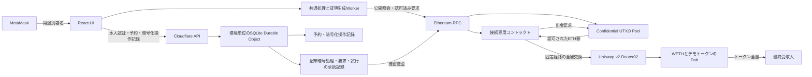

# Uniswap接続のアーキテクチャ

## 目的と文書の状態

[Issue #40](https://github.com/shodaimomiyama/ethereum-confidential-utxo/issues/40)に基づき、[PRD](PRD.md)、[要件定義](requirements.md)、[仕様](specification.md)を実現する初版の構成を定める。本書と[接続の設計](design.md)を実装の基準とする。成立性と受入結果の未検証範囲は後続Issueに引き継ぎ、失敗した場合は根拠を記録して本設計を改訂する。

参照開始コミットは `1fdaa062e2fc4a09de178cad23e478c3a862f785`。本体の構成と責務は[本体アーキテクチャ](../../architecture.md)を参照する。方式・詳細規則と成立性の証拠は[接続の設計](design.md)を正本とする。

採用した構成と、版・配置ごとに固定する値を区別する。最小実験で確認できた範囲と未判定の条件は[接続の設計](design.md#最小実験の結果と証拠の境界)に記録する。候補の一覧や公式資料の確認を実装・成立性の証拠とは扱わない。

## 合意済みの構成条件

### 初版のウォレット対応範囲

初版はGoogle ChromeのMetaMask拡張の通常アカウントを対象とする。Firefox、ハードウェアウォレット連携、モバイルと複数ウォレットへの対応は初版の必須範囲に含めない。受領鍵は専用の決定的署名から利用者のブラウザ内で導出する。Chrome・拡張の完全版は実装の検証前にmanifestへ固定し、実受領と安全性を[#46](https://github.com/shodaimomiyama/ethereum-confidential-utxo/issues/46)で確認する。

対象を限定して、[準備と残高再利用の仕様](specification.md#準備入金残高再利用出金)を満たすことを検証する。初版でいう別ブラウザの検証は、サイト保存領域を共有しない二つの独立したChromeプロファイルで、同じウォレットを使う条件とする。サイトへの秘密鍵入力・機密鍵ファイル移送を求めない条件は維持する。対応範囲を限定したことを、鍵方式の成立性の証拠とは扱わない。

ウォレット以外の追加インストールを避け、鍵復元専用の署名操作を求める。署名の再現性と秘密保持が実装で成立しなければ、[#46](https://github.com/shodaimomiyama/ethereum-confidential-utxo/issues/46)で別方式へ戻す。詳細は[接続の設計](design.md)を参照する。

### 運用費用

公開サイトとデモ報酬配布はCloudflare Freeでの運用を初版構成とする。無料枠の制限、休止、保存容量、実暗号の処理資源は[#47](https://github.com/shodaimomiyama/ethereum-confidential-utxo/issues/47)で検証する。無料構成で要求を満たせない場合は、その根拠と代替案を示して再検討する。有料構成への変更は未合意である。

費用の希望を理由に、[報酬要求の同一性と重複防止](specification.md#重複修正追加要求)、永続化と障害復旧の要件を緩和しない。静的サイトとAPIをWorkers、環境単位の永続状態と配布暗号処理を一つのSQLite Durable Objectへ配置する。RPCと実行資源への適合は[#47](https://github.com/shodaimomiyama/ethereum-confidential-utxo/issues/47)・[#48](https://github.com/shodaimomiyama/ethereum-confidential-utxo/issues/48)で検証する。

配布元の鍵はサーバー側で管理する。運営者とホストは配布元の鍵と配布額を扱う信頼対象となる。利用者の秘密鍵・受領鍵はサーバーへ渡さず、ブラウザ側で扱う。[Durable Objectsの公式制限](https://developers.cloudflare.com/durable-objects/platform/limits/)を参照し、無料枠での実暗号の処理時間、永続化、復旧を検証する（確認日: 2026-09-27）。

### 公開環境と交換先

公開環境はEthereum Sepoliaとする。[Ethereumのネットワーク案内](https://ethereum.org/developers/docs/networks/)はSepoliaをアプリ開発向けとしている（確認日: 2026-09-27）。初回利用者が利用できるfaucet、RPC、Uniswap経路、流動性は公開配置前に確認し、不成立なら環境選択を見直す。ローカル検証と公開テストネット検証の区分は[接続仕様](specification.md#後続検証の対象となる環境)に従う。

Uniswap公開デモには、本体 #36 の検証用とは別アドレスの専用Poolを配置する。正式Poolと検証器のコード・配置処理は #27 の成果物を再利用し、操作履歴は環境ごとに分離する。公開配置は運営者のコマンド操作とし、CIは固定版のビルド・テスト・ローカル配置検査を実行する。CIからSepoliaの取引を送らない。

交換先は自前のデモ用ERC-20一銘柄とし、転送手数料、残高の自動増減、アップグレードを持たせない方針を合意した。Uniswap上に流動性を準備する。実在のドル資産との交換価値を持つとは表示しない。名称はDemo USD、symbolは`dUSD`、decimalsは18とする。配置時に1,000,000 dUSDを一度だけ発行し、追加発行を設けない。初期流動性は0.1 test ETHをラップしたWETHと10,000 dUSDで作る。名称のUSDは法定通貨への償還や価格維持を意味せず、この初期比率を実勢価格と説明しない。具体的なトークン実装とUniswapの固定artifactは[#45](https://github.com/shodaimomiyama/ethereum-confidential-utxo/issues/45)で照合する。

初回発行先、残余990,000 dUSDの保有先、LPトークンの受取先は運営者が指定するテスト専用アドレスとして配置記録に残し、報酬配布サービスの鍵から分離する。LP保有者は流動性を引き出せる。公開デモの配布資金は流動性資金と分けて配置時に指定し、不足時は新規配布を停止して手動で補充する。必須推論例の配布元入金0.01 ETHを公開運用の固定額としない。

交換経路はUniswap v2 Router02の単一ペアとする。固定したWETHとデモトークンの経路を使う。公式配置・ローカルで使うソースの版とartifactを照合し、実Uniswapで全額交換と全量着金を[#45](https://github.com/shodaimomiyama/ethereum-confidential-utxo/issues/45)で確認する。[公式配置一覧](https://developers.uniswap.org/docs/protocols/v2/deployments)と[Router02実装](https://github.com/Uniswap/v2-periphery/blob/master/contracts/UniswapV2Router02.sol)を候補調査の根拠とする（確認日: 2026-09-27）。可変ブランチの参照を実験の固定版の代わりにはしない。

### 進行中操作の保存と配布の並行性

進行中の支払い情報をクライアントで暗号化し、サーバーへ保存する構成を合意した。別ブラウザでも古い認可を照合し、同じ入力を使う条件変更を防ぐ。復号鍵は利用者側だけに保持する。サーバーと照合できない間は新たな認可を開始しない。識別情報やアクセス履歴など、暗号化で隠れない情報も機密性評価の対象とする。

報酬配布は一件ずつ処理し、本体のfinalized基準で配布の確定を確認してから次の配布へ進む方針を合意した。複数の配布用UTXOで並行処理する案より、初版の競合・復旧処理を絞る。混雑時の待ち時間が長くなる制約を表示する。

予約の索引として、ウォレットアドレス、対象環境、入力UTXO ID、認可期限をサーバーが読める形で保持する方針を合意した。非公開金額、乱数、受領鍵は含めない。運営者には公開済みの資産情報に加えて操作を開始しようとした時点が分かる。保存内容全体が運営者から秘匿されるとは説明しない。

環境ごとに一つのSQLite DOへ、操作予約、暗号化操作記録、報酬要求、配布用UTXOの管理、配布の暗号処理をまとめる方針を合意した。停止・無料枠超過・復旧中は環境全体の新規操作に影響することを許容する。処理を別サーバーへ自動移管して、重複配布の可能性を作らない。

### サイトとローカル検証

サイトはReact、Vite、TypeScriptによる静的配信とする。紹介ページと4カードを提供し、証明生成はブラウザのWeb Workerで実行する。本体の共通処理を再利用し、UIへ金額検証・符号化・受領規則を重複実装しない。依存の完全版とWeb Workerでの実行可能性は実装後に確認する。[Reactの構成案内](https://react.dev/learn/build-a-react-app-from-scratch)を参照する（確認日: 2026-09-27）。

ローカルは固定版の実Uniswapコントラクトを配置し、デモトークンと流動性を同じ条件で作る方式を基準とする。交換前の状態を復元して正常・異常系と通常の公開交換を比較する。公開RPCからのforkをローカル追試の必須条件にしない。Sepoliaの公式Routerと実経路は別途検証する。

必須推論履歴の単位は`u = 0.001 ETH`とする。配布元の公開入金0.010 ETH、報酬0.006 ETH、支払い0.003 ETHで検証する。これは評価入力の固定であり、公開UIの初期値や配布額の制限ではない。報酬額・支払額・宛先は初期空欄、報酬は仕様の範囲内で自由入力を維持する。

## 構成要素と信頼境界

以下の構成を初版で採用する。実行環境の制限と成立性は後続Issueで検証する。

### 責務と実行単位

以下の分割と名称を採用する。関数、ABI、保存レコード、失敗時の遷移は[接続の設計](design.md)で定める。

| 構成要素 | 責務 | 実行・配置と境界 |
| --- | --- | --- |
| 英語の紹介ページ・4カード | Demo reward / Pay / Deposit / Withdraw、準備案内、状態・Explorer表示、本人の再確認 | 静的Reactアプリ。表示上の成功を独自判定せず、共通処理の照合結果を表示 |
| ウォレット接続 | アカウント・チェーン変更、用途別の署名要求、取引承認と拒否の通知 | MetaMask通常拡張との接続。秘密鍵の入力・取り出しを要求しない |
| 接続クライアント | 支払条件、見積り、予約、暗号化操作記録、Adapter要求、接続成功履歴の照合 | ブラウザとCLIから共用するTypeScript。React・Cloudflare SDKへの依存を持たない |
| 証明生成Worker | 本体crypto/coreを使った証明生成、受領暗号処理と整合性確認 | ブラウザのWeb Worker。利用者の秘密をRPC・配布APIへ送らない。メイン画面とのメッセージは処理IDで対応付ける |
| API Worker | HTTP入口、経路・サイズの検査、DOへの配送、静的ファイル配信 | 暗号証明生成を通常WorkerのCPU予算に載せない。本人確認・要求内容の最終判定はDOで行う |
| 環境DO | 本人確認と要求照会権限、UTXO予約、暗号化進行情報、配布要求・試行・資金予約の永続化、配布暗号処理、送信と確定照合 | 一環境一SQLite DO。alarmで待機から再開。ブラウザ利用者の復号鍵は保持しない |
| 支払いAdapter | 二つの認可の対応、固定環境・経路、Poolからの出金受領、全額交換・全量着金、成功記録と全体取消 | 固定コントラクト。予約サーバーの許可をオンチェーン受理条件に追加しない |
| デモERC-20 | 固定供給と通常の残高移転 | dUSD一銘柄。手数料・rebase・upgradeなし |
| Uniswap v2 | WETH/dUSD単一pairで交換し、最終受取人へ出力を送付 | Router02・Factory・WETH・pairの実コード。Adapterが任意のRouterやpathを受け入れない |
| 本体Pool・金額検証器 | 認可、UTXO状態、暗号検証、資産保存と公開出金 | 本体の既定の責務。接続設計だけでABI・保証を変更しない |
| 本体core/crypto/ethereum | 操作・符号化、証明、受領・同期、署名とRPC接続 | 本体の公開境界を利用。接続側から実験コードを通常実行時にimportしない |

Adapterのconstructorは六つの固定参照のコード存在とRouter・Factory・Pairの参照関係を検査し、不一致なら配置を拒否する。固定アドレスは公開getterから照合できる。採用artifactと実runtime、配置取引・環境の一致は配置処理とmanifestで照合する。constructorの参照整合検査だけを採用コードの証明と扱わない。具体的な検査式とABIは[接続の設計](design.md#支払い認可と公開abi)に従う。

### 情報と信頼の境界

| 境界 | 渡す情報 | 前提・制限 |
| --- | --- | --- |
| Wallet → ブラウザ | 用途別署名・公開アカウント | 鍵復元専用の署名は受領鍵と同様の秘密。API本人確認や公開認可への流用を禁止 |
| ブラウザ → DO | 本人確認、予約索引、暗号化操作記録、本人の報酬要求と署名済み受取情報 | 予約索引とアクセス時刻は運営者に見える。報酬要求額は処理する配布元が知る。利用者の鍵・開示用乱数は送らない |
| DO → Ethereum RPC | 配布の公開要求・署名済み取引、公開識別子による状態照会 | 配布元の秘密入力は要求の付加データやログに含めない |
| ブラウザ → Ethereum RPC | 公開履歴・状態照会、認可済み支払い・入出金の提出 | RPCに本人の機密残高を計算させない。履歴の完全性・正しさには本体のRPC信頼前提が残る |
| Adapter → Pool/Router/token | 固定した公開条件、認可・証明、ETH、残高照会 | コード・配置・版をmanifestで識別。後段失敗を成功に変換しない |
| 運営者 → Cloudflare | 配布元鍵、保存暗号化鍵、RPC設定 | Secretsで供給し、平文設定・ソース・通常ログへ記載しない。ホストと実行コードを信頼する |

ブラウザ側の秘密を処理する配信コード、ウォレット、端末は利用者の信頼対象である。RPCは履歴と状態の取得先、サーバーは操作予約の整合と可用性の信頼対象となる。サーバーの予約はオンチェーン認可の代わりではなく、正当な別提出者による支払いを拒否する条件にはしない。

配布サービスは自分が配布する額と配布元の秘密を扱う。配布後の利用者の受領は鍵と公開履歴から成立させ、配布サービスの継続稼働を受領データ取得の必須条件にしない。

## 採用構成と検証用のサービス候補

構成欄は初版の採用方針、外部サービス・ツールの個別版は検証用の候補である。完全版の取得・適合・実験完了を意味しない。確認日は2026-09-27。

| 対象 | 初版の構成・検証用候補と根拠 | 実装・配置時に確認すること |
| --- | --- | --- |
| ブラウザと拡張 | Google Chromeのみ。MetaMask通常版 [13.50.0](https://github.com/MetaMask/metamask-extension/releases/tag/v13.50.0)は実験候補 | 独立した二つのChromeプロファイルで、拡張・ブラウザ完全版、署名・鍵・受領の再現性を記録。私物の鍵を使わない |
| Cloudflare構成 | 静的配信・軽量APIをWorker、永続記録・配布暗号処理をSQLite Durable Objectsへ配置 | 通常Workerの10ms CPU制限に証明生成を収める前提を置かない。DO対象runtimeの時間・メモリを実証する |
| 配布と予約の保存単位 | 環境ごとに一つのSQLite DOへ集約する方針を合意済み | SQLによる排他、停止・枠超過時の全体停止、再起動後の照合を実証する |
| ローカルCloudflare環境 | [Wrangler 4.116.0](https://registry.npmjs.org/wrangler/4.116.0)と依存する[Miniflare 4.20260730.0](https://registry.npmjs.org/miniflare/4.20260730.0) | 非prereleaseの依存を持つ組合せの候補。lockfile、互換性日付、flagsを固定して実runtimeとの差を検証する |
| faucet | [QuickNode Sepolia](https://faucet.quicknode.com/ethereum/sepolia) | 現行FAQは通常配布にmainnet残高・アカウント・SNS投稿不要とする。新規ウォレットでの実受取、必要gas、bot検査と在庫条件は未実証 |
| 公開RPC | [PublicNode](https://www.publicnode.com/)と[OnFinality Sepolia](https://www.onfinality.io/en/rpc-assistant/rpc-eth-sepolia) | finalized、block hash指定、requireCanonical、ログ・過去状態、CORSと制限時の振る舞いを検証。無料という理由だけで採用しない |

Cloudflareの[Worker制限](https://developers.cloudflare.com/workers/platform/limits/)、[DO制限](https://developers.cloudflare.com/durable-objects/platform/limits/)、[DO無料枠](https://developers.cloudflare.com/durable-objects/platform/pricing/)を別々に照合する。通常WorkerはCPU 10ms・メモリ128MB、DO固有ページは既定CPU 30秒を記載する。無料枠で実証せず上限増量を前提にしない。DO保存容量は公式表とFAQに差があるため、初回は保守的に1GB/DO以下、アカウント合計5GB以下で評価する。

要求と署名済み取引を保存し、永続化の完了後に送信する。RPCへの送信をSQLトランザクションで巻き戻せるとは扱わない。alarmの重複実行では永続記録を読み直して同じ処理を再開し、finalized待ちを一つの長時間呼出しで保持しない。[SQLite API](https://developers.cloudflare.com/durable-objects/api/sqlite-storage-api/)と[Alarms](https://developers.cloudflare.com/durable-objects/api/alarms/)に適合させる。

## データフローと障害時の境界

以下は予定する処理順序であり、実行記録ではない。各段階の保存内容と受理条件は[接続の設計](design.md)に従う。

### 支払い

1. ブラウザがウォレットと対象環境を確認し、本人の受領鍵と公開履歴から利用可能UTXOを同期する。
2. 接続クライアントが単一入力・見積り・五条件を固定し、DOと既存操作を照合して入力を予約する。永続化完了の応答前に認可要求へ進まない。
3. Web Workerが本体の部分出金要求・残額・証明を作る。ウォレットから本体出金認可と接続支払い認可を取得し、進行情報を本人の鍵で暗号化して保存する。
4. 利用者のwalletからAdapterへ提出する。AdapterはPoolから固定額を受け取り、固定Routerで交換・着金を確認する。全体の失敗を伝播させる。
5. 接続クライアントが本体とAdapterの履歴、finalized条件、本人の残額受領を区別して照合する。再読み込み・別ブラウザでも同じ認可済み操作へ戻る。

予約の解除はブラウザの放置時間だけで決めない。期限超過、旧操作の成功有無、入力使用状態を同じ確定履歴で照合する。サーバー予約はUIの競合を防ぐ仕組みであり、CLI等の正当な競合や第三者のコピー提出をオンチェーンで禁止するものではない。

### 報酬と通常の入出金

DOは本人の要求額・受取先を受付時に固定し、要求と配布操作・試行を永続記録へ対応付ける。配布用資金の予約、証明・認可の生成、署名済み取引の保存を行ってから送信する。応答喪失・alarm重複・再起動では保存済み操作へ戻り、新規配布へ読み替えない。

配布成立のfinalized照合後に全体キューを次へ進める。ある利用者の画面離脱や受領確認待ちは、別利用者の次の配布を止める条件にしない。同じ利用者の追加要求には本人の受領完了と明示操作を要求する。配布後の本人による復号・受領確認はブラウザの責務である。

DepositとWithdrawは本体の入口を使い、接続Adapterを経由しない。WithdrawもPayと同じ入力予約を原子的に取得してから署名を要求し、互いの競合を防ぐ。Withdrawの本体認可には期限がないため、予約を時間切れで解除しない。Withdrawは選択UTXOの全額を本人へ戻し、未確定・受領不整合を利用可能にしない。

### 停止と復旧

DO、RPC、永続化のいずれかを照合できない場合、未実行と決めず確認不能を表示する。新しい予約・認可・報酬配布を停止し、既存署名や取引を削除して進めない。既に公開した取引はサーバー停止中にも実行され得るため、復旧時はチェーンを照合してからキューを進める。

古いバックアップへの巻戻りは、チェーン再走査だけで復旧済みとしない。未提出認可と予約の欠落を排除できない場合は、全損時と同様に新規処理を停止する。

サイト停止や無料枠超過は、オンチェーン資産の取消・凍結を意味しない。CLIによる受領・同期と正当に認可された提出は本体・接続の規則に従う。別ブラウザの未公開操作照合にはサーバー可用性が必要であり、公開履歴だけで未提出認可まで復元できるとは保証しない。

## モジュールと配置予定

以下は配置案であり、ディレクトリや実装が存在するという意味ではない。既存の本体パッケージ境界を維持し、接続側から本体へ依存する。

| 配置予定パス | 内容と依存 |
| --- | --- |
| `contracts/src/integration/uniswap/` | Adapter、dUSD。PoolとRouterの固定interfaceを利用し、本体の状態管理を複製しない |
| `contracts/test/integration/uniswap/` | 実Pool・実Uniswapへの結合、拒否・取消・再入・受取額の検証 |
| `packages/uniswap/` | UI/CLI共通の支払条件、見積り、認可・要求、接続履歴照合、保存interface。本体core/ethereumへ依存 |
| `apps/uniswap-web/` | React/Viteサイト、MetaMask接続、Web Worker、本人向け状態表示。packages/uniswapと本体共通処理を利用 |
| `apps/uniswap-service/` | Worker入口、環境DO、SQL schema、本人認証、配布と復旧、Secretsとの接続 |
| `packages/cli/` の接続サブコマンド | packages/uniswapを利用する追試入口。本体の既存コマンドと受領・同期を共有 |
| `tests/integration/uniswap/` | CLI/UI/API/コントラクトをまたぐ受入試験、別ブラウザと障害復旧 |
| `benchmarks/uniswap/` | 正式実装を使った推論・費用・操作回数の入力、生データ、集計 |
| `experiments/design/uniswap/` | 方式選定に用いた局所実験。通常実装からの依存は禁止 |

依存方向は`web / service / CLI → uniswap`、`uniswap → core / ethereum`とし、本体側は`ethereum → core → crypto`を維持する。serviceの配布処理は本体core/cryptoを直接利用できる。coreからReact・Cloudflare・接続固有の署名や保存形式をimportしない。コントラクトABIは固定artifactから生成し、手書きの第二の正本を作らない。

## 開発・検証環境

| 環境 | 構成と由来 | 確認する範囲 |
| --- | --- | --- |
| ローカルEVM | 本体と同じFoundry/Anvil基準。固定した実Uniswap v2ソースまたは公式artifact、WETH、dUSD、初期流動性を配置 | 同じ初期状態から正常・境界・拒否・取消、通常公開交換との反復比較。forkや外部RPCを必須にしない |
| ローカルサイト/API | Vite、Wrangler/Miniflare、試験専用walletとブラウザ。永続保存を有効にし再起動試験を行う | 予約競合、要求重複、暗号化保存、署名拒否、鍵の別ブラウザ再現、送信応答喪失 |
| 公開テストネット | Sepolia。公式Router/Factory/WETHを照合し、自前dUSDとpair流動性、本体Pool、Adapterを配置 | 実暗号の報酬・部分支払い・全量着金・残額再利用、拒否、実gas、faucetからの初回導線 |
| 公開サイト/API | Cloudflare Free、静的assetsとWorker、環境単位SQLite DO、Secrets、無料`workers.dev` | 実runtimeのCPU・メモリ・保存、alarmと再起動、無料枠相当の停止、RPC制限時の回復 |

本体のcompiler、Node.js、TypeScript、pnpm、viem、暗号ライブラリ、テスト基盤は[本体の固定基準](../../architecture.md#初回実装の固定基準)を出発点とする。Uniswap旧ソースのcompilerを本体compilerへ無条件に変更しない。ビルドを分けてartifactを固定し、pairアドレス導出が使うinit code hashとの一致も検証する。

Cloudflareの[無料サブドメイン](https://developers.cloudflare.com/workers/configuration/routing/workers-dev/)は独自ドメイン購入なしで利用でき、個人・趣味向けとされる。今回の研究PoCの配置先とし、本番可用性の保証に読み替えない。公開サイトとAPIのorigin、chain、配置世代をmanifestへ記録する。ローカルと公開を同じ認証・保存環境として扱わない。

### 実行前に固定する版と配置情報

確認済み候補の表にない完全版を推定して記載しない。各実験では、その実験が使用するコード・runtime・入力の版を実行前に固定する。実験対象外のブラウザやRPCなどの未選定は局所実験を妨げないが、各対象の実装試験・配置前に次の情報をmanifestへ固定し、未固定の対象では受入結果を主張しない。

| 情報 | 制約・決定担当・時点 | 検証方法 |
| --- | --- | --- |
| React/Viteと直接依存、ブラウザ完全版 | 接続設計担当が本体TypeScript/Nodeと適合する版を実験前に選定 | 公式package metadata、lockfile、実ブラウザの署名・Worker実行 |
| Uniswap/WETH/dUSDの固定コードとビルド | 接続設計・環境担当がローカル交換実験前に固定 | source commit、compiler設定、artifact/runtime hash、Factory/Router/WETH参照一致 |
| Cloudflare互換性日付・flags | 接続設計担当がDO実験前に固定。増量や有料化を暗黙に前提としない | ローカルとFree runtimeで暗号・SQL・alarm・復旧を実行 |
| RPC・faucet | 環境担当が初回利用実験前に選定 | 新規walletで資金取得、finalized・過去ログ・block hash・CORS・障害挙動を確認 |
| 公開アドレス・URL・runtime hash | 配置担当が配置時に生成し、利用開始前に公開manifestへ反映 | chain ID、code、constructor・immutable、pair、token decimals/供給を照合 |
| 機器・OS・履歴量・キャッシュ | 評価担当が各測定前に固定 | 実行manifestと生データへ記録し、別環境の結果と混同しない |

## 本体との依存と未実装の範囲

参照開始版の作業ツリーには、設計が予定する本体の`contracts/`、`packages/`、`tests/`、`formal/`の完成実装は存在しない。既存の暗号実験・先行方式比較を、本体や接続アプリの実装と数えない。2026-09-27の確認では次の依存IssueはすべてOpenである。

| 依存と担当 | 必要な能力 | 解消に必要な証拠 |
| --- | --- | --- |
| [#27 Pool](https://github.com/shodaimomiyama/ethereum-confidential-utxo/issues/27)、[#26 検証器](https://github.com/shodaimomiyama/ethereum-confidential-utxo/issues/26) | 本体認可、部分出金・残額、ETH CALL失敗時の取消、金額検証 | 固定実コードとABI、実認可・実証明での正常・改変・取消。接続Adapterからの実呼出し |
| [#28 crypto](https://github.com/shodaimomiyama/ethereum-confidential-utxo/issues/28) | v3証明、コミットメント、HPKE | 固定suiteの相互運用、Web WorkerとDOでのCPU・メモリ、秘密取扱い |
| [#29 core](https://github.com/shodaimomiyama/ethereum-confidential-utxo/issues/29) | 操作作成、署名対象、受領・同期と再編成 | 公開interface、独立符号化ベクトル、状態・受領の結合試験 |
| [#30 ethereum](https://github.com/shodaimomiyama/ethereum-confidential-utxo/issues/30) | wallet署名、生成ABI、RPC・提出・履歴取得 | MetaMask/RPC接続、応答喪失・別提出者・確定照合の試験 |
| [#31 CLI](https://github.com/shodaimomiyama/ethereum-confidential-utxo/issues/31) | 本人の鍵・操作作成・提出・受領とローカル保存 | 同じ公開APIで接続を追試でき、UIを使わず残額再送金・受領を実行 |
| [#36 結合検証](https://github.com/shodaimomiyama/ethereum-confidential-utxo/issues/36)、[#38 本体進捗管理](https://github.com/shodaimomiyama/ethereum-confidential-utxo/issues/38) | 実暗号の必須経路、正式証明・評価の対象版管理 | 本体と接続で共通の固定版を記録し、未完了のFV-01〜04を明示 |

本体APIの契約を基に接続の詳細設計・局所実験は先行できる。ただしモックでのAdapter成功を本体接続の完了としない。能力不足が判明した場合は[仕様の変更要求手順](specification.md#本体との依存と変更要求)へ戻り、本体の責務や保証を接続文書だけで変更しない。

## 後続作業と実装後の検証

本節は実装・検証担当への作業分解である。各詳細規則と全要件・シナリオの対応は[接続の設計](design.md)を正本とする。

| 順序・対象 | 入力と依存 | 完了時に渡すもの |
| --- | --- | --- |
| 1. 実装後の成立性検証 | 二認可・全量着金、wallet鍵復元、DO資源と配布復旧、推論評価の設計規則。必要な固定版 | 問い・入力・実行手順・結果・限界。不成立なら設計を改訂 |
| 2. コントラクトと接続共通処理 | 本体ABI・core interface、採用済み設計、固定Uniswap | Adapter/dUSD、型・符号化・認可・見積り・履歴照合、独立ベクトル。コントラクトとTypeScriptは境界を固定して並行可能 |
| 3. サイトと配布サービス | 接続共通処理、本体crypto、鍵方式、保存・認証・復旧規則 | 4カード、Web Worker、MetaMask、SQLite DO、予約と配布。UIとサービスはAPIを固定して並行可能 |
| 4. CLIと環境 | 接続共通API、固定artifact、[#4 環境構築](https://github.com/shodaimomiyama/ethereum-confidential-utxo/issues/4) | ローカルの再配置・初期化、公開manifest、CLIによる正常・異常・残額再送金と受領 |
| 5. 結合検証と評価 | 実本体・実Uniswap・UI/API/CLI、同じ対象版 | 全20要件・S-01〜S-50の証拠、公開情報一覧と推論、同条件の公開交換比較、生データ、第三者追試 |
| 6. 成果説明 | 検証済み版と未達範囲 | [#19 README](https://github.com/shodaimomiyama/ethereum-confidential-utxo/issues/19)へ実行手順と証拠、[#20 動画](https://github.com/shodaimomiyama/ethereum-confidential-utxo/issues/20)へ公開サイト・必要準備・待機条件 |

実装後の検証先は、実Pool・Uniswap・認可と取消の[#45](https://github.com/shodaimomiyama/ethereum-confidential-utxo/issues/45)、Chrome間の実受領と鍵の[#46](https://github.com/shodaimomiyama/ethereum-confidential-utxo/issues/46)、Cloudflare Freeでの実暗号処理の[#47](https://github.com/shodaimomiyama/ethereum-confidential-utxo/issues/47)、予約・配布の実取引復旧の[#48](https://github.com/shodaimomiyama/ethereum-confidential-utxo/issues/48)、公開情報と能動照会を含む機密性の[#49](https://github.com/shodaimomiyama/ethereum-confidential-utxo/issues/49)、公開サイトと一連の利用者操作の[#50](https://github.com/shodaimomiyama/ethereum-confidential-utxo/issues/50)とする。これらの未完了は本設計の成立を実証したことを意味しない。不成立なら影響する規則と要求を示して設計を改訂する。接続固有の形式証明は追加せず、本体の正式証明義務を接続テストで代替しない。
